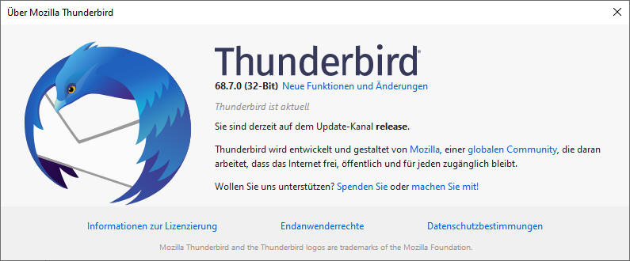
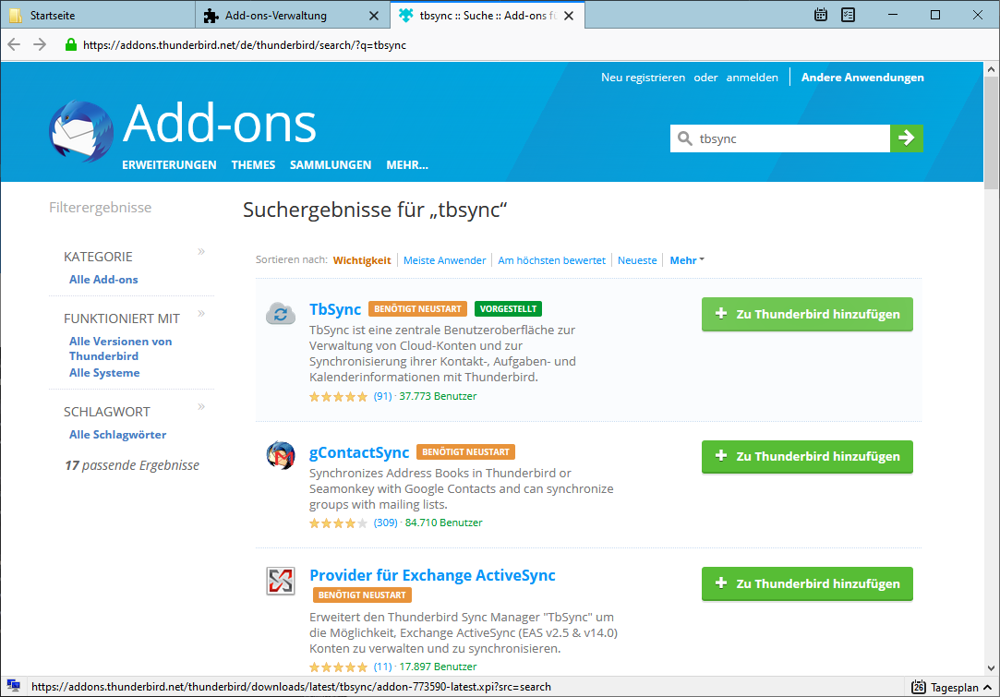
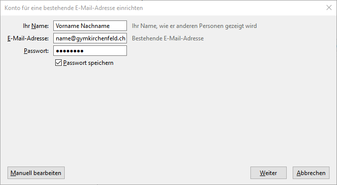
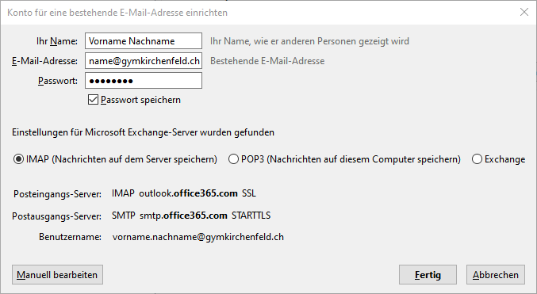
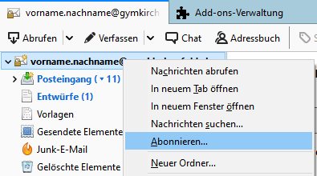
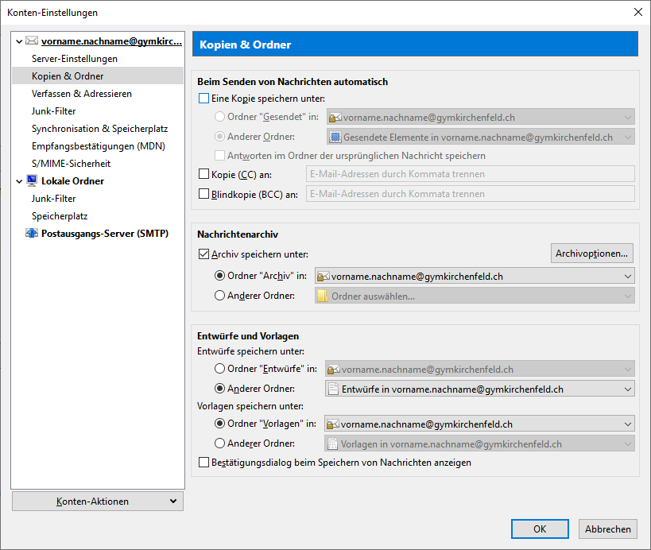
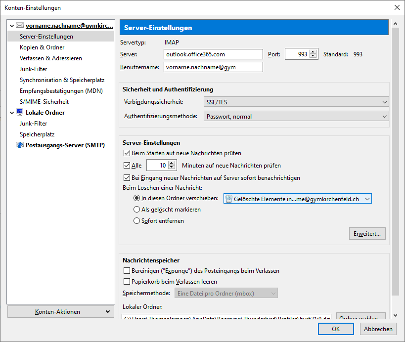
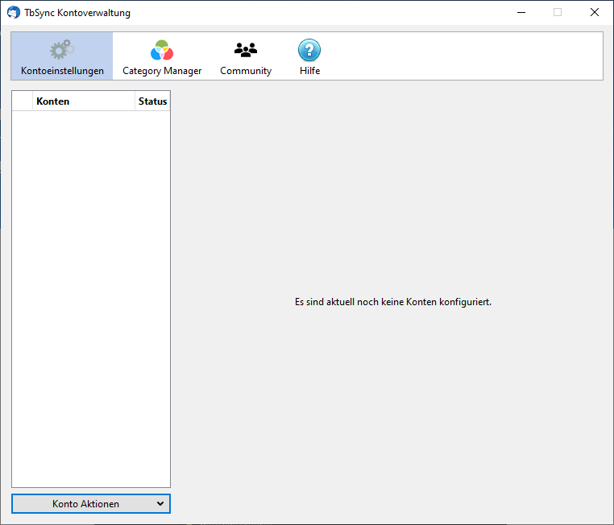
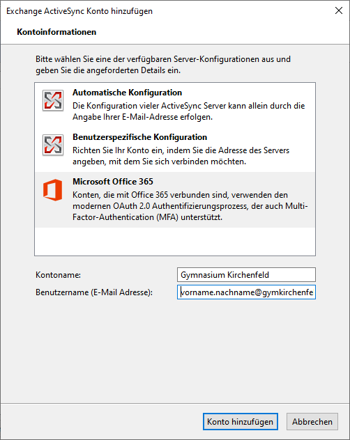
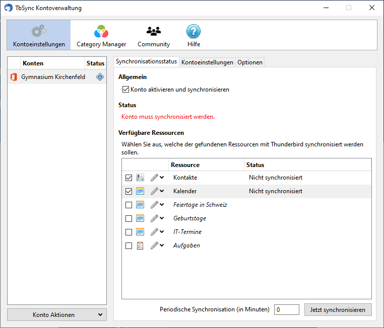

# 'Thunderbird'

Falls du Thunderbird (den E-Mail-Client von Mozilla) verwenden möchtest, umdeine Gymer-E-Mails zu verwalten, findest du hier eine Anleitung zum Einrichten.

## Vorarbeiten

### Version prüfen
Bitte stelle unbedingt sicher, dass du mindestens Thunderbird Version 68 installiert hast, indem du im Menü (bei den drei Strichen rechts oben) auf den Eintrag __Hilfe__ :mdi-chevron-right: __Über Thunderbird__ klickst.

Falls nicht, kannst du in diesem Fenster den Knopf zum Aktualisieren von Thunderbird anklicken.

### Add-ons installieren
Nun musst du zwei Add-ons installieren, damit du bequem auf den Exchange-Server zugreifen kannst:

- TbSync
- Provider für Exchange ActiveSync

Klicke dazu im Menü auf __Add-ons__. Im neuen Fenster wählst du links den Eintrag __Erweiterungen__ aus. Nun kannst du oben rechts im Suchfeld _tbsync_ eintippen und suchen.

Du musst die beiden Add-ons **TbSync** und **Provider für Exchange ActiveSync** installieren (also jeweils den Knopf __Zu Thunderbird hinzufügen__ klicken und dann die Erweiterung installieren und Thunderbird neustarten).

## E-Mail-Konto hinzufügen
Im Thunderbird-Menü wählst du dazu den Eintrag __Einstellungen__ :mdi-chevron-right: __Konto-Einstellungen__. Im neuen Fenster wählst du __Konto-Aktionen__ :mdi-chevron-right: __E-Mail-Konto hinzufügen__.

Nun gibst du deine Schul-E-Mail-Adresse und dein Schul-Passwort ein und klickst anschliessend auf `Weiter`.

Stelle sicher, dass _IMAP_ ausgewählt ist und klicke auf __Fertig__. Nun klickst du auf den Ordner **Posteingang**, damit einige weitere Ordner geladen werden. Es kann sein, dass nicht alle deine Ordner angezeigt werden. Im nächsten Abschnitt erklären wir, wie deine Mailbox in Thunderbird korrekt konfiguriert wird.

### Ordner abonnieren
Du kannst mit einem Rechtsklick auf die Kontobezeichnung oberhalb des Posteingangs (üblicherweise deine E-Mail-Adresse) das Kontextmenü öffnen und auf __Abonnieren…_ klicken und im neuen Fenster die gewünschten Ordner mit einem Häkchen markieren:

### E-Mail-Konto: Spezialordner richtig konfigurieren (Papierkorb und gesendete E-Mails)
Thunderbird legt gesendete E-Mails korrekt im Ordner "Gesendete Elemente" ab, allerdings speichert auch der Mailserver von Microsoft die von Thunderbird gesendeten Nachrichten, d.h. sie tauchen doppelt auf. Damit dies nicht geschieht und damit auch gelöschte Mails im richtigen Papierkorb landen, müssen noch zwei Einstellungen angepasst werden:

Öffne erneut die Konto-Einstellungen: Im Thunderbird-Menü wählst du dazu den Eintrag __Einstellungen__ :mdi-chevron-right: __Konto-Einstellungen__. Jetzt klickst du im linken Bereich auf __Kopien & Ordner__ und entfernst im rechten Bereich oben das Häkchen unter **Beim Senden von Nachrichten** bei _Eine Kopie speichern unter:_.

Nun klickst du im linken Bereich auf __Servereinstellungen__ und wählst anschliessend im rechten Bereich ca. in der Mitte bei **Beim Löschen einer Nachricht:** die Option _In diesen Ordner verschieben:_ und wählst in der Auswahl den Ordner _Gelöschte Elemente_:

## Kalender und Adressbücher hinzufügen
Im Thunderbird-Menü wählst du dazu den Eintrag __Add-ons__ :mdi-chevron-right: __TbSync__. Im neuen Fenster wählst du __Konto Aktionen__ :mdi-chevron-right: __Neues Konto hinzufügen__ :mdi-chevron-right: _Exchange ActiveSync_.

Im nächsten Schritt musst du **Microsoft Office 365** auswählen, eine Konto-Bezeichnung und die eigene Schul-E-Mail-Adresse eingeben:

Nun öffnet sicht ein Login-Dialog von Microsoft und fordert zur Passworteingabe auf. Hier gibst du das Schul-Passwort ein. Anschliessend musst du zustimmen, dass Thunderbird via TbSync Zugriff zum Microsoft-Konto erhält.

Sobald du das Gutzeichen bei **Konto aktivieren und synchronisieren** setzt, erscheinen unten die verfügbaren Kalender, Adressbücher und Aufgaben. Markiere diejenigen, die du synchronisieren möchtest.

:::warning Achtung

Denke unbedingt daran, die gewünschte Synchronisationsperiode (z.B. `30` Minuten) einzutragen), sonst erfolgt die Synchronisation in Zukunft nicht automatisch!
:::

Nachdem du die Synchronisationsperiode gewählt hast, klickst du auf __Jetzt synchronisieren__.

Sobald die Synchronisation erfolgt ist, kannst du das Fenster schliessen.
