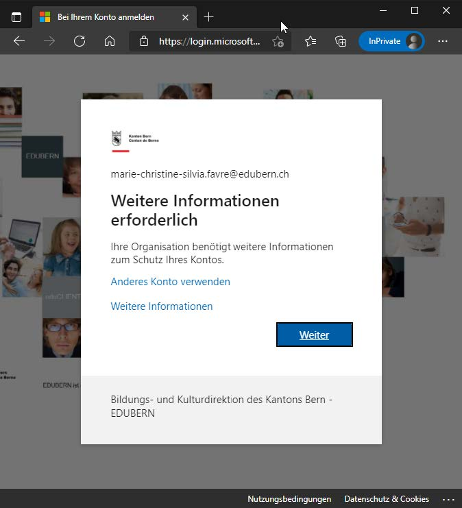
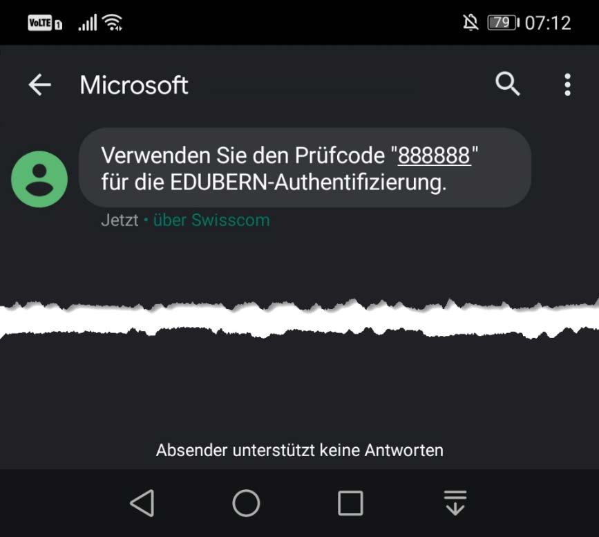

---

sidebar_custom_props:
  icon: mdi-two-factor-authentication
  path: /docs/byod/mfa/README.md
sidebar_position: 25
---

# Multi-Faktor-Authentifikation

Eine "Multi-Faktor-Authentifizierung" dient der Sicherheit. Wenn man sich mit 2 Geräten authentifizieren muss, kann ein gestohlener Lapatop nicht dazu verwendet werden, um sich Zutritt zu einem Konto zu verschaffen. Alle Lehrer:innen und Schüler:innen müssen diese einrichten. Wenn du im Schulnetz bist, reichen Mailadresse und Passwort, aber sonst musst du dich immer doppelt authentifizieren.
Zuerst musst du dich mit Mailadresse der Schule und Passwort anmelden.
Danach erthältst du auf deinem Smartphone entweder eine SMS mit einem Code oder einen Code in deiner Authenticator-App.

**Anleitung:**

# Anleitung: Einrichtung 

:::tip
Aktiviere die Authentifizierung über SMS.

Es bestehen verschiedene Varianten der zusätzlichen Authentifizierung. Hier wird die Variante der Authentifizierung über SMS-Code vorgestellt, die einfacher zu installieren ist als andere.
:::

## Überprüfung und Einrichten der Sicherheitsinformationen mit SMS

Um MFA zu nutzen, müssen weitere Sicherheitsinformationen für die Anmeldemethode hinterlegt werden. 

### Schritte zur Einrichtung

1. Im Browser folgende Adresse eingeben:
   - [https://aka.ms/mfasetup](https://aka.ms/mfasetup)

   Es erscheint die Aufforderung zur Eingabe der E-Mail-Adresse (Benutzernamen). E-Mail-Adresse eingeben und mit [Weiter] bestätigen.

   **WICHTIG:** Hier die Schul-Email-Adresse verwenden: Vorname.Name@edu.gbsl.ch

   

2. Eingabe des Passworts und [Anmelden] wählen.

   

3. Wurde bereits eine Mobiltelefonnummer hinterlegt, erhältst du einen Code per SMS. In diesem Fall kannst du die Webseite verlassen.

:::details[Klicke, wenn du eine andere Meldung erhalten hast]  

4. Falls die Mobiltelefonnummer noch nicht in deinem Konto hinterlegt wurde, hast dufolgende Meldung erhalten, die du mit [Weiter] bestätigst.

   

   Die Methode [Authentifizierungstelefon], das Land des Providers, die Mobiltelefonnummer und die Auswahl [Code per SMS an mich senden] anwählen. Eingaben mit [Weiter] bestätigen.

   

5. Auf das Mobiltelefon mit der unter Punkt 4 angegebenen Mobiltelefonnummer wird eine SMS mit einem Prüfcode (zufällige Zahlennummer) geschickt.

   **Hinweis:** Die Bildschirmaufnahme stammt von einem Google-Android-Smartphone. Die Darstellung ist abhängig vom Smartphone-Typ und kann abweichen.

   

6. Den Prüfcode aus Punkt 5 im Eingabefeld eingeben und Eingabe mit [Überprüfen] bestätigen.

   
   

7. Abschlussmeldung mit [Fertig] bestätigen.

   

8. Bei der nächsten Anmeldung via Link unter Punkt 1 erscheint nun die Aufforderung, den SMS-Code einzugeben.

   
:::
