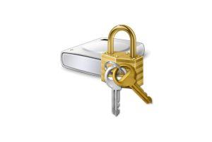
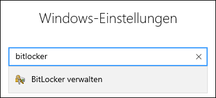
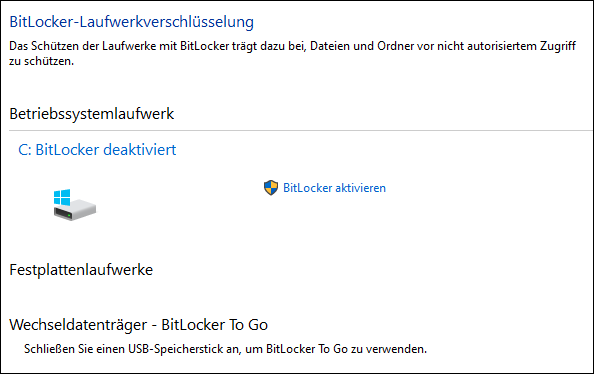
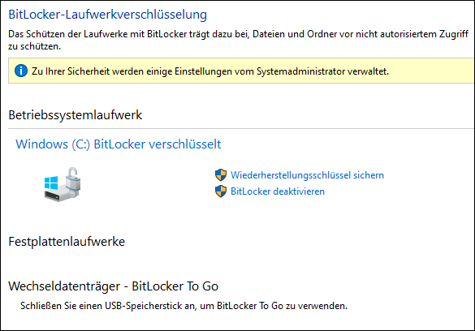
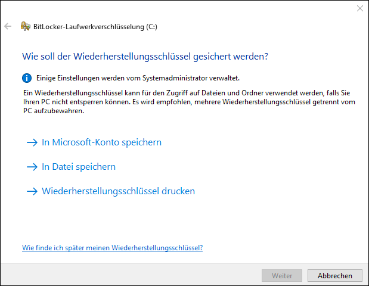
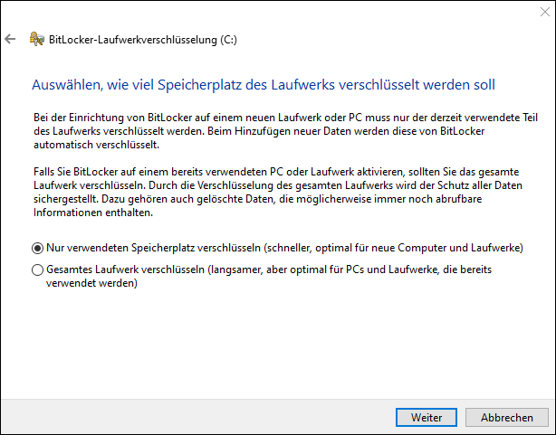
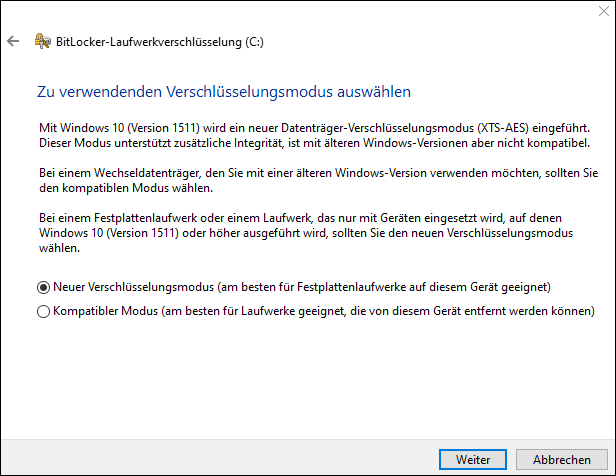
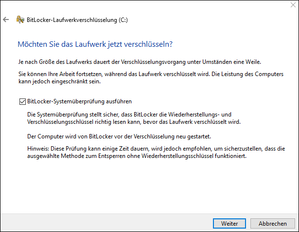
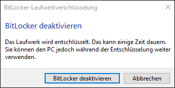

---
systems:
  - neues-geraet
sidebar_position: 10
sidebar_custom_props:
  icon: mdi-shield-lock
  source: gym-kirchenfeld
  path: /docs/byod/neues-geraet/bitlocker/README.md
draft: false
---

# Bitlocker

Auf Windows-Rechnern kann ein Mechanismus namens **Bitlocker** aktiviert werden. Auf gewissen Geräten ist dieser bereits standardmässig aktiviert. Bitlocker stellt sicher, dass bei Diebstahl oder anderem Verlust des Gerätes keine unbefugte Person auf die Daten zugreifen kann, indem es sämtliche Daten auf der Festplatte verschlüsselt. 

Für den Zugriff auf die Daten benötigt man dann einen speziellen **Key**. Wenn auf einem mit Bitlocker geschützten Gerät ein Problem mit der Windowsinstallation oder ein anderer schwerwiegender Fehler auftritt und das Gerät repariert werden muss, **muss dieser Bitlocker-Key vorhanden sein, sonst sind die Daten verloren**. Selbst die Nutzerin/der Nutzer ist dann ausgesperrt und auch der Informatikdienst hat keinen Zugriff, solange der Key nicht bekannt ist. Deshalb sollten alle Schüler:innen und Lehrpersonen, die ein eigenes Windows-Gerät für die Schule nutzen,
* sich überlegen, ob sie den Schutz durch Bitlocker wollen.
* kontrollieren, ob Bitlocker  aktiviert ist und dieses je nach Wunsch deaktivieren/aktivieren.
* falls Bitlocker aktiviert ist, sich unbedingt den Key notieren und an einem sicheren Ort aufbewahren - dafür benötigt man einen USB-Stick.

## Prüfen, ob Bitlocker installiert ist

1. Auf den Windows-Startknopf klicken.

2. Auf _Einstellungen_ [[:mdi[cog]]] klicken.

3. Im Suchfeld _Windows-Einstellungen_ den Begriff _bitlocker_ eingeben und auf den Suchvorschlag _BitLocker verwalten_ klicken.

4. Es wird angezeigt, ob Bitlocker aktiviert ist.

## Bitlocker-Key speichern

Wenn Bitlocker aktiviert ist, sollte man unbedingt den Key abspeichern. 

1. Bitlocker öffnen wie im vorigen Abschnitt beschrieben.

2. Auf _Wiederherstellungsschlüssel sichern_ klicken.

3. Den USB-Stick einstecken.

4. Auf _In Datei speichern_ klicken.

5. Als Speicherort den USB-Stick wählen, einen guten Dateinamen eingeben und abspeichern. Es ist nicht möglich, den Key auf der Festplatte zu speichern, da diese Festplatte ja verschlüsselt ist. 

6. Der Key ist nun als Textdatei auf dem Stick abgespeichert. Diese Textdatei sollte an einem sicheren Ort abgelegt werden, z.B. auf einem anderen Computer oder man bewahrt den Stick sicher auf.

7. Zusätzlich sollte der Code ausgedruckt werden. Dazu entweder auf _Wiederherstellungsschlüssel drucken_ klicken oder die Textdatei vom USB-Stick direkt drucken.

8. Den ausgedruckten Key zu Hause gut aufbewahren.

## Bitlocker aktivieren

1. Im Bitlockermenü (siehe Abschnitt _Prüfen, ob Bitlocker installiert ist_) auf _BitLocker aktivieren_ klicken.

2. Bitlocker-Key speichern (siehe Abschnitt _Bitlocker-Key speichern_).

3. _Nur verwendeten Speicherplatz verschlüsseln_ anklicken und auf __Weiter__ klicken.

4. _Neuer Verschlüsselungsmodus_ wählen und auf __Weiter__ klicken.

5. _BitLocker-Systemüberprüfung ausführen_ anwählen und auf __Weiter__ klicken.

6. Dialogfeld, das zum Systemneustart auffordert, bestätigen.

## Bitlocker deaktivieren

1. Im Bitlockermenü (siehe Abschnitt _Prüfen, ob Bitlocker installiert ist_) auf _BitLocker deaktivieren_ klicken.

2. Im erscheinenden Fenster auf _BitLocker deaktivieren_ klicken.

