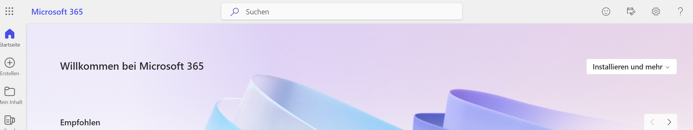
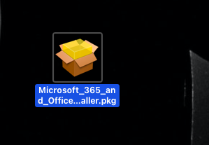
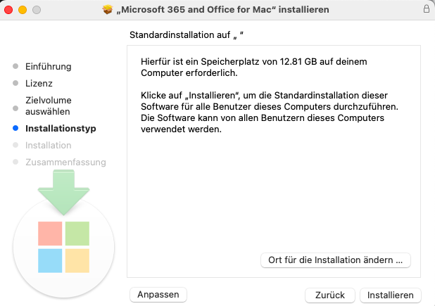

---
sidebar_custom_props:
  icon: mdi-microsoft-office
  path: /docs/byod/teams/README.md
sidebar_position: 17
---

# Office 365 einrichten

Alle Lehrer:innen und Schüler:innen haben eine Lizenz für die Programmsuite office 365 und arbeiten mit diesen Programmen.

Microsoft365 wird wie folgt installiert:

<Tabs>
  <TabItem value="win" label="Windows">
 
Gehe zu folgender Seite [Konto](https://www.microsoft365.com/?auth=2&home=1), melde dich an und wähle __Installieren und mehr__. Die Programme werden heruntergeladen und installiert.

Kontrolliere, ob auch **Teams** und **OneNote** installiert worden sind. Wenn nicht, findest du die Anleitung auch auf der **ict.gbsl-Seite**.

  </TabItem>
  <TabItem value="osx" label="Mac OS">
    
Gehe zu folgender Seite [Konto](https://www.microsoft365.com/?auth=2&home=1), melde dich an und wähle **Installieren und mehr**. 

Sichere die Datei:

Oeffne die Datei:

Wähle _Standardinstallation_, damit werden auch _OneNote_  und _Teams_ installiert.

Sollten **Teams** und **OneNote** nicht installiert worden sein, Wfindest du die Anleitung auch auf der **ict.gbsl-Seite* um sie zu installieren.

  </TabItem>
  <TabItem value="ios" label="iOS">

## Installation

Office 365 lässt sich auch auf dem iPhone oder iPad installieren. Gerade wenn du dein iPad im Unterricht brauchen willst, macht das Sinn:

1. Die Microsoft Apps vom AppStore installieren,
2. dich in den Apps mit deinem Schul-Account anmelden.

Installiere die folgenden Apps:

- [Microsoft Word im App Store][1]
- [Microsoft Excel im App Store][2]
- [Microsoft PowerPoint im App Store][3]
- [Microsoft OneNote im App Store][4]
- [Microsoft Teams im App Store][5]

[1]: https://apps.apple.com/ch/app/microsoft-word/id586447913
[2]: https://apps.apple.com/ch/app/microsoft-excel/id586683407
[3]: https://apps.apple.com/ch/app/microsoft-powerpoint/id586449534
[4]: https://apps.apple.com/ch/app/microsoft-onenote/id410395246
[5]: https://apps.apple.com/ch/app/microsoft-teams/id1113153706

  </TabItem>
  <TabItem value="android" label="Android">
Office 365 lässt sich auch auf dem Android-Smartphone oder Android-Tablet installieren. Gerade wenn du dein Tablet im Unterricht brauchen willst, macht das Sinn:

1. Die Microsoft Apps vom _Play-Store_ installieren,
2. dich in den Apps mit deinem Schul-Account anmelden.

Installiere die folgenden Apps:
- Microsoft Word
- Microsoft Excel
- Microsoft PowerPoint
- Microsoft OneNote
- Microsoft Teams

</TabItem>
</Tabs>
