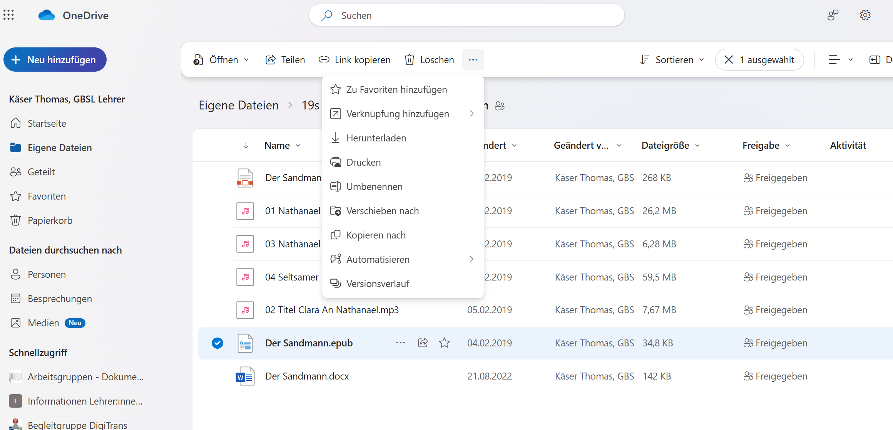

---
sidebar_custom_props:
  icon: mdiCloudSyncOutline
  path: /docs/byod/onedrive/Dateienteilen/README.md
sidebar_position: 30
draft: false
---

# Dateien teilen

Gehe auf die Schulwebseite [www.gbsl.ch](https://www.gbsl.ch), wähle __Quicklinks__ und __Office365 Login__.

Anschliessend öffnest du **OneDrive** über __⋮⋮⋮__ links oben.

Falls du noch keine Datei hast, erstelle rasch eine über __Neu hinzufügen__

Anschliessend kannst du die Datei teilen. Achte darauf, ob die Empfänger:innen die Datei bearbeiten dürfen sollen oder nicht.
Wenn du eine Datei markierst, erhältst du drei Befehle, wenn du oben im Menü auf __...__ klickst, erhältst du weitere Möglichkeiten.

Du kannst übrigens direkt aus jedem Microsoft 365-Programm eine Datei teilen, so beispielsweise aus Word. Klicke dafür auf __Freigeben__.

