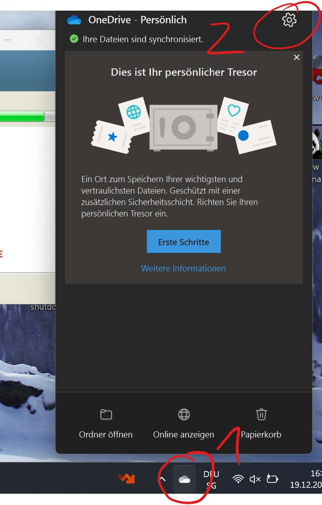
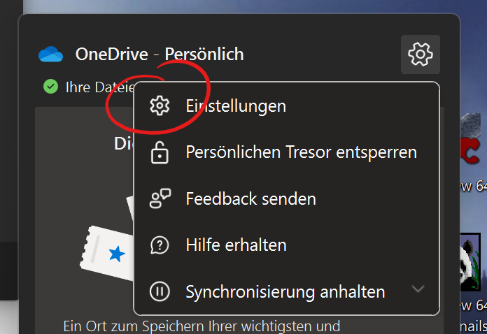
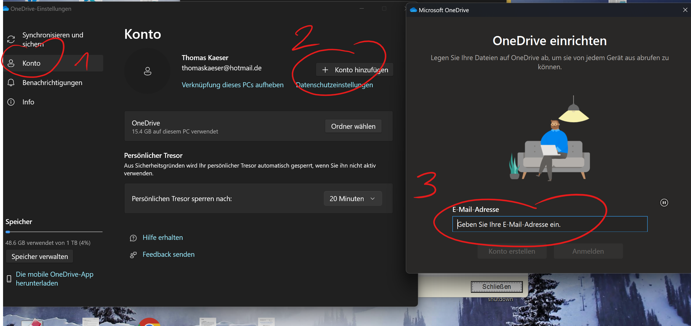

---
sidebar_custom_props:
  icon: mdiCloudCogOutline
  path: /docs/byod/onedrive/onedriveeinrichten/README.md
sidebar_position: 10
draft: true
---

# OneDrive einrichten

:::info[Ich habe noch kein OneDrive eingerichtet]
:::solution[Klicke hier]

Rufe im Browser __www.gbsl.ch__ auf, über __Quicklinks__ __Office365 Login__.
:::

:::info[Ich habe bereits ein privates (persönliches) OneDrive eingerichtet]
:::solution[Klicke hier]
Damit zwischen dem persönlichen Onedrive und dem Onedrive deines gbsl-Accountes keine Probleme entstehen, empfiehlt sich folgendes Vorgehen:
Rechtsklick Wolke, Konto, Konto hinzufüge 3 screenshots

:::

:::info[Ich habe bereits ein OneDrive einer Organisation eingerichtet]
:::solution[Klicke hier]
Onedrive deines gbsl-Accounts kannst du problemlos zusätzlich einrichten:

Rufe im Browser __www.gbsl.ch__ auf, über __Quicklinks__ __Office365 Login__.
:::

:::info[Onedrive auf dem iPhone/iPad oder dem Android-Gerät einrichten]
Die OneDrive-App ermöglicht einfachen Zugriff auf den persönlichen Datenspeicher am GBSL.
:::solution[Klicke hier]
Installiere die App direkt aus dem jewwiligen App Store:

[Microsoft OneDrive im App Store](https://apps.apple.com/us/app/microsoft-onedrive/id477537958)

oder

[Microsoft OneDrive im Play Store](https://play.google.com/store/apps/details?id=com.microsoft.skydrive&hl=de_CH)
:::
