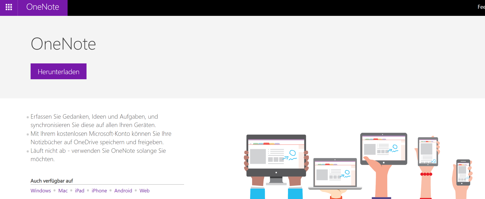
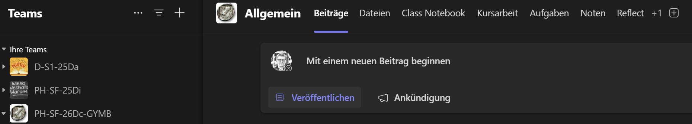

---
sidebar_custom_props:
  icon: mdi-microsoft-onedrive
  path: /docs/byod/onedrive/README.md
sidebar_position: 18
---

# OneNote

Sollte OneNote nicht schon mit office 365 installiert worden sein, kannst du es direkt über die folgende Seite installieren für dein Betriebssystem:

[https://www.onenote.com/download?omkt=de-DE](https://www.onenote.com/download?omkt=de-DE)

Du wirst OneNote aber auch über Teams verwenden können, deine Lehrer:innen werden es unterschiedlich handhaben. In Teams heisst es Class Notebook:

