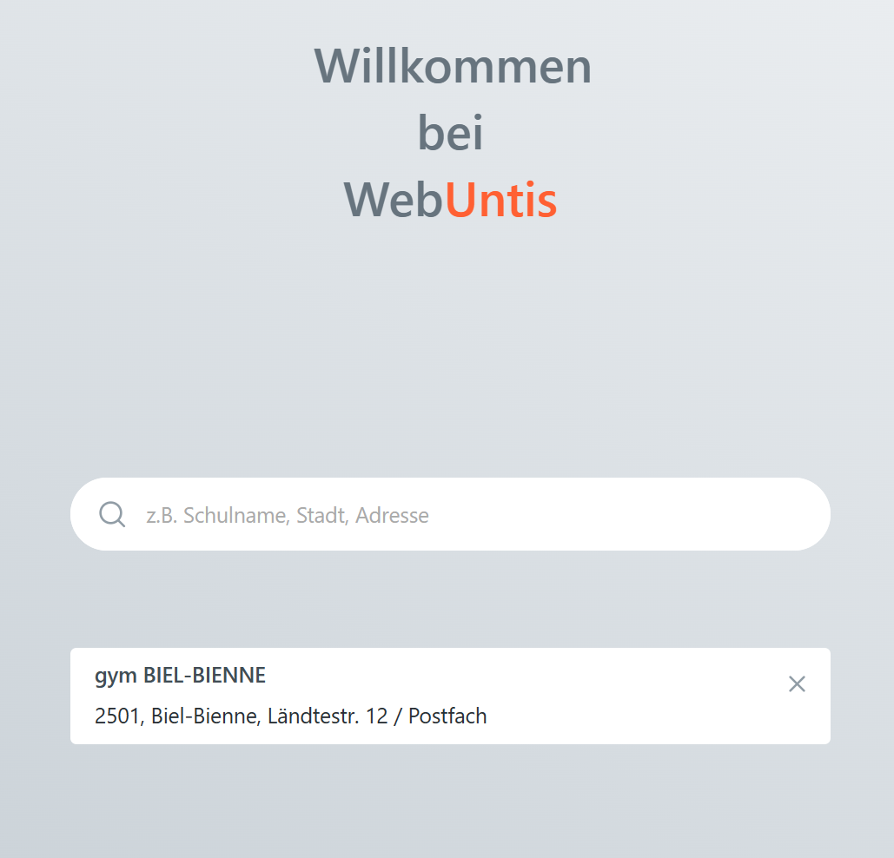

---
sidebar_custom_props:
  icon: mdi-calendar-month-outline
  source: gbsl
  path: /docs/byod/stundenplan/README.md
sidebar_label: Stundenplan
sidebar_position: 70
draft: false
---

#  Stundenplan einrichten auf dem Smartphone

:::flex

***

:::

