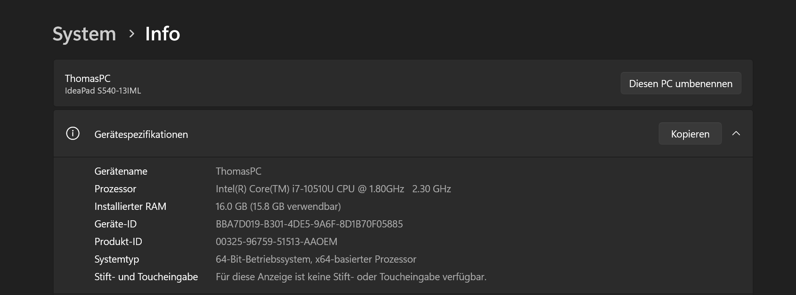

---
sidebar_custom_props:
  icon: mdi-wifi
  path: /docs/byod/teams/README.md
sidebar_position: 17
---

# Teams einrichten

Jede Klasse und jede Unterrichtsgruppe hat ein Team. Diese Teams werden in der gleichnamigen App teams verwaltet. In den Teams finden sich wichtige Informationen in den Chats und den Dateien: Termine, Aufgaben etc.

Gilt für alle Betriebssysteme: Installiere die App direkt über die folgende Seite:

[https://www.microsoft.com/de-ch/microsoft-teams/download-app?market=ch](https://www.microsoft.com/de-ch/microsoft-teams/download-app?market=ch)

Lade Teams für Beruf, Schule und Studium herunter

:::details[Klicke, falls du nicht weisst, welches Windows-Beriebssystem du hast]
Gib im Suchfenster _Version_ ein und  wähle _Ueberprüfen..._

Schau unter _Systemtyp_ nach.
:::

