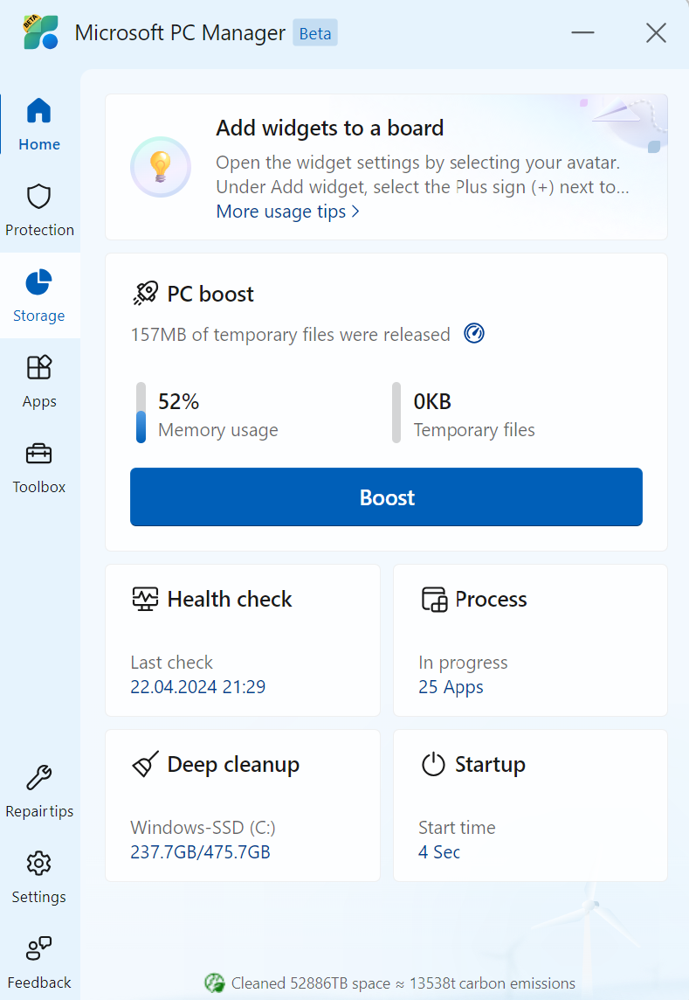
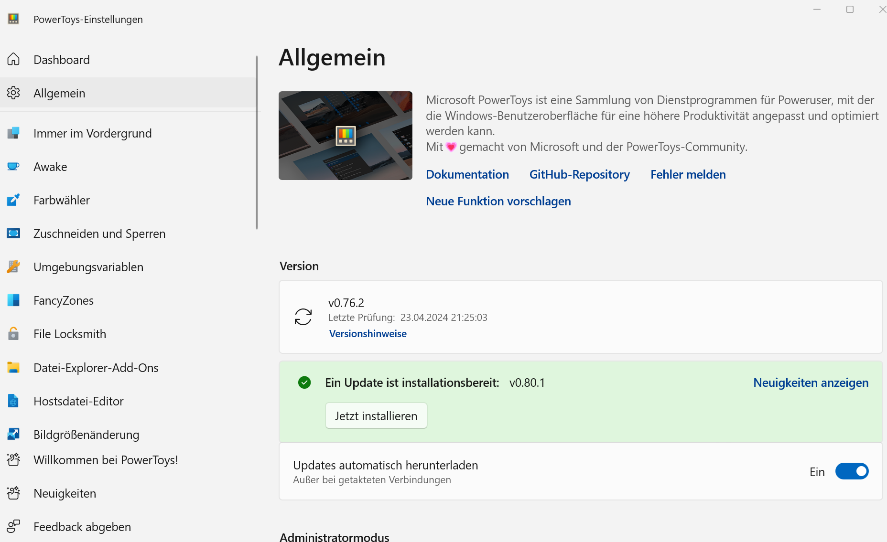

# Tools von Microsoft

Mit dem PC Manager von Microsoft lässt sich der Laptop wieder etwas "fit" machen, alte Dateien entfernen, kontrollieren, welche Apps automatisch starten etc.

Mit den PowerToys lassen sich auf einfache Weise Einstellungen anpassen, so etwa, dass der Bildschirm bei Präsentationen nicht dunkel wird.

Beide Tools kannst du über den Microsoft Store herunterladen

