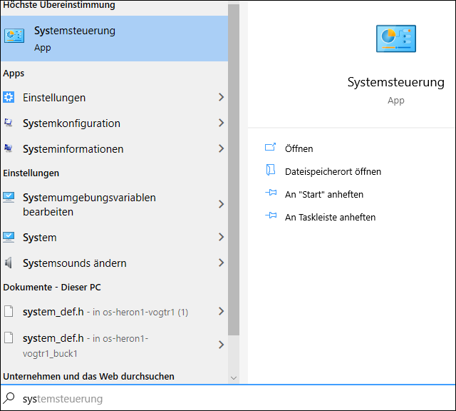
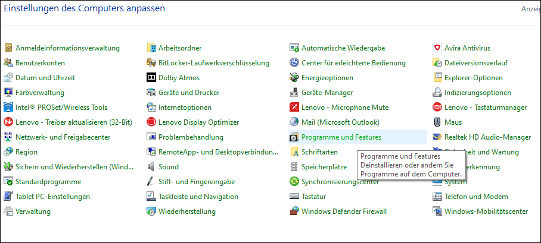
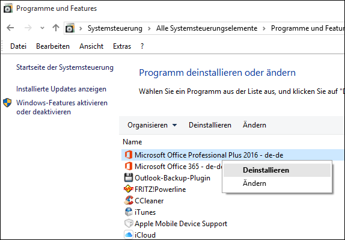
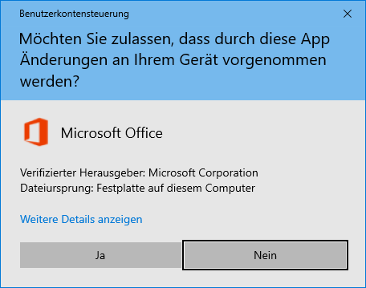
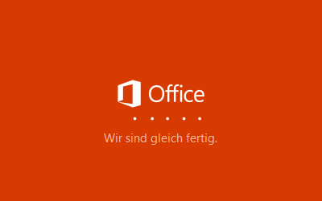
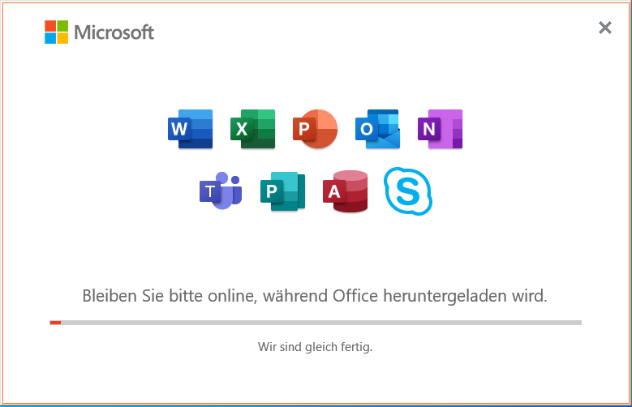

Um unsere Microsoft 365 Schul-Cloud verwenden zu können, musst du:

1. Microsoft 365 von unserer Schul-Cloud herunterladen und installieren,
2. dich mit einer 365-App (z.B. Word) an der Schul-Cloud anmelden.

## Ältere Office-Versionen deinstallieren

1. Auf den Windows Startknopf klicken

2. Auf der Tastatur _Systemsteuerung_ tippen

3. Auf die vorgeschlagene Option klicken

4. Im nun erscheinenden Fenster auf _Programme und Features_ klicken

5. Zum Programm scrollen, das deinstalliert werden soll, z.B. _Microsoft Office Professional Plus 2016_

6. Rechtsklick auf das Programm und _Deinstallieren_ anklicken

## Microsoft Office 365 installieren

Lade Microsoft 365 von der Schul-Cloud herunter und installiere es:

[Microsoft 365 Download][1]

1. Klicke auf __Ja__:

    

2. Warte.

    

3. Warte. Nun werden die Anwendungen heruntergeladen. Dazu ist eine gute Internetverbindung nötig.

    

[1]: https://portal.office.com/account#home
