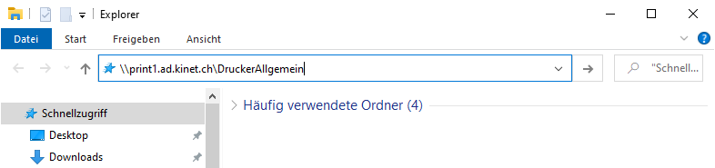
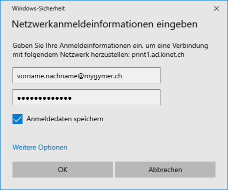
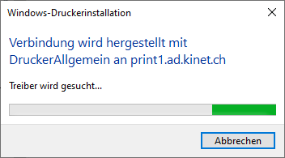
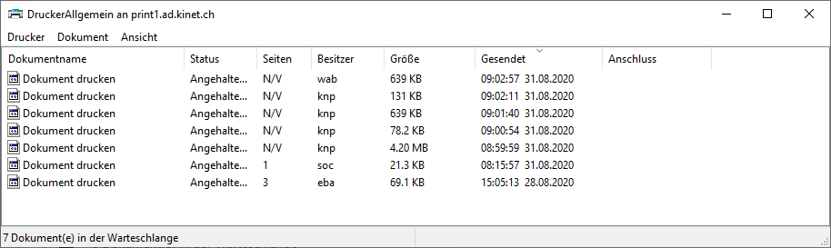
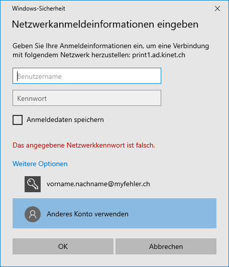
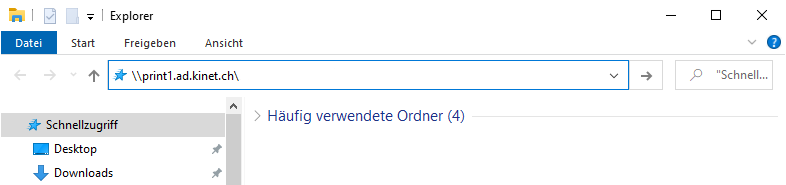
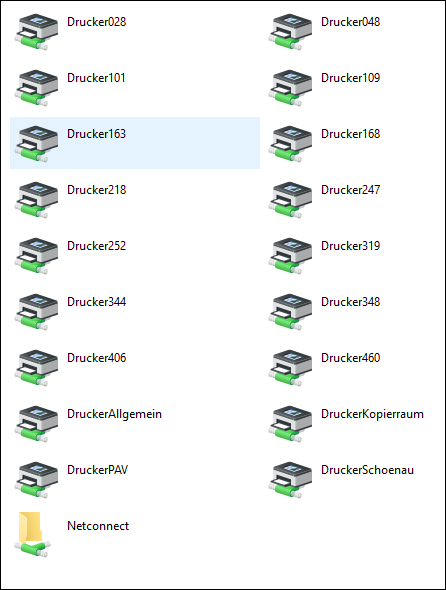
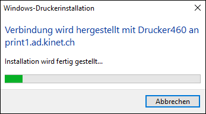
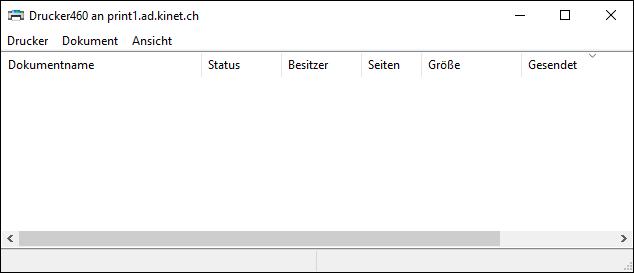

---
systems:
  - Windows
sidebar_position: 60
sidebar_custom_props:
  icon: mdi-printer
  source: gym-kirchenfeld
  path: /docs/byod/windows/drucker/README.md
---

# Drucker einrichten

## DruckerAllgemein hinzufügen

Um den Drucker einzurichten muss dein Gerät am WLAN der Schule angemeldet sein.

1. Öffne den Dateiexplorer.

2. Kopiere den Text `\\print1.ad.kinet.ch\DruckerAllgemein` und füge ihn in das Eingabefeld im Dateiexplorer ein und drücke die Eingabetaste [[:mdi-keyboard-return:]].

2. Gib deine Schul-E-Mail-Adresse und dein Passwort ein, setze das Häkchen bei _Anmeldedaten speichern_. Klicke anschliessend auf __OK__:

3. Warte bis der Druckertreiber installiert worden ist.

4. Sobald du das folgende Fenster siehst, ist der Drucker fertig installiert. Du kannst das Fenster schliessen.

## Fehlerbehebung

Falls du deine E-Mail-Adresse falsch eingegeben hast, klicke auf __Weitere Optionen__ und anschliessend auf __Anderes Konto verwenden__:

Nun kannst du die korrekte E-Mail-Adresse eingeben.

## Lehrpersonen: Fachschaftsdrucker hinzufügen

Um einen Drucker einzurichten muss dein Gerät am WLAN der Schule angemeldet sein.

1. Öffne den Dateiexplorer.

2. Kopiere den Text `\\print1.ad.kinet.ch\` und füge ihn in das Eingabefeld im Dateiexplorer ein und drücke die Eingabetaste [[:mdi-keyboard-return:]].

3. Die unterschiedlichen Drucker, die man wählen kann, erscheinen. Sie sind benannt nach dem Schema _Drucker[Zimmernummer]_.

4. Um einen Drucker zu installiere, doppelklicke auf das entsprechende Icon.

5. Warte bis der Druckertreiber installiert worden ist.

6. Sobald du das folgende Fenster siehst, ist der Drucker fertig installiert. Du kannst das Fenster schliessen.

