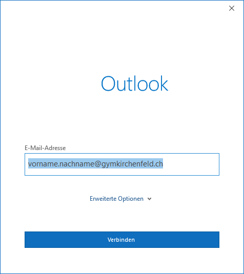
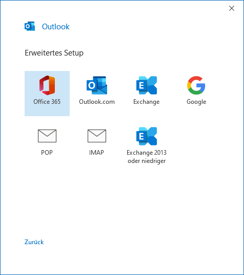
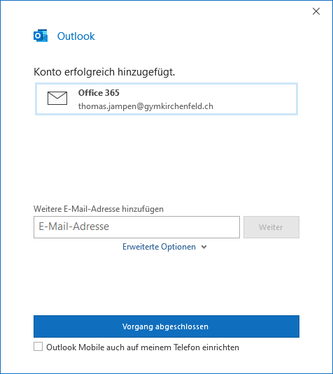

---
systems:
  - Windows
apps:
  - Microsoft Outlook
sidebar_position: 39
sidebar_custom_props:
  icon: mdi-email
  source: gym-kirchenfeld
  path: /docs/byod/windows/e-mail/README.md
draft: true
---

# E-Mail einrichten

1. Starte Outlook und melde dich mit deiner Schul-E-Mail-Adresse und deinem Passwort an:

Falls die Anmeldung nicht automatisch beim Starten von Outlook erscheint, dann gehe in Outlook oben links auf _Datei_. Klicke im Abschnitt _Informationen_ auf _Konto hinzufügen_.

2. Im nächsten Dialog wählst du _Office 365_:

Entferne den Haken bei _Outlook Mobile auch auf meinem Telefon einrichten_. Dazu kannst du die Anleitung auf dieser Webseite verwenden.

