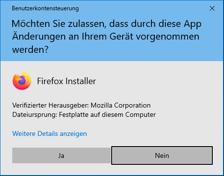
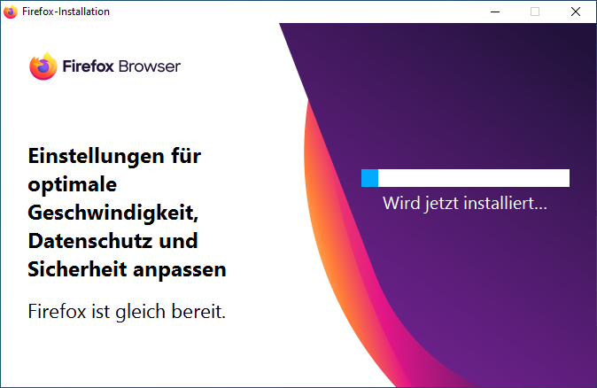
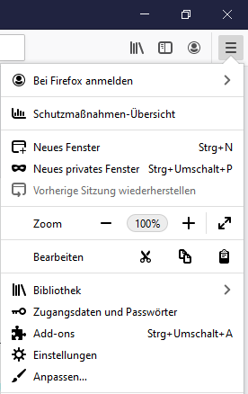
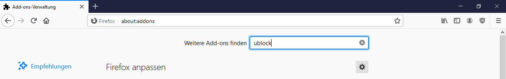
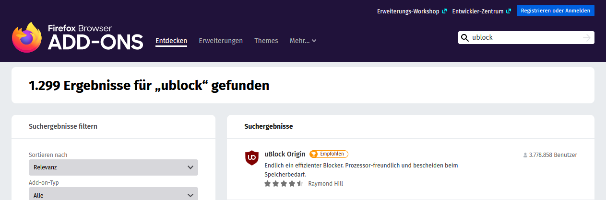
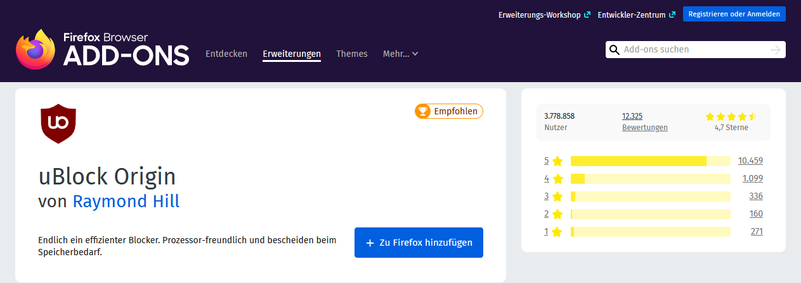
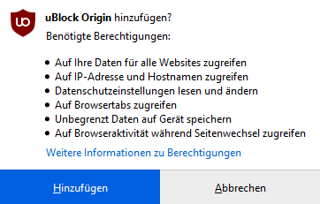

# Firefox einrichten

Wir empfehlen, auf Windows-Geräten den Firefox-Browser zu verwenden.

## Firefox installieren

1. Lade das Installationsprogramm von der offiziellen Webseite herunter:

    [Downloadseite für Firefox Browser](https://www.mozilla.org/de/firefox/new/)

2. Starte das Installationsprogramm und klicke hier auf __Ja__:

    

3. Warte bis Firefox fertig installiert worden ist:

    

## Ad-Blocker installieren

Wenn Sie beim Surfen lieber keine Werbung sehen möchten, empfehlen wir, den Ad-Blocker **uBlock Origin** zu installieren.

1. Öffne das Menü und wähle den Menüpunkt __Add-ons__ aus:

    

2. Tippe bei _Weitere Add-ons finden_ das Wort **ublock** ein und drücke die Eingabetaste [[:mdi-keyboard-return:]].

    

3. Klicke auf das Suchergebnis **uBlock Origin**:

    

4. Klicke auf __Zu Firefox hinzufügen__:

    

5. Klicke auf __Hinzufügen__:

    
