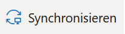
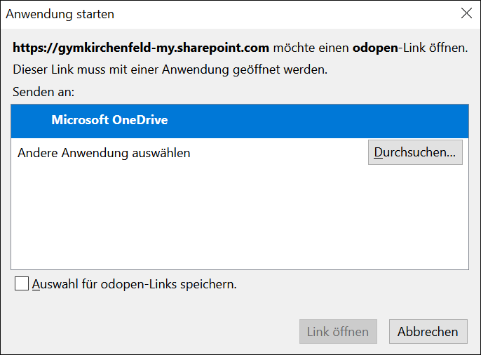
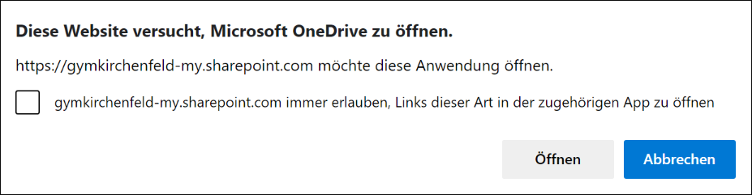
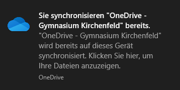
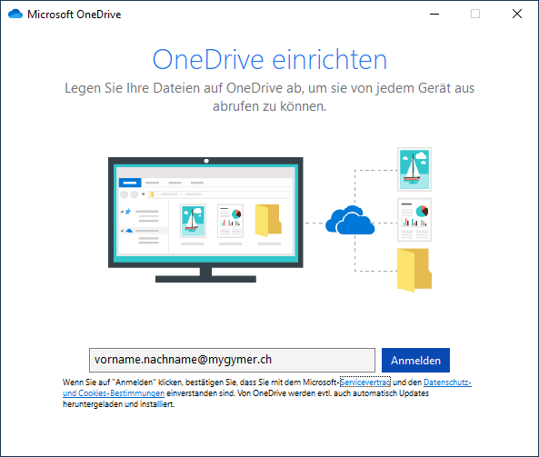
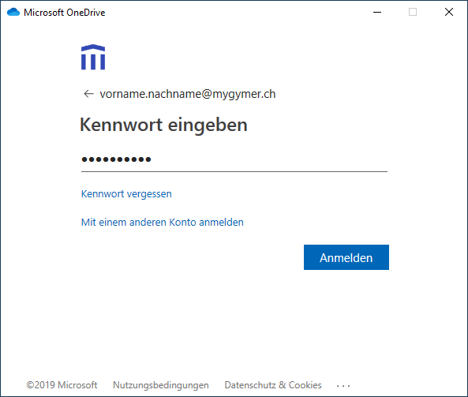
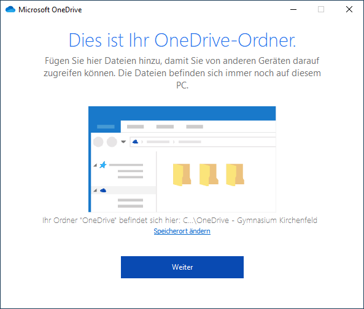
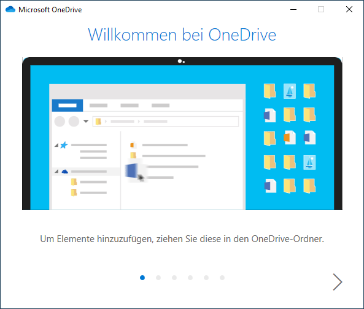
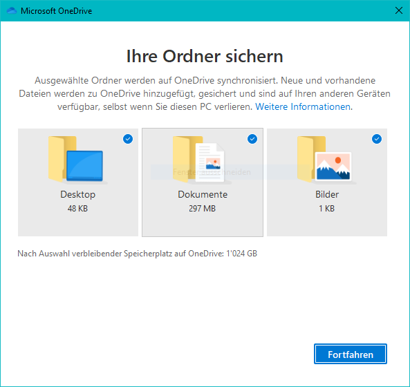
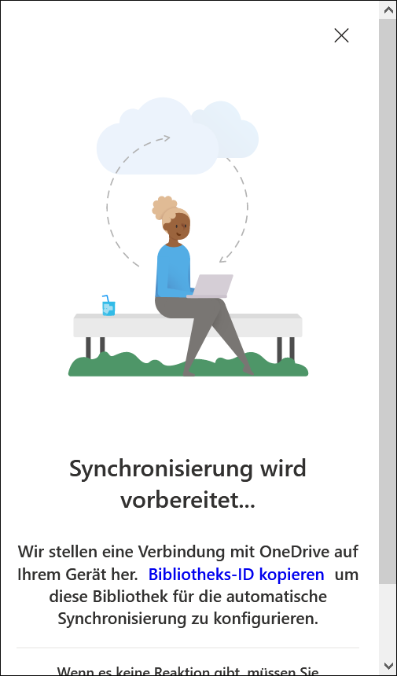

# OneDrive einrichten

Zunächst musst du in einem Internetbrowser (z.B. Firefox) über die Schul-Cloud auf OneDrive gehen. Klicke dafür folgenden Link an:

[OneDrive][1]

Oberhalb der Liste mit deinen Dateien und Ordnern befindet sich der Button __Synchronisieren__, drücke diesen:

Falls du Firefox  als Browser verwendest, erscheint das folgende Dialogfeld:

Klicke auf __Link öffnen__.

Falls du Microsoft Edge  als Browser verwendest, erscheint das folgende Dialogfeld:

Klicke auf __Öffnen__.

Falls rechts unten am Bildschirm folgendes Dialogfeld erscheint, ist dein OneDrive bereits synchronisiert und du brauchst nichts weiter zu machen:

Andernfalls erscheint das folgende Fenster, in welchem du deine Schul-E-Mail-Adresse eingibst und anschliessend auf __Anmelden__ klickst:

Im nächsten Schritt gibst du das Passwort ein und klickst auf __Anmelden__:

Wenn die folgende Meldung erscheint, war die Anmeldung erfolgreich:

Hier kannst du den lokalen Speicherort für die Cloud-Synchronisation ändern. Normalerweise klickst du hier einfach auf __Weiter__. Nun erscheint das folgende Fenster:

Auf die Nachfrage, ob der _Desktop_ und die Ordner _Dokumente_ und _Bilder_ synchronisiert werden sollen, bei diesen Ordnern **das Häkchen entfernen**. Diese Ordner sollen **nicht** synchronisiert werden. 

Dies bedeutet, dass du die Synchronisation erfolgreich eingerichtet hast. Die kurze Einführung in OneDrive kannst du lesen oder sofort schliessen.

In deinem Browser wird ausserdem folgendes Fenster angezeigt:

Dieses kannst du ebenfalls schliessen.

[1]: https://gymkirchenfeld-my.sharepoint.com/
