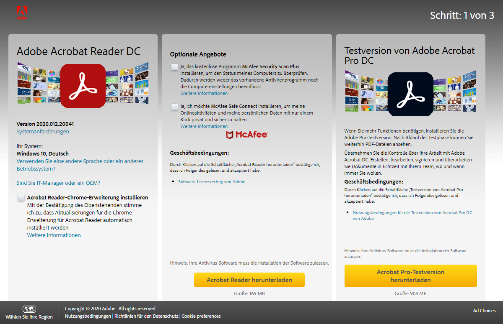
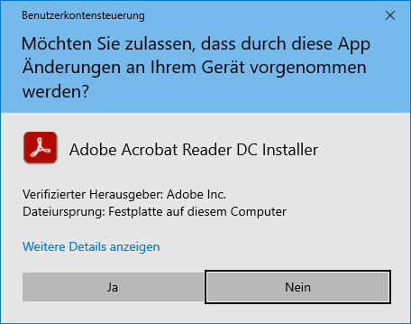
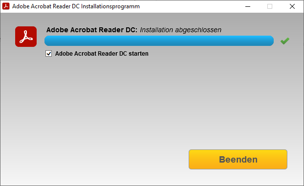
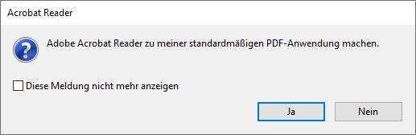

# Acrobat Reader einrichten

Wir empfehlen, den Adobe Reader zu installieren, um bequem **PDF-Dokumente** und **E-Books** lesen und mit Notizen zu versehen zu können.

## Acrobat Reader installieren

1. Öffne die Download-Seite für den Acrobat Reader und lade das Installationsprogramm herunter:

   - [Downloadseite für Adobe Acrobat Reader](https://get.adobe.com/reader/)

2. Stelle sicher, dass **keine Häkchen** gesetzt sind und klicke auf **Acrobat Reader herunterladen**.

   

3. Starte das Installationsprogramm. Klicke hier auf **Ja**:

   

4. Warte, bis die Installation fertig ist und klicke auf **Beenden**.

   

5. Beim ersten Start erscheint die folgende Meldung. Klicke auf **Ja**:

   
