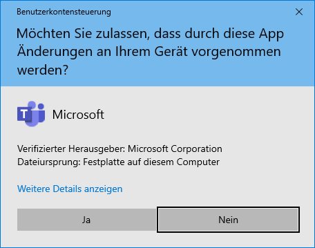

Um Microsoft Teams auf deinem Windows-Laptop einzurichten, musst du:

1. Microsoft Teams herunterladen und installieren,
2. dich mit Teams an unserer Schul-Cloud anmelden,
3. in Teams in die Listenansicht wechseln.

## Teams installieren

Lade Microsoft Teams von dieser Webseite herunter und installiere es:

[Microsoft Teams Download](https://www.microsoft.com/de-ch/microsoft-365/microsoft-teams/download-app)

Warte einfach, bis Microsoft Teams fertig installiert worden ist:

## Anmelden

1. Gib deine Schul-E-Mail-Adresse ein und klicke auf __Anmelden__:

    

2. Gib dein Kennwort ein und klicke auf __Anmelden__:

    

3. Es kann sein, dass Teams beim ersten Start die folgende Meldung anzeigt. Hier will Teams eine zusätzliche Installation vornehmen, um den Teams-Chat in Office zu integrieren. Klicke auf __Los&nbsp;geht's!__:

    

4. Klicke auf __Ja__:

    

## Layout anpassen

siehe https://ict.mygymer.ch/verwenden/teams/allgemein/