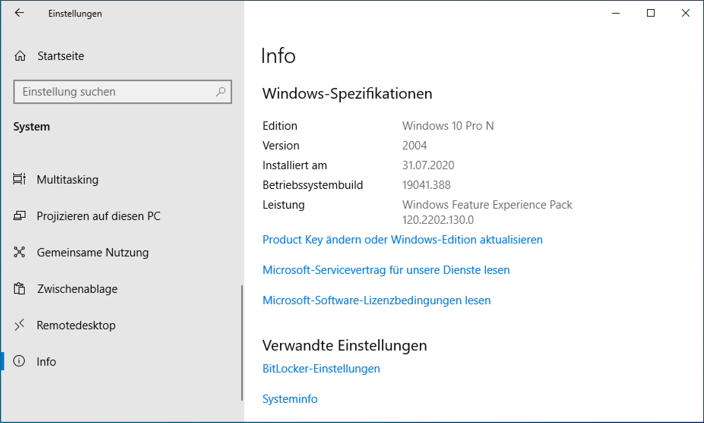
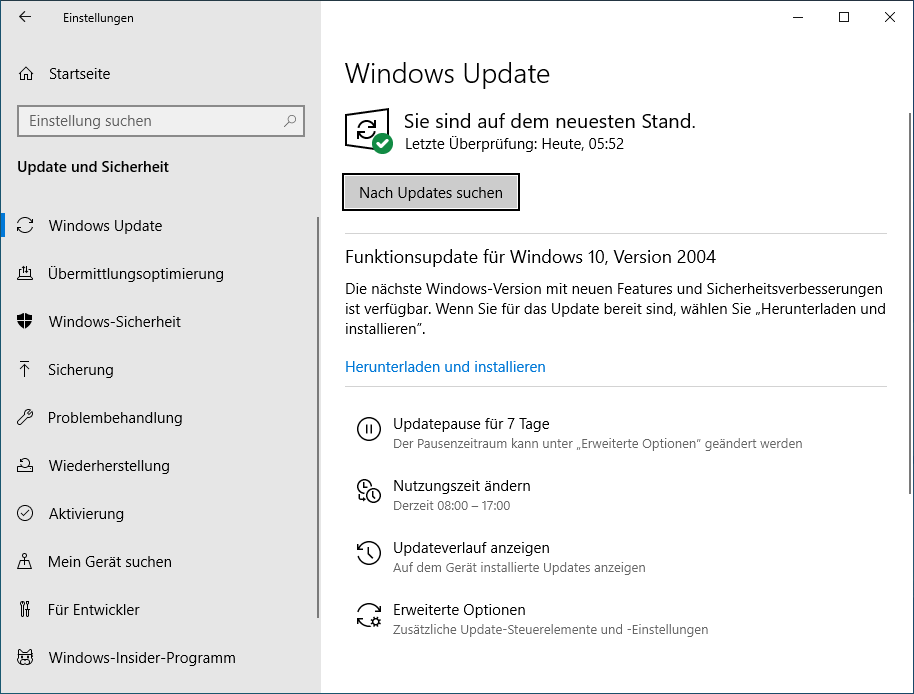

---
systems:
  - Windows
sidebar_custom_props:
  icon: mdi-microsoft-windows
  source: gym-kirchenfeld
  path: /docs/byod/windows/updates/README.md
draft: false
---

# Windows-Updates

Das Betriebssystem und wichtige Apps sollte unbedingt auf dem neuesten Stand gehalten werden, um die Sicherheit zu gewährleisten.

## Betriebssystem-Version überprüfen

1. Öffne die Systemeinstellungen und wähle _System_.
2. Wähle links im Menü ganz unten den Menüpunkt __:mdi[informationOutline] Info__.
3. Überprüfe folgendes:

    - Bei _Edition_ steht **Windows 10**.
    - Bei _Version_ steht **20H2**.

:::tip
Die Version setzt sich aus Jahr und Halbjahr geplanten Veröffentlichung zusammen. Version 20H2 bedeutet, dass es sich um die Version vom 2. Halbjahr 2020 handelt.
:::

## Funktionsupdates installieren

1. Öffne die Systemeinstellungen und wähle _Updates & Sicherheit_.
2. Wähle links im Menü ganz oben den Menüpunkt __:mdi[autorenew] Windows&nbsp;Update__.
3. Überprüfe, ob ein Funktionsupdate zur Installation bereit steht. Falls ja, klicke auf __Herunterladen&nbsp;und&nbsp;installieren__.

## Weitere Updates installieren

1. Öffne die Systemeinstellungen und wähle _Updates & Sicherheit_.
2. Wähle links im Menü ganz oben den Menüpunkt __Windows Update__.
3. Überprüfe, ob Updates zur Installation bereit stehen. Falls ja, starte den Computer neu, damit die Updates installiert werden.
