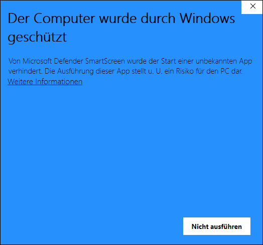
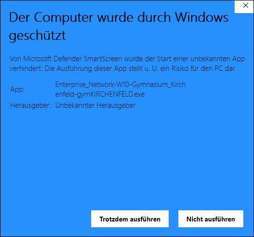
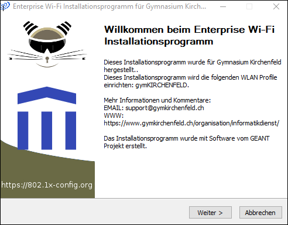
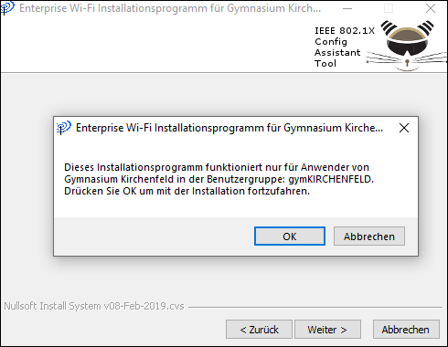
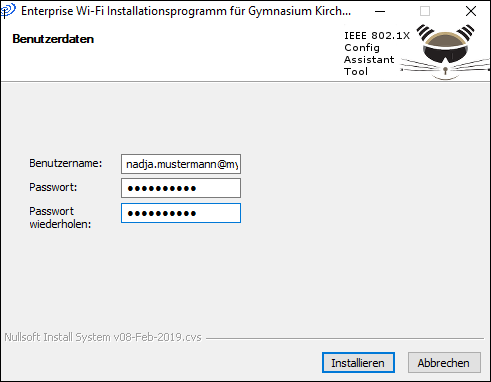
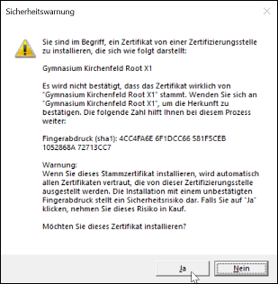
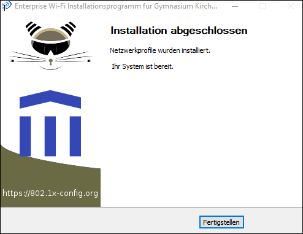

# WLAN einrichten

## Automatische Konfiguration (empfohlen)

Um unser WLAN auf deinem Windows-Gerät zu konfigurieren, verwendest du am besten das Konfigurationsprogramm, welches hier heruntergeladen werden kann:

[:mdi-download: WLAN-Konfigurationsprogramm für Windows 10 (neues WLAN gymKIRCHENFELD)][1]

[1]: https://enterprise-wifi.net/user/API.php?action=downloadInstaller&api_version=2&lang=de&device=w10&profile=332

:::warning E-Mail-Adresse
Beim neuen Netzwerk __gymKIRCHENFELD__ bitte die **Schul-E-Mail-Adresse** in das Feld __Benutzername__ eintragen!
:::

1. Starte das heruntergeladene Programm. Klicke bei dieser Meldung __Weitere Informationen__:

2. Klicke auf __Trotzdem ausführen__:

3. Klicke auf __Weiter__:

4. Klicke auf __OK__:

5. Gib deine Schul-E-Mail-Adresse (_vorname.nachname@mygymer.ch_ oder _vorname.nachname@gymkirchenfeld.ch_) und zweimal dein Passwort ein und klicke auf __Installieren__:

6. Klicke auf __Ja__:

7. Klicke auf __Fertigstellen__:

