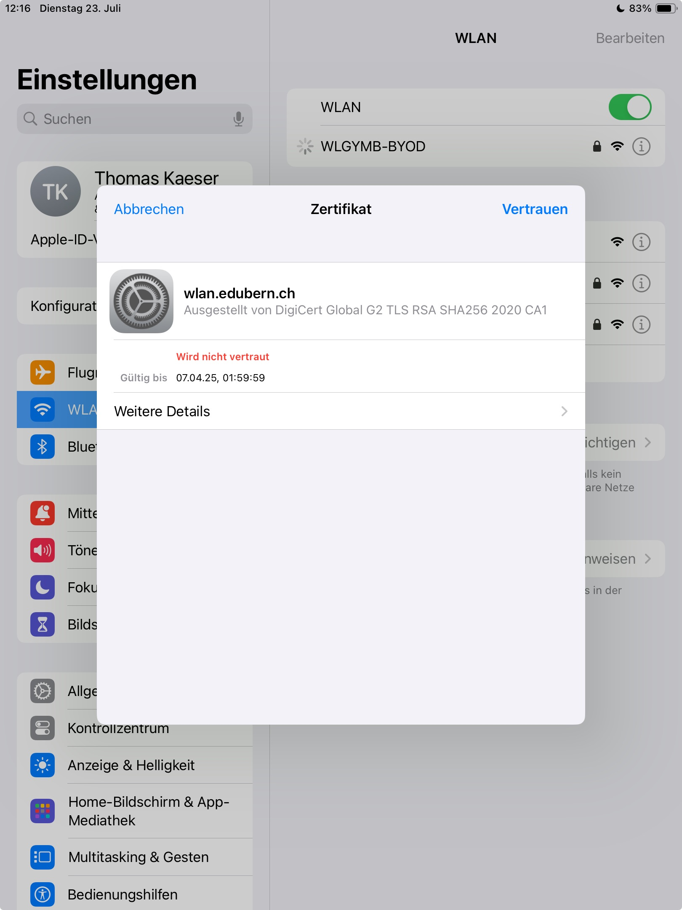

# Configurer le réseau Wi-Fi

<Tabs groupId="os" queryString>
  <TabItem value="win" label="Windows">
  Cliquez sur l'icône Wi-Fi dans la barre des tâches en bas, puis sélectionnez le réseau Wi-Fi __WLGYMB-BYOD__. Connectez-vous à ce réseau, ignorez l'avertissement concernant le certificat et connectez-vous avec votre adresse e-mail et votre mot de passe.

  :::details[Impossible de se connecter ou pas d'accès Internet ?]
    Tapez __Paramètres Wi-Fi__ dans la barre de recherche et vérifiez les paramètres suivants :
    
  :::
  </TabItem>
  
  <TabItem value="osx" label="Mac OS">
  Cliquez sur l'icône Wi-Fi en haut, puis sélectionnez le réseau Wi-Fi __WLGYMB-BYOD__. Connectez-vous à ce réseau, ignorez l'avertissement concernant le certificat et connectez-vous avec votre adresse e-mail et votre mot de passe.  
  :::details[Aucun accès Internet malgré la connexion Wi-Fi ?]
    1. Installez (à domicile ou via un hotspot) un autre navigateur (Chrome, Opera, Edge) pour accéder à Internet à l'école.
    2. Vérifiez si vous avez un abonnement iCloud+ et si __Private Relay__ est activé :

    Cliquez sur le menu Apple __:mdi[apple]__, sélectionnez __Réglages système__. Cliquez ensuite sur votre nom en haut de la barre latérale, puis sur __iCloud__. Ensuite, cliquez sur __Private Relay__.
    
    Désactivez-le.
  :::

:::details[Qu'est-ce que Private Relay et pourquoi cela pose-t-il problème ? Une solution élégante]
**Private Relay**  
Vous protège des attaques sur Internet en masquant votre identité et vos requêtes. Cela est utile sur un réseau domestique, mais moins dans des réseaux bien sécurisés où l'identité contribue à renforcer la sécurité.

**Meilleure solution**  
La meilleure solution consiste à désactiver __Private Relay__ uniquement pour le réseau Wi-Fi BYOD, tout en restant protégé sur d'autres réseaux :

Cliquez sur le menu Apple __:mdi[apple]__, sélectionnez __Réglages système__. Dans la barre latérale, allez sur __Réseau__, puis sélectionnez __Wi-Fi-BYOD__ sur la droite. Cliquez sur l'icône __:mdi[informationOutline]__.

Enfin, désactivez l'option __Limiter le suivi de l'adresse IP__.

:::
</TabItem>

  <TabItem value="ios" label="iOS">
Allez dans __Réglages__ __Wi-Fi__ et connectez-vous au réseau __WLGYMB-Byod__. Lorsque l'on vous demande de __Certificat__, cliquez sur __Faire confiance__, puis connectez-vous avec votre adresse e-mail et votre mot de passe.

:::details[Cliquez ici si vous ne pouvez pas vous connecter à WLGYMB-Byod ou si vous n'avez pas d'accès Internet.]

Vérifiez les paramètres suivants :

- Configuration de l'adresse IP : automatique
- Configuration DNS : automatique
- Configuration du proxy : désactivée

Si vos paramètres diffèrent, ajustez-les.

Vérifiez également le VPN : __Réglages__ __Général__, faites défiler vers le bas jusqu'à VPN et gestion des appareils.

Aucun VPN ne doit être connecté et aucun compte professionnel ou scolaire ne doit être configuré.
:::

  </TabItem>

  <TabItem value="android" label="Android">
    Ouvrez les paramètres de votre appareil et accédez à Wi-Fi. Sélectionnez le réseau __WLGYMB-BYOD__.
    
    Saisissez les paramètres suivants et connectez-vous avec votre adresse e-mail et votre mot de passe :
  
:::details[Cliquez ici si vous ne pouvez pas vous connecter à WLGYMB-Byod.]
Saisissez les paramètres suivants et connectez-vous avec votre adresse e-mail et votre mot de passe :

:::
  </TabItem>
</Tabs>
