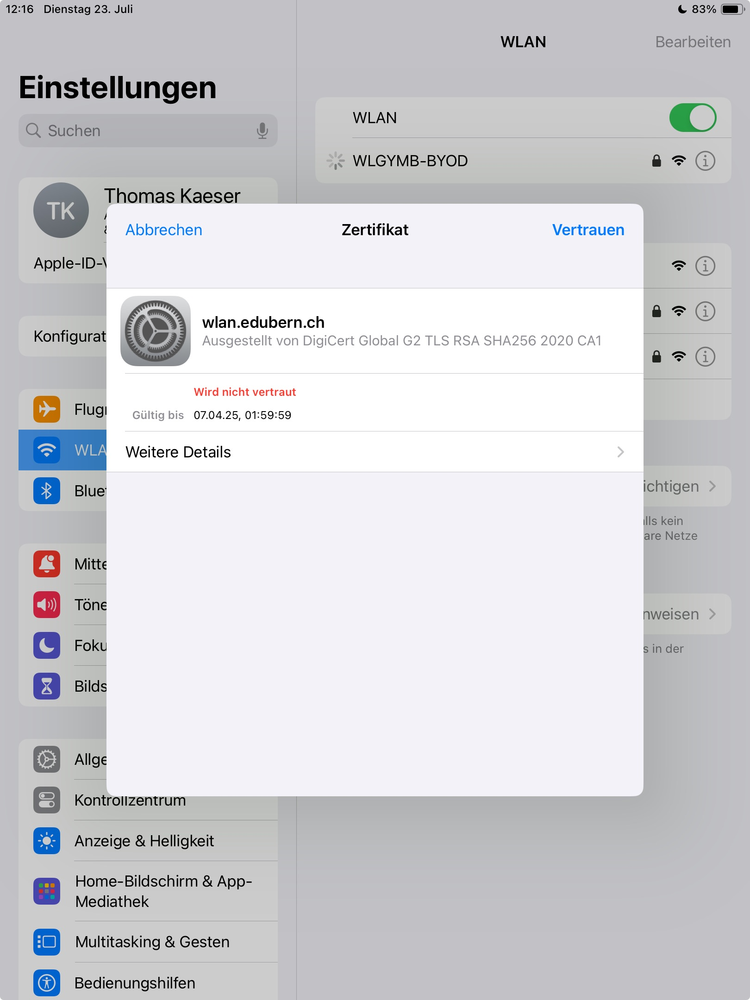
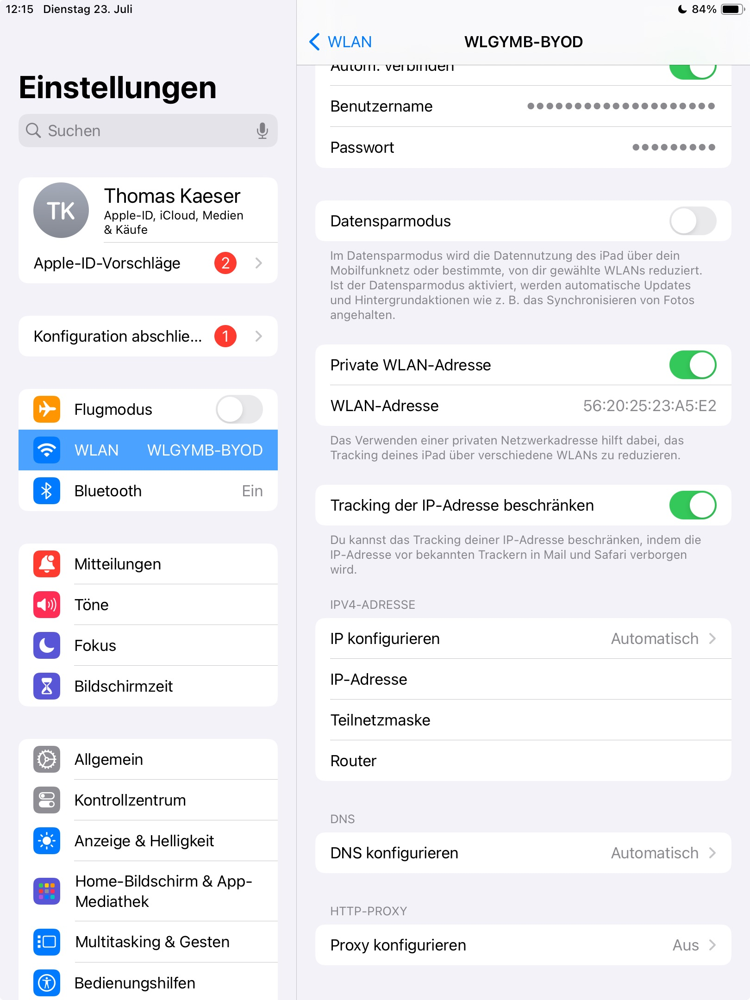
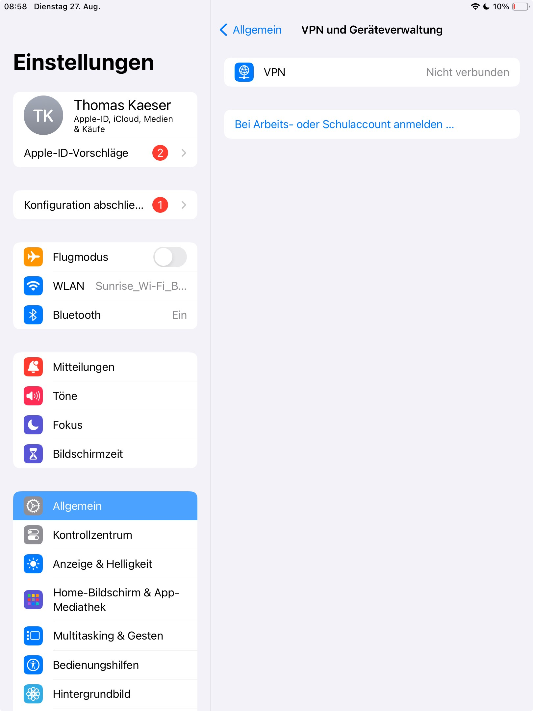

---
sidebar_custom_props:
  icon: mdi-wifi
  path: /docs/byod/wlan/README.md
sidebar_position: 17
---

# WLAN einrichten

<Tabs>
  <TabItem value="win" label="Windows">
  Klicke in der Taskleiste unten auf das WLAN-Symbol und wähle das WLAN __WLGYMB-BYOD__ aus. Verbinde dich mit diesem Netzwerk, ignoriere die die Meldung über das Zertifikat und melde dich mit Mailadresse und Passwort an.
  :::details[Klicke, wenn du dich nicht verbinden kannst oder du keine Internetverbindung bekommst]
  Gib __WLAN-Einstellungen__ im Suchfeld ein und kontrolliere die folgenden Einstellungen

:::
  </TabItem>
  <TabItem value="osx" label="Mac OS">
Klicke oben auf das WLAN-Symbol und wähle das WLAN __WLGYMB-BYOD__ aus. Verbinde dich mit diesem Netzwerk, ignoriere die die Meldung über das Zertifikat und melde dich mit Mailadresse und Passwort an.  
:::details[Klicke, wenn du trotz WLAN-Verbindung keine Internetseite öffnen kannst.]
1. Kontrolliere, ob du mit einem andern Browser als Safari ins Internet kommst. Wenn ja, so kannst du diesen in der Schule benutzen.
2. Kontrolliere, ob du ein iCloud+-Abo hast und __Privat-Relay__ eingeschaltet ist:

Klicke auf das Apple-Menü __:mdi[apple]__, wähle __Systemeinstellungen__ . Klicke dann oben in der Seitenleiste auf „[dein Name]“ und anschließend auf __iCloud__. Klicke anschliessend auf __Privat-Relay__.

Schalte es aus.
:::

:::details[Was ist Private-Relay und wieso gibt es Probleme?- Eine elegante Lösung]
Private-Relay schützt dich vor Angriffen aus dem Internet, indem es deine Identität verbirgt und deine Anfragen versteckt. Das macht durchaus Sinn etwa im WLAN daheim, aber nicht in gut gesicherten Netzwerken, weil in diesen gerade mit der Kontrolle der Identität die Sicherheit erhöht wird.

Die beste Lösung besteht darin, __Private-Relay__ nur für das BYOD-WLAN auszuschalten, so bist du weiterhin auch in den einfacheren Netzwerken gut geschützt:

Klicke auf das Apple-Menü __:mdi[apple]__, wähle __Systemeinstellungen__ . Klicke in der Seitenleiste auf __Netzwerk__ und anschiessend auf der rechten Seite __WLAN-BYOD__, Klicke auf die __:mdi[informationOutline]__.

Deaktiviere zum Schluss die Option __Tracking der IP-Adresse beschränken__.

:::
</TabItem>

  <TabItem value="ios" label="iOS">
Gehe zu __Einstellungen__ __WLAN__ und verbinde dich mit __WLGYMB-Byod__ und bei __Zertifikat__ klickst du auf __Vertrauen__ und melde dich mit Mailadresse und Passwort an.

:::details[Klicke, falls du keine Verbindung mit WLGYMB-Byod herstellen kannst oder keine Internetverbindung erhältst.]

Kontrolliere folgendes:

- IP Konfigurieren: automatisch
- DNS Konfigurieren: automatisch
- Proxy konfigurieren: aus

Weichen deine Einstellungen davon ab, so ändere sie.

Kontrolliere auch VPN: __Einstellungen__ __Allgemein__ runterscrollen zu VPN und Geräteverwaltung.

Hier darf weder VPN verbunden noch ein Arbeits- oder Schulaccount eingerichtet sein.
:::

  </TabItem>

  <TabItem value="android" label="Android">
    Anleitung Android
  </TabItem>
</Tabs>
