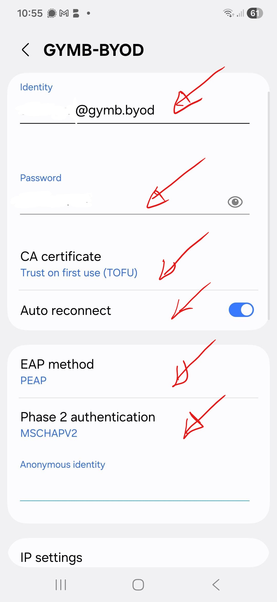
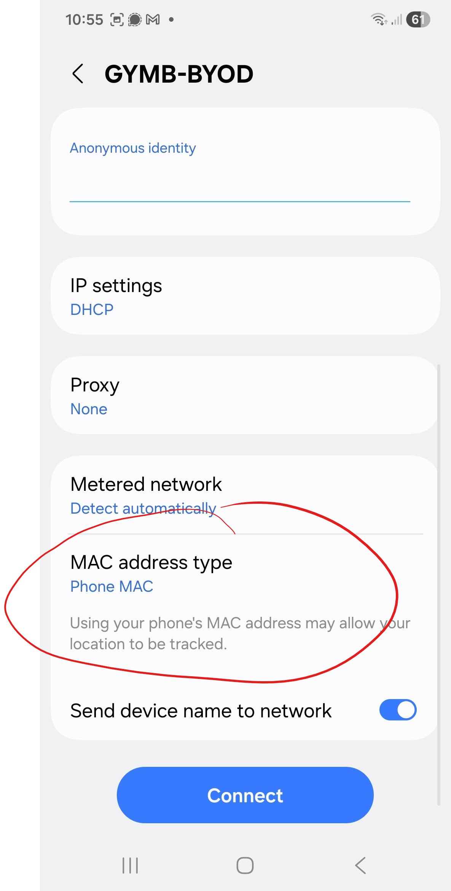
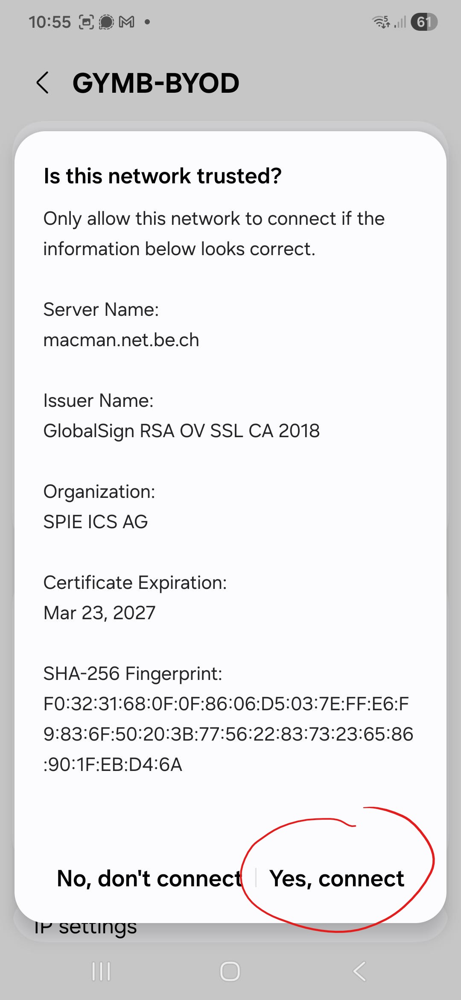

---
sidebar_custom_props:
  icon: mdi-wifi
  path: /docs/byod/wlan/README.md
sidebar_position: 17
---

# Wechsel des WLAN-Netzwerkes

:::danger
Für das neue WLAN musst du in die Sicherheitseinstellungen deiner Geräte eingreifen. Es ist von Vorteil, wenn du verstehst , warum was gemacht werden muss. Aus diesem Grund findest du hier Infoboxen, die du anklicken kannst.
:::

:::details[Wieso ist ein Wechsel nötig?]
    Die bisherige Anmeldung mit E-Mail und Passwort entspricht nicht mehr den heutigen Sicherheitsanforderungen, Mailadresse und Passwort können gestohlen werden, ohne dass man es bemerkt. Aus diesem Grund benutzt das neue WLAN auch die Identität der Geräte, die sich verbinden. Dass das Gerät gestohlen worden ist, bemerkt man ja.
  :::

  :::details[Was ist die MAC-Adresse? Was der Gerätename?]
Die MAC-Adresse hat nichts mit Macbooks zu tun, sondern ist eine Abkürzung für *Media Access Control*, und ist eine weltweit eindeutige Hardware-Adresse eines Netzwerkadapters, die im Chip fest verbaut ist. In Netzwerken wird sie zur Identifizierung von Geräten verwendet.

Der Gerätename kann frei vergeben werden, er eignet sich also nicht für eine eindeutige Identifizierung. Wenn du dich mit dem Beamer verbindest, siehst du meist den Namen deines Laptops.
  :::

  :::details[Muss ich das Tracking meiner WLAN-Adresse im Wlan der Schule __GYMB-BYOD__ erlauben? Was bedeutet das?]
Ja, die Sicherheitsanforderungen im WLAN der Schule erfordern das. Das Tracking ermöglicht festzustellen, welches Gerät in welchem Zimmer beim jeweiligen Accesspoint angemeldet ist.
  :::

  :::details[Ist mein Gerät nicht gefährdet, wenn ich Sicherheitseinstellungen deaktiviere?]
Nein, wenn du die Anleitungen klar befolgst, schaltest du die Sicherheitseinstellung nur für das __GYMB-BYOD__ aus. Das ist ungefährlich, weil das Schul-WLAN sehr gut gegen aussen geschützt ist. Das ist aber bei öffentlichen WLANs (Hotel, Restaurant, Bahnho, Zug etc.) nicht der Fall und in diesen solltest du dich schützen. Wir empfehlen alle WLANs in den Einstellgungen zu kontrollieren auf die Sicherheitseinstellungen hin. Wie das geht, liest du in den Anleitungen unten.
  :::

## Anleitungen

Es wird empfohlen die erstmalige Anmeldung mit dem Laptop durchzuführen.

<Tabs groupId="os" queryString>
  <TabItem value="win" label="Windows">
  Klicke in der Taskleiste unten auf das WLAN-Symbol und wähle das WLAN __WLGYMB-BYOD__ aus. Verbinde dich mit diesem Netzwerk, ignoriere die die Meldung über das Zertifikat und melde dich mit Mailadresse und Passwort an.

  :::details[Keine Verbindung möglich oder kein Internetzugang?]
    Gib __WLAN-Einstellungen__ im Suchfeld ein und kontrolliere die folgenden Einstellungen
    
  :::
  </TabItem>
  <TabItem value="osx" label="Mac OS">
Klicke oben rechts auf :mdi[wifi] → unten auf __WLAN Einstellungen__  

Im neuen Fenster kannst du nun bei allen WLANs die Einstellungen kontrollieren und ändern

→ bei __GYMB-BYOD__ auf «Details» oder ⓘ klicken

→ im Menu «Private WLAN-Adresse» auf «Aus» stellen. Deaktiviere ebenfalls die Option __Tracking der IP-Adresse beschränken__.

Verbinde dich mit diesem Netzwerk mit Username und Passwort, die du in Onway Director erhalten hast. Die folgende Fehlermeldung kannst du ignorieren, sie bestätigt dir, dass du die private WLAN-Adresse korrekt ausgeschaltet hast.

Wenn du zu Schritt 1 zurück gehst, kannst du nun alle deine WLANs auf die Sicherheitseinstellung kontrollieren. Die «Private WLAN-Adresse» sollte auf "Statisch" oder "Rotierend" eingestellt sein.
</TabItem>

  <TabItem value="ios" label="iOS">
Gehe zu __Einstellungen__  wähle __Andere Netzwerke__, dann klickst du bei __GYMB-BYOD__ auf ⓘ

__Private WLAN-Adresse__ stellst du auf __Aus__ und bestätigst das im nächsten Fenster

Danach verbindest du dich mit diesem Netzwerk und bestätigst das Zertifikat.

  </TabItem>

  <TabItem value="android" label="Android">
    Öffne auf deinem Gerät die Einstellungen und klicke unter WLAN auf das Netzwerk __GYMB-BYOD__.
    
    Gib folgende Einstellungen ein und melde dich mit Username und Passwort an, die du auf dem Onway Director Portal erhalten hast. Untenstehend Screenshots der nötigen Schritte von einem Samsung und einem Google Pixel.

  :::details[Google Pixel]

  :::

  :::details[Samsung Phone]

Scrolle nach unten:

  :::

  </TabItem>
</Tabs>
