---
sidebar_custom_props:
  icon: mdi-wifi
  path: /docs/byod/wlan/README.md
sidebar_position: 17
---

# Einrichten des WLAN-Netzwerkes
**Von WLGYMB-BYOD zu GYMB-BYOD**

:::danger[Achtung]
Du musst dich im WLAN **BEGuest** in der Schule (mit einem Hotspot geht das nicht) mit deiner Schulmailadresse und deinem Passwort auf einem Portal einloggen. Dort erhältst du einen neuen Usernamen und ein neues Passwort, mit denen du dich im WLAN **GYMB-BYOD** anmelden musst. Diese sind nun für das WLAN deine Anmeldedaten.
:::

:::warning
Für das Schul-WLAN musst du in die Sicherheitseinstellungen deiner Geräte eingreifen. Es ist von Vorteil, wenn du verstehst , warum was gemacht werden muss. Aus diesem Grund findest du hier Infoboxen, die du anklicken kannst.
:::

:::details[Sicherheitseinstellungen]
Eine Anmeldung mit E-Mail und Passwort entspricht nicht mehr den heutigen Sicherheitsanforderungen, Mailadresse und Passwort können gestohlen werden, ohne dass man es bemerkt. Aus diesem Grund benutzt das Schul-WLAN auch die Identität der Geräte, die sich verbinden.
:::

  :::details[Was ist die MAC-Adresse? Was der Gerätename?]
Die MAC-Adresse hat nichts mit Macbooks zu tun, sondern ist eine Abkürzung für *Media Access Control*, und ist eine weltweit eindeutige Hardware-Adresse eines Netzwerkadapters, die im Chip fest verbaut ist. In Netzwerken wird sie zur Identifizierung von Geräten verwendet.

Der Gerätename kann frei vergeben werden, er eignet sich also nicht für eine eindeutige Identifizierung. Wenn du dich mit dem Beamer verbindest, siehst du meist den Namen deines Laptops.
  :::

  :::details[Muss ich das Tracking meiner WLAN-Adresse im Wlan der Schule __GYMB-BYOD__ erlauben? Was bedeutet das?]
Ja, die Sicherheitsanforderungen im WLAN der Schule erfordern das. Das Tracking ermöglicht festzustellen, welches Gerät in welchem Zimmer beim jeweiligen Accesspoint angemeldet ist.
  :::

  :::details[Ist mein Gerät nicht gefährdet, wenn ich Sicherheitseinstellungen deaktiviere?]
Nein, wenn du die Anleitungen klar befolgst, schaltest du die Sicherheitseinstellung nur für das __GYMB-BYOD__ aus. Das ist ungefährlich, weil das Schul-WLAN sehr gut gegen aussen geschützt ist. Das ist aber bei öffentlichen WLANs (Hotel, Restaurant, Bahnho, Zug etc.) nicht der Fall und in diesen solltest du dich schützen. Wir empfehlen alle WLANs in den Einstellgungen zu kontrollieren auf die Sicherheitseinstellungen hin. Wie das geht, liest du in den Anleitungen unten.
  :::

## Anleitungen

Es wird empfohlen die erstmalige Anmeldung mit dem Laptop durchzuführen.

Die Anmeldung ins WLAN der Schule erfolgt über das __Onway Director Portal__. Die Anmeldung kann nur im WLAN der Schule erfolgen.

Deshalb must du dich mit dem WLAN  __BEGuest__ verbinden.

Danach gibst du im Browser folgende Adresse ein: https://onwaydirector.be.ch/n/login

Anschliessend erscheint die Startseite von __Onway Director__.

Du meldest dich mit deinen Zugangsdaten für die Schule an:
vorname.name@edu.gbsl.ch oder vorname.name@gbsl.ch (für Lehrer:innen) und deinem Passwort an.

 Die Authentifizierung wird durchgeführt und es dauert einen kleinen Moment, bis  die noch leere Übersichtsseite erscheint.
Um mit der Einrichtung weiterzufahren, klicke entweder auf __Verbinde dein erstes Gerät__ oder __Hinzufügen__. Es erscheint folgendes Fenster mit dem Namen des neuen WLANs: __GYMB-BYOD__ und deinen Zugangsdaten:

:::danger[Username und Passwort unbedingt speichern]
Es erscheint ein Benutzername und Passwort (musst du zuerst aufdecken). Wenn du dich nach Anleitung mit dem neuen WLAN verbinden wirst, wird das Passwort verschwinden, deshalb musst du Username + Passwort UNBEDINGT JETZT herausschreiben (z.B. in ein Word kopieren oder mit dem Smartphone fotografieren).
Solltest du sie verloren haben, so melde dich wieder bei __Onway Director__ an. Das kannst du immer über __BEGuest__. Im Portal einfach auf __Hinzufügen__ klicken und schon siehst du deinen Usernamen und dein Passwort.
:::

<Tabs groupId="os" queryString>
  <TabItem value="win" label="Windows">

Öffne die Systemeinstellungen, wähle __Netzwerk und Internet__, __WLAN__. Die __Zufällige Hardwareadresse__ muss auf __Aus__ sein, damit die Anmeldung im Onway Portal ohne Probleme klappt.

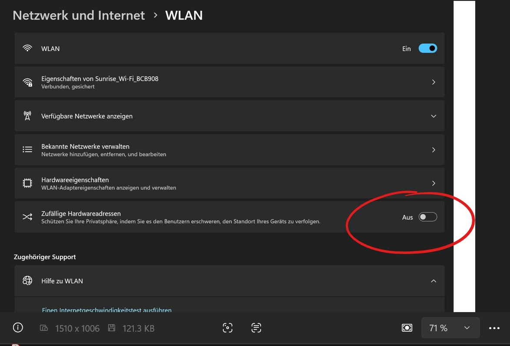
  
Öffne die WLAN-Einstellungen deines Laptops und wähle __GYMB-BYOD__. Verbinde dich mit diesem WLAN.

:::danger
Du wirst aufgefordert, Benutzername und Kennwort einzugeben. Nutze dazu den Benutzernamen und das Passwort aus dem Onway Director, mit deiner Mailadresse funktioniert die Anmeldung nicht im neuen WLAN.
:::

Wenn du deinen Laptop mit dem neuen WLAn verbunden hast, wechselst du wieder auf die Systemeinstellungen und schaltest die __Zufällige Hardwareadresse__ wieder ein.

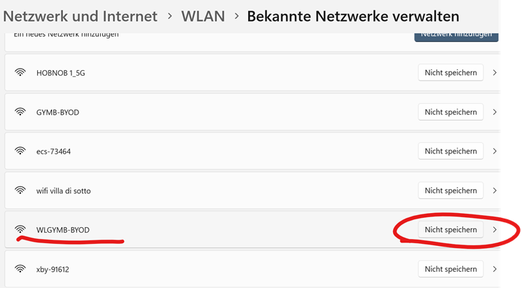

:::details[Empfehlung]
Kontrolliere bei dieser Gelegenheit auch, ob für die andern Netzwerke die zufällige Hardwareadresse eingeschaltet ist. Das ist die Empfehlung, sollten in einem bestimmten Netzwerk Probleme auftreten, kannst du das wieder ausschalten.
:::

  </TabItem>
  <TabItem value="osx" label="Mac OS">
  
Klicke oben rechts auf :mdi[wifi] → im neuen Fenster auf __WLAN Einstellungen__  
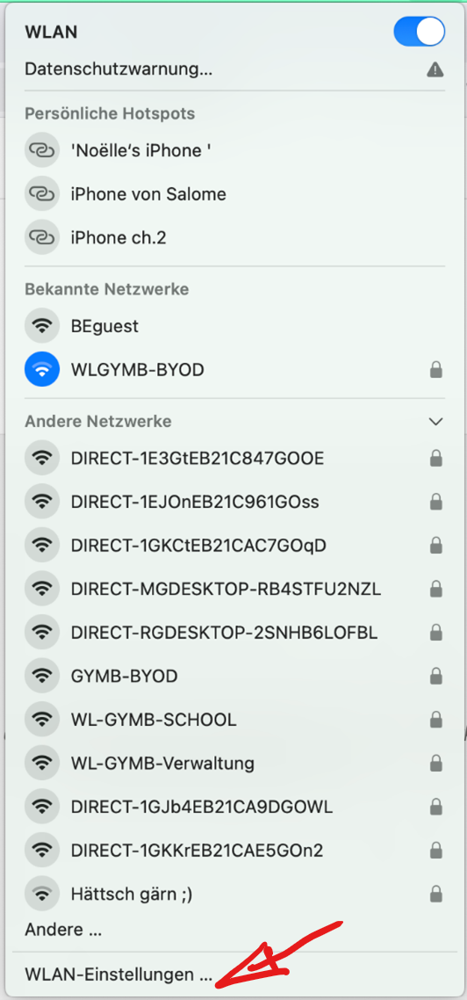
Im neuen Fenster kannst du nun bei allen WLANs die Einstellungen kontrollieren und ändern

→ bei __GYMB-BYOD__ auf «Details» oder ⓘ klicken

→ im Menu «Private WLAN-Adresse» auf «Aus» stellen. Deaktiviere ebenfalls die Option __Tracking der IP-Adresse beschränken__.

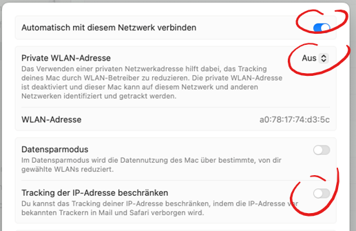

:::danger
Du wirst aufgefordert, Benutzername und Kennwort einzugeben. Nutze dazu den Benutzernamen und das Passwort aus dem Onway Director, mit deiner Mailadresse funktioniert die Anmeldung nicht. Die folgende Fehlermeldung kannst du ignorieren, sie bestätigt dir, dass du die private WLAN-Adresse korrekt ausgeschaltet hast.
:::

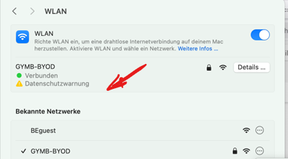

Wenn du zu Schritt 1 zurück gehst, kannst du nun alle deine WLANs auf die Sicherheitseinstellung kontrollieren. Die «Private WLAN-Adresse» sollte auf "Statisch" oder "Rotierend" eingestellt sein.
</TabItem>

  <TabItem value="ios" label="iOS">
Gehe zu __Einstellungen__  wähle __Andere Netzwerke__, dann klickst du bei __GYMB-BYOD__ auf ⓘ

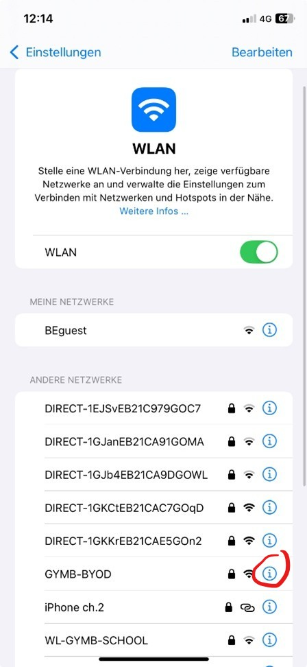
__Private WLAN-Adresse__ stellst du auf __Aus__ und bestätigst das im nächsten Fenster

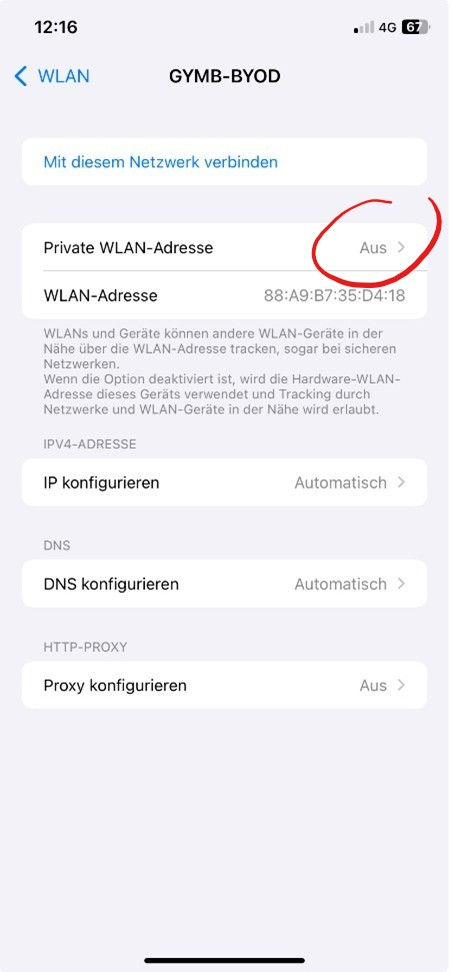

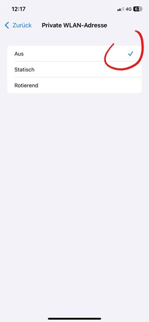

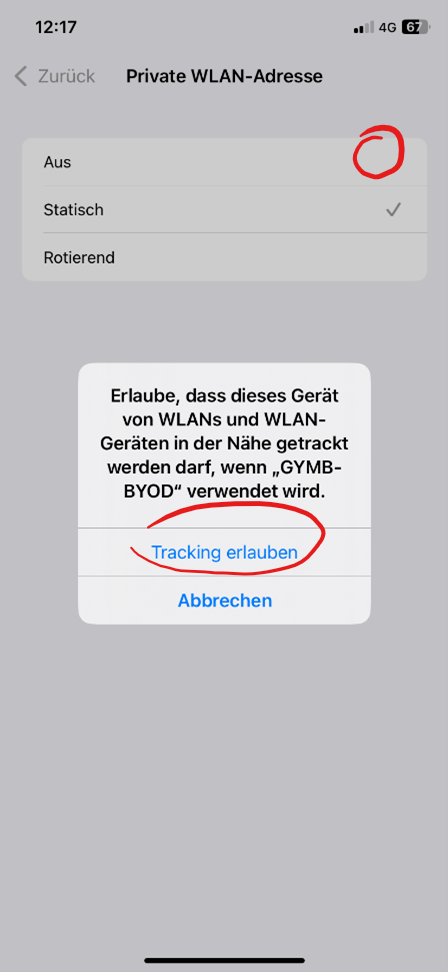

:::danger
Danach verbindest du dich mit __GYMB-BYOD__. Du wirst aufgefordert, Benutzername und Kennwort einzugeben. Nutze dazu den Benutzernamen und das Passwort aus dem Onway Director, mit deiner Mailadresse funktioniert die Anmeldung nicht.Danach verbindest du dich mit diesem Netzwerk und bestätigst das Zertifikat.
:::

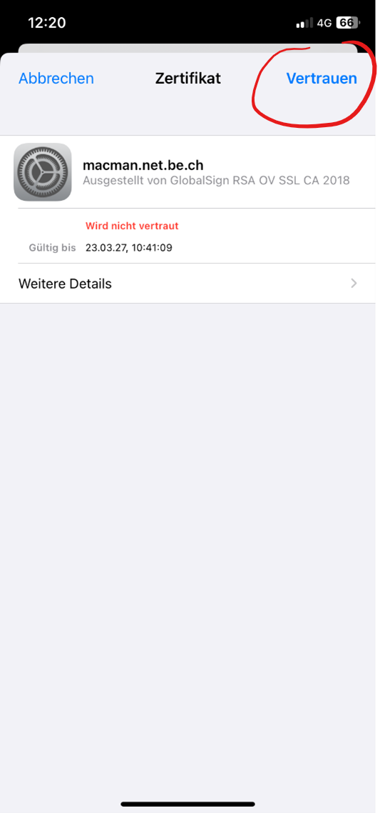

  </TabItem>

  <TabItem value="android" label="Android">
    Öffne auf deinem Gerät die Einstellungen und klicke unter WLAN auf das Netzwerk __GYMB-BYOD__.
    
    :::danger
    Du wirst aufgefordert, Benutzername und Kennwort einzugeben. Nutze dazu den Benutzernamen und das Passwort aus dem Onway Director, mit deiner Mailadresse funktioniert die Anmeldung nicht. Untenstehend Screenshots der nötigen Schritte von einem Samsung und einem Google Pixel.
    :::

  :::details[Google Pixel]
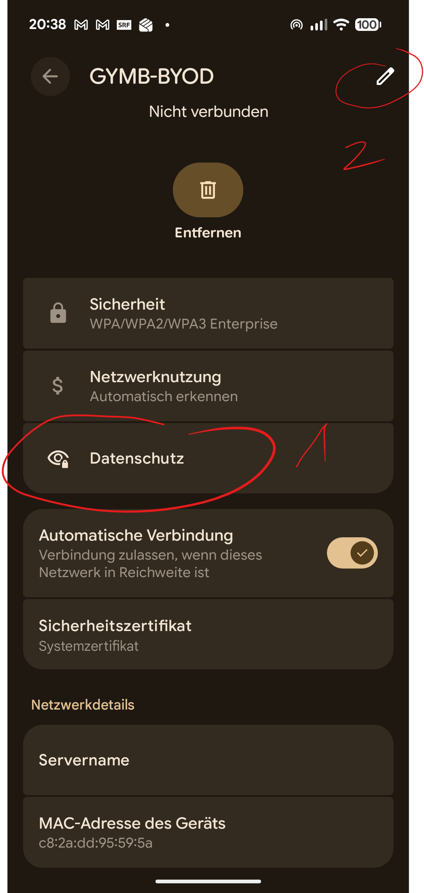
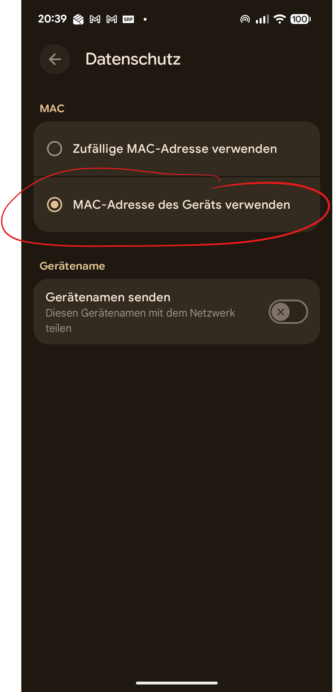
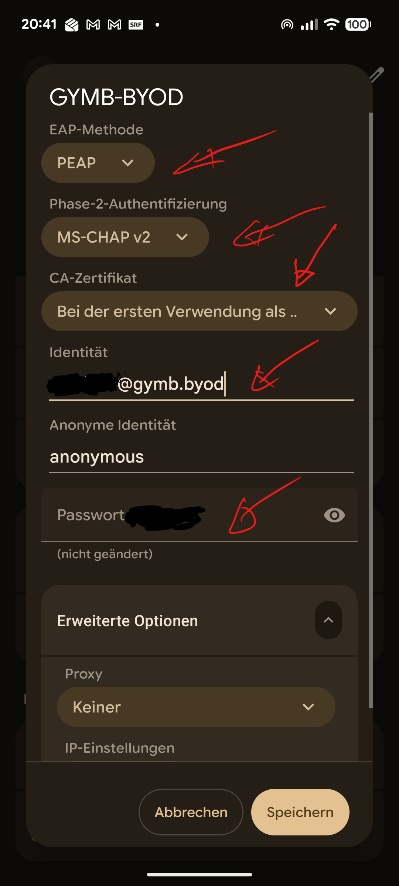
  :::

  :::details[Samsung Phone]
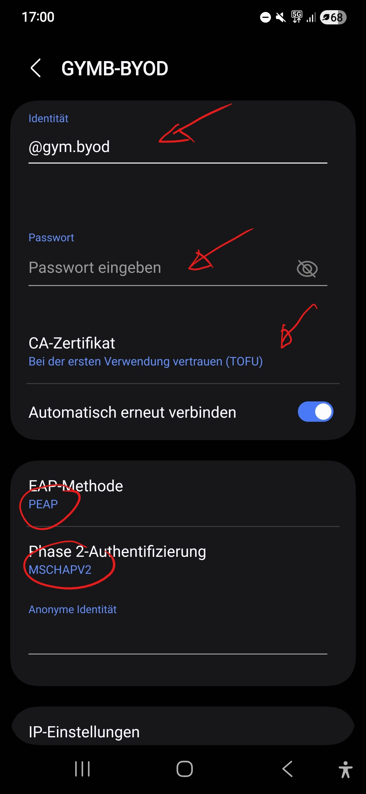
Scrolle nach unten:
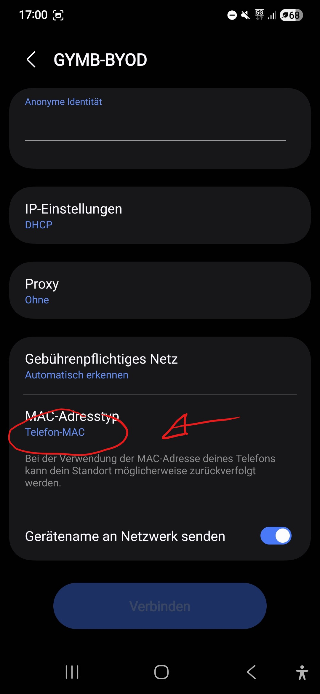
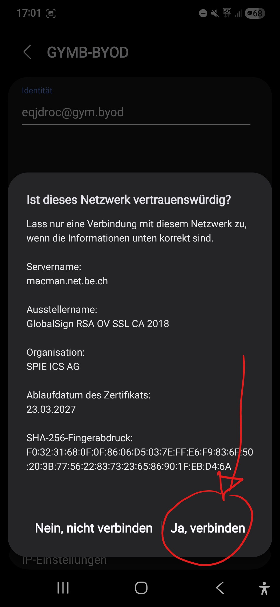
  :::

  </TabItem>
</Tabs>
