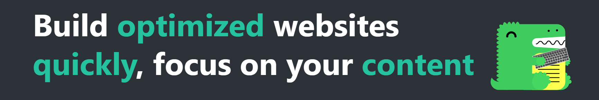
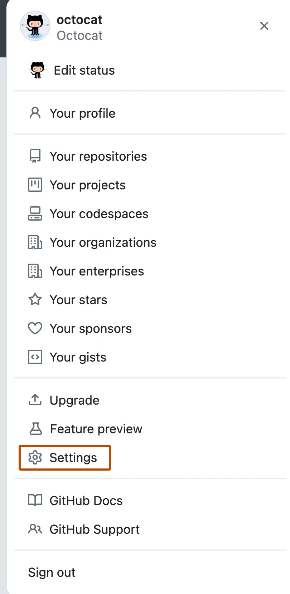
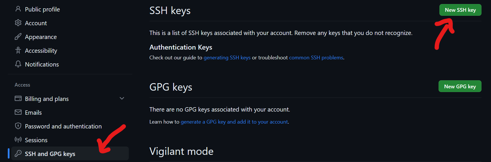
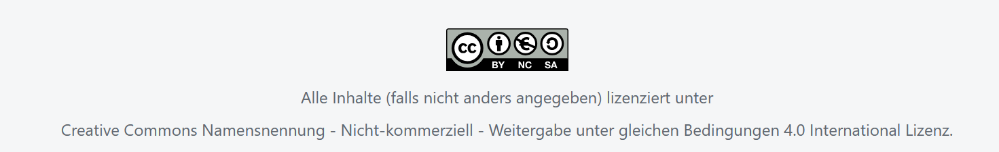
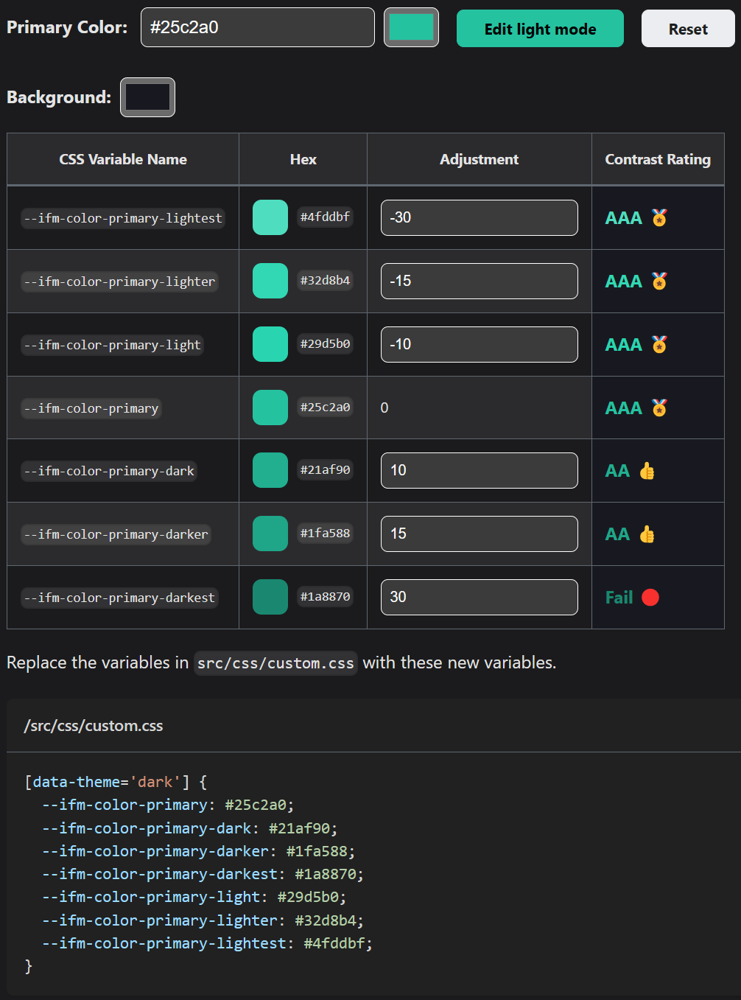

import Tabs from '@theme/Tabs';
import TabItem from '@theme/TabItem';

# Docusaurus




[👉 Docusaurus](https://docusaurus.io/)

## Voraussetzungen

- [VS Code](https://code.visualstudio.com/) Ein Texteditor für das Schreiben und Hinzufügen der Webseiteninhalte
- [GitHub Account](https://github.com)
- [git](https://git-scm.com/) Ein Versionsmanager (wird verwendet um die Seite zu veröffentlichen)
  :::details Git konfigurieren & SSH-Key erstellen
  Um das Arbeiten mit GitHub zu vereinfachen, kann auf GitHub der öffenliche SSH-Key hinterlegt werden. Dieser wird dann bei jedem Push verwendet, um die Identität zu verifizieren.

  ```bash
  git config --global user.name FooBar
  git config --global user.email foo@bar.ch

  # neues ssh Schlüsselpaar erstellen
  ssh-keygen
  # Öffentlichen Schlüssel anzeigen
  cat ~/.ssh/id_rsa.pub
  ```

  Nun in GitHub den öffentlichen Schlüssel hinterlegen:

  1. __Settings > Access > SSH and GPG keys__ 

    
    
    

  2. Klick auf __New SSH Key__ New SSH key or Add SSH key.
     1. Beim "Titel" eine Beschreibung für den Schlüssel eingeben - z.b. "Arbeits Laptop".
     2. Bei "Key type" ist die Standardeinstellung __Authentication Key__ gut.
     3. Beim "Key" den zuvor kopierten öffentlichen Schlüssel einfügen.
  3. Mit __Add SSH key__ den Schlüssel hinzufügen.
  :::

- [Node v18+](https://nodejs.org/de/) Eine Javascript-Laufzeitumgebung
  :::details Empfehlung unter Unix/WSL: NVM (Node Version Manager)
  Mit NVM können mehrere Node Versionen parallel verwendet werden, was praktisch ist, da die Standard-Node-Version des OS dadruch nicht verändert werden muss.

  👉 https://github.com/nvm-sh/nvm

  Danach kann Node installiert werden:

  ```bash
  nvm install 18
  nvm use default 18
  ```
  :::

- [yarn](https://classic.yarnpkg.com/lang/en/)  Ein Paketmanager für die Installation von Bibliotheken
  :::details Installation über die Konsole
  ```bash
  npm install --global yarn
  ```
  :::


## Ein neues Projekt erstellen

Die Schritte zum Erstellen einer neuen Seite sind im Detail unter [docusaurus.io](https://docusaurus.io/docs/installation) erklärt. Unten wird das klassische Vorgehen beschrieben:


1. Neues Projekt erstellen

  <Tabs>
    <TabItem value="js" label="JavaScript">

  ```bash
  npx create-docusaurus@latest my-website classic
  ```

    </TabItem>
    <TabItem value="ts" label="Type Script" default>

  ```bash
  npx create-docusaurus@latest my-website classic --typescript
  ```

    </TabItem>
  </Tabs>

  Das `classic` Template enthält alle typischen Elemente einer modernen Webseite - Darkmode, CSS-Styles und andere sinnvolle Voreinstellungen, so dass man direkt beginnen kann.

  Es wurde ein neuer Ordner `my-website` erstellt. Dieser enthält alle Dateien, die für die Webseite benötigt werden.

2. Projekt in VS Code öffnen

  ```bash
  cd my-website
  code .
  ```

  Die typische Struktur des Projekts sieht wie folgt aus:
  ```
  my-website
  ├── blog
  │   ├── 2019-05-28-hola.md
  │   ├── 2019-05-29-hello-world.md
  │   └── 2020-05-30-welcome.md
  ├── docs
  │   ├── doc1.md
  │   ├── doc2.md
  │   ├── doc3.md
  │   └── mdx.md
  ├── src
  │   ├── css
  │   │   └── custom.css
  │   └── pages
  │       ├── styles.module.css
  │       └── index.js
  ├── static
  │   └── img
  ├── docusaurus.config.js
  ├── package.json
  ├── README.md
  ├── sidebars.js
  └── yarn.lock
  ```

    - `/blog/` - Enthält die Markdown Dokumente für die Blogs. Der Ordner kann gelöscht werden, wenn das Blog-Plugin in `docusaurus.config.js` deaktiviert wird.
    - `/docs/` - Enthält die Markdown Dokumente für die Dokumentation. Standardmässig werden alle Dokumente gemäss der Ordner-Hierarchie inerhalb des `/docs` Ordners angezeigt.
    - `/src/` - Nicht-Dokumentationsrelevante Files - eigene React-Komponenten können hier gespeichert werden.
    - `/src/pages` - Alle Dokumente (Dateityp `.jsx`, `.tsx`, `.mdx`, `.md`) in diesem Ordner werden in Webseiten umgewandelt, welche jedoch nicht in der Sidebar-Navigation angezeigt aufgelistet werden.
    - `/static/` - Static directory. Jeglicher Inhalt dieses Ordners wird in den `root` Ordner des finalen Builds kopiert (`favicon.ico`, `robots.txt`, Logos, etc.).
    - `/docusaurus.config.js` - Die Docusaurus-Konfigurationsdatei.
    - `/package.json` - Eine Docusaurus-Website ist im wesentlichen eine React app. Zusätzliche Pakete können über `yarn add` hinzugefügt und in der Dokumentation verwendet werden.
    - `/sidebars.js` - Hier wird die Reihenfolge der Dokumentations-Seite spezifiziert. Standardmässig muss hier nichts verändert werden.

3. Projekt-Abhängigkeiten installieren
   ```bash
    yarn install
    ```
4. Lokalen Entwicklungsserver starten:  
   Über `Terminal > New Terminal` wird ein neues Eingabefenster (direkt in VS Code) erzeugt. Mit 
   ```bash
    yarn run start
   ```
   wird die Webseite gestartet und in einem Browser geöffnet. (Falls nicht, kann sie unter http://localhost:3000 abgerufen werden).


## Erste Anpassungen
### Titel und Beschreibung

```js title=docusaurus.config.js
const config = {
  title: 'ICT am Gymnasium Biel Seeland',
  tagline: 'Anleitungen, Tipps und Tricks',
  url: 'https://ict.gbsl.website',
  baseUrl: '/',
  onBrokenLinks: 'warn',
  onBrokenMarkdownLinks: 'warn',
  deploymentBranch: 'gh-pages',
  trailingSlash: true,
  i18n: {
    defaultLocale: 'de',
    locales: ['de'],
  },
  presets: [
    // ...
    blog: false, // Blog Plugin deaktivieren
    // ...
  ],
  themeConfig: {
    docs: {
        sidebar: {
          hideable: true, // Sidebar kann ausgeblendet werden
          autoCollapseCategories: true // Beim Öffnen einer Kategorie werden andere Offene geschlossen
        }
    },
    navbar: {
      title: 'ICT Gymnasium Biel Seeland'
    },
  }
  // ...
}
```

### Copyright

Ein Copyright kann einfach im Footer angezeigt werden.




Im Beispiel: CC 4.0 Lizenz.

Zuerst muss das Bild `by-nc-sa.eu.svg` in den Ordner `/static/img` kopiert werden. Anschliessend kann der HTML-Code im Footer angepasst werden.

[👉 Download `by-nc-sa.eu.svg`](/img/by-nc-sa.eu.svg)

```js title=docusaurus.config.js
const config = {
  // ...
  themeConfig: {
    footer: {
      // reiner HTML-Textcode
      // Bspw. CC-BY-NC-SA Lizenz
      copyright: `<a 
        class="footer__link-item"
        href="https://creativecommons.org/licenses/by-nc-sa/4.0/deed.de"
        target="_blank"
      >
        
        <br/>
        Alle Inhalte (falls nicht anders angegeben) lizenziert unter
        <br/>
        Creative Commons Namensnennung - Nicht-kommerziell - Weitergabe unter gleichen Bedingungen 4.0 International Lizenz.
      </a>`,
    },
  }
  // ...
}
```

### Farbschema

Das Farbschema lässt sich über CSS-Variablen in der Datei `src/css/custom.css` (bzw. `src/css/custom.scss`) anpassen.

Sinnvolle Werte können bspw. direkt auf der Dokumentationswebseite [docusaurus.io](https://docusaurus.io/docs/styling-layout#styling-your-site-with-infima) generiert werden:



Den entsprechenden Code kopiert man ins eigene CSS-File unter `src/css/custom.css` (bzw. `src/css/custom.scss`).

### Logo & Favicon

Das Logo und das Favicon sind in der `docusaurus.config.js` Datei definiert. 


```js title=docusaurus.config.js
const config = {
  favicon: 'img/favicon.ico',
  themeConfig: {
    navbar: {
      logo: {
        alt: 'ICT GBSL',
        src: 'img/logo.svg',
      },
    },
  }
}
```

Die entsprechenden Dateien müssen also im Ordner `/static/img` abgelegt werden. Falls für das Logo nicht eine SVG-Datei verwendet wird, muss entsprechend der Dateiname in der Konfiguration angepasst werden. 

Das Logo sollte quadratisch sein, und nicht mehr als `300 kb` gross sein. Falls man selber gerade kein inspirierendes Logo im Kopf hat: Ein Logo kann mit kostenlosen Webapps leicht auf Basis einiger Stichwörter erzeugt werden (dazu braucht es kein all zu grosses künstlerisches Flair 😉). Ein entsprechender Logo Generator findet sich schnell...

<BrowserWindow url="https://google.com">

<SearchBox>

free Logo Generator
</SearchBox>

</BrowserWindow>

Das `favicon.ico` ist das kleine Bildchen oben links in einem Browser-Tab. Dies kann auf Basis des gewählten Logos leicht erzeugt werden.

<BrowserWindow url="https://google.com">

<SearchBox>

png to ico
</SearchBox>

</BrowserWindow>

### Sass

Wer gerne mit SASS arbeitet, kann dies einfach einrichten.

:::details Was ist Sass?
Sass steht für `Syntactically Awesome Style Sheets` und ermöglicht das effizientere Schreiben von CSS-Code. Sass ist eine Erweiterung von CSS, welche insbesondere die Verwendung von verschachtelten Selektoren ermöglicht. Sass-Code wird in der Dateiendung `.scss` gespeichert. Sass-Code wird in CSS-Code kompiliert, welcher dann im Browser verwendet wird.

Statt CSS-Code wie folgt zu schreiben:

```css
/* CSS */
button {
    background-color: #fff;
    color: #000;
}
button:hover {
    background-color: #000;
    color: #fff;
}
```

kann mit Sass folgender Code geschrieben werden:

```scss
/* SCSS */
button {
    background-color: #fff;
    color: #000;
    &:hover {
        background-color: #000;
        color: #fff;
    }
}
```

:::

```sh
# fügt die Möglichkeit für SASS-Styled css hinzu
yarn add docusaurus-plugin-sass sass
# Umbenennen von custom.css -> custom.scss
mv ./src/css/custom.css ./src/css/custom.scss
```

Anpassung der `docusaurus.config.js` Datei:
```js title=docusaurus.config.js
{
    /*...*/
    plugins: ['docusaurus-plugin-sass'],
    /*...*/
}
```

## Markdown Extensions

### Formeln / Math

Docusaurus kommt bereits mit den Morkdown-Erweiterungen `Admonitions` und `Mermaid`. Einige Weitere sind unten aufgeführt:

#### KaTeX - Latex Formeln

```md
$$
I = \int_0^{2\pi} \sin(x)\,dx
$$
```

als Formel rendern:


<BrowserWindow url="http://localhost:3000">

$$
I = \int_0^{2\pi} \sin(x)\,dx
$$

</BrowserWindow>


```bash
yarn add remark-math@3 rehype-katex@5 hast-util-is-element@1.1.0
```

:::caution Warnung
Verwende die oben genannten Versionen. Die aktuellsten Versionen sind nicht mit Docusaurus V2 kompatibel. Wer dennoch eine aktuellere Version von KaTeX braucht, kann diese wie [👉 hier](https://docusaurus.io/docs/markdown-features/math-equations#upgrading-rehype-katex-beyond-recommended-version) beschrieben konfigurieren.
:::

Die Konfiguration muss wie folgt angepasst werden:

```js title="docusaurus.config.js"
// highlight-start
const math = require('remark-math');
const katex = require('rehype-katex');
// highlight-end

const config = {
  /* ... */
  presets: [
      [
        '@docusaurus/preset-classic',
        {
          docs: {
            // highlight-start
            remarkPlugins: [math],
            rehypePlugins: [katex],
            // highlight-end
          },
          blog: false,
          // highlight-start
          pages: {
            remarkPlugins: [math],
            rehypePlugins: [katex],
          },
          // highlight-end
        },
      ],
    ],
    // highlight-start
    stylesheets: [
      {
        href: 'https://cdn.jsdelivr.net/npm/katex@0.13.24/dist/katex.min.css',
        type: 'text/css',
        integrity:
          'sha384-odtC+0UGzzFL/6PNoE8rX/SPcQDXBJ+uRepguP4QkPCm2LBxH3FA3y+fKSiJ+AmM',
        crossorigin: 'anonymous',
      },
    ],
    // highlight-end
  };
};
```

### Remark MDI

[remark-mdi](https://www.npmjs.com/package/remark-mdi) ermöglicht das Einbinden von Icons in Markdown-Dateien. Die Icons können auf der Webseite [Material Design Icons](https://materialdesignicons.com/) gesucht werden. Die Icons können dann wie folgt eingebunden werden:

:mdi-island: :mdi-soccer:

```md
:mdi-island: :mdi-soccer:
```

farbig

:mdi-school--red: :mdi-school--green: :mdi-school--blue: :mdi-school--yellow: :mdi-school--orange: :mdi-school--cyan:

```md
:mdi-school--red: 
:mdi-school--green:
:mdi-school--blue:
:mdi-school--yellow:
:mdi-school--orange:
:mdi-school--cyan:
```

unterschiedliche Grösse

:mdi-school--m: :mdi-school--l: :mdi-school--xl:

```md
:mdi-school--m: :mdi-school--l: :mdi-school--xl:
```

oder kombiniert...

:mdi-school--orange-m: :mdi-school--red-l: :mdi-school--green-xl:

```md
:mdi-school--orange-m: :mdi-school--red-l: :mdi-school--green-xl:
```

#### Installation
```bash
yarn add remark-mdi
```

und konfigurieren:

```js title="docusaurus.config.js"
// highlight-start
const remarkMdi = require('remark-mdi');
// highlight-end

const config = {
  /* ... */
  presets: [
      [
        '@docusaurus/preset-classic',
        {
          docs: {
            // highlight-start
            remarkPlugins: [remarkMdi, /*...*/],
            // highlight-end
          },
          blog: false,
          pages: {
            // highlight-start
            remarkPlugins: [remarkMdi, /*...*/],
            // highlight-end
          },
        },
      ],
    ],
  };
};
```

Im `custom.css` bzw. `custom.scss` muss noch das Stylesheet für die Icons einbinden und die Farben spezifizieren  einbinden:

<Tabs>
  <TabItem value="css" label="custom.css">

```css title="/src/css/custom.css"
// highlight-start
@import "@mdi/font/css/materialdesignicons.min.css"; /* erste Zeile*/
// highlight-end

/*...*/

.mdi.green {
    color: var(--ifm-color-success);
}

.mdi.red {
    color: var(--ifm-color-danger);
}

.mdi.orange {
    color: var(--ifm-color-warning);
}

.mdi.yellow {
    color: #edcb5a;
}

.mdi.blue {
    color: #3578e5;
}

.mdi.cyan {
    color: #01f0bc;
}

.mdi.m {
    font-size: 1.25em;
}

.mdi.l {
    font-size: 1.6em;
}

.mdi.xl {
    font-size: 2rem;
}
```

  </TabItem>
  <TabItem value="scss" label="custom.scss">

```scss title="/src/css/custom.scss"
// highlight-start
@import "@mdi/font/css/materialdesignicons.min.css"; /* erste Zeile*/
// highlight-end

/*...*/

.mdi {
    &.green {
        color: var(--ifm-color-success);
    }

    &.red {
        color: var(--ifm-color-danger);
    }

    &.orange {
        color: var(--ifm-color-warning);
    }

    &.yellow {
        color: #edcb5a;
    }

    &.blue {
        color: #3578e5;
    }

    &.cyan {
        color: #01f0bc;
    }

    &.m {
        font-size: 1.25em;
    }

    &.l {
        font-size: 1.6em;
    }

    &.xl {
        font-size: 2rem;
    }
}
```

  </TabItem>
</Tabs>

### Remark KBD

Tastenkürzel können mit dem Plugin [remark-kbd-simple](https://www.npmjs.com/package/remark-kbd-simple) plugin eingebunden werden. Die Tastenkürzel werden mit `[[` und `]]` umschlossen:

``` md
[[Ctrl]] + [[x]]
```

ergibt: [[Ctrl]] + [[x]]

#### Installation
```bash
yarn add remark-kbd-simple
```

und konfigurieren - achtung, das Plugin muss vor den anderen Remark-Plugins ausgeführt werden, damit andere Markdown-Syntax nicht den Tastenkürzel-Text bereits verändert. Dies wird über das `beforeDefaultRemarkPlugins`-Attribut erreicht:

```js title="docusaurus.config.js"
// highlight-start
const remarkKbd = require('remark-kbd-simple');
// highlight-end
const config = {
  /* ... */
  presets: [
      [
        '@docusaurus/preset-classic',
        {
          docs: {
            // highlight-start
            beforeDefaultRemarkPlugins: [remarkKbd],
            // highlight-end
          },
          blog: false,
          pages: {
            // highlight-start
            beforeDefaultRemarkPlugins: [remarkKbd],
            // highlight-end
          },
        },
      ],
    ],
  };
};
```

```css title="/src/css/custom.(s)css"

kbd {
	padding: 0.3em 0.5em;
	padding-bottom: 0.35em;
	padding-top: 0.25em;
  border-radius: 0.5em;
  box-shadow: inset 1px -2px 0 var(--ifm-color-emphasis-400);
}

```

### Remark Underline

Damit man auf eine einfache Art und Weise bspw. Pfadangaben oder Dateinamen kennzeichnen kann, können mit dem Remark Plugin [underline](https://www.npmjs.com/package/remark-underline) Benutzerdefinierte Klassen basierend auf dem verwendeten Modifier hinzugefügt werden (**Bold** kann entweder über die Syntax `**Bold**` oder als `__Bold__` formatiert werden). Für `__Bold__` wird nun eine Klasse `underline` hinzugefügt, so dass `__Bold__` als __Bold__ formatiert werden kann.

```js title="docusaurus.config.js"
// highlight-start
const remarkUnderline = require('remark-underline');
// highlight-end
const config = {
  /* ... */
  presets: [
      [
        '@docusaurus/preset-classic',
        {
          docs: {
            // highlight-start
            beforeDefaultRemarkPlugins: [
              [
                remarkUnderline, { marker: '__', classNames: ['underline'], tagType: 'strong'}], 
                /*...*/
            ],
            // highlight-end
          },
          blog: false,
          pages: {
            // highlight-start
            beforeDefaultRemarkPlugins: [
              [
                remarkUnderline, { marker: '__', classNames: ['underline'], tagType: 'strong'}], 
                /*...*/
            ],
            // highlight-end
          },
        },
      ],
    ],
  };
};
```

Schliesslich muss die Klasse `underline` im `custom.(s)css` noch definiert werden:

```css title="/src/css/custom.(s)css"
strong.underline {
	color: #3348b5;
	font-weight: normal;
	border: 1px solid var(--ifm-color-gray-600);
	padding: 0.15em 0.4em 0.15em 0.3em;
	border-radius: 2px;
	-moz-border-radius: .2em;
	-webkit-border-radius: .2em;
	border-radius: .2em;
	white-space: nowrap;
}

/* Dark Mode */
html[data-theme='dark'] {
	strong.underline {
		color: var(--ifm-color-primary);
	}
}
```

### Mermaid Diagramme

Unterstützung von [Mermaid](https://mermaid.js.org/) Diagrammen.

- [👉 Live Editor](https://mermaid.live/edit)
- [👉 Mermaid Docs](https://mermaid.js.org/intro/)
- [👉 Mermaid in Docusaurus Docs](https://docusaurus.io/docs/markdown-features/diagrams)

````md

````
ergibt:


#### Installation

```bash
yarn add @docusaurus/theme-mermaid
```

#### Konfiguration

```js title="docusaurus.config.js"
const config = {
  /* ... */
  markdown: {
    mermaid: true
  },
  themeConfig: {
    mermaid: {
      theme: {light: 'default', dark: 'dark'},
    },
  },
  /*...*/,
  themes: ['@docusaurus/theme-mermaid'],
};
```

## Deploy Website

Docusaurus Webseiten lassen sich wahlweise auf dem Computer compilieren um anschliessend die statischen Dateien auf einen Webserver zu kopieren (bspw. auf GitHub pages):

```bash
yarn run clear # löscht mögliche vorherige Builds und caches
yarn build # buildet die Seite - die statischen Dateien befinden sich im Ordner build
```

Die statische Seite kann mit `yarn serve` lokal ausprobiert- und allenfalls auf einen Fileserver kopiert werden.

### Netlify
Der Build- und Deploy-Prozess kann jedoch auch automatisiert werden. Es gibt mehrere Möglichkeiten, einige sind unter [👉 Docusaurus.io](https://docusaurus.io/docs/deployment) beschrieben. Eine sehr performante und einfach zu konfigurierende Möglichkeit ist [Netlify](https://www.netlify.com/). Dies ist ein Cloud-Service, der die statischen Dateien automatisch auf einem CDN verteilt und die Seite bei jedem Commit neu baut. Das kostenlose Basis-Angebot bietet zudem die notwendigen Features, so dass es sich für viele Projekte eignet.

1. [👉 Netlify Account erstellen](https://app.netlify.com/signup) - allenfalls direkt den GitHub Account als Login-Möglichkeit verwenden
2. [👉 GitHub Repository auswählen](https://app.netlify.com/start) und deployen.
3. Auf [👉 Cloudflare.com](https://cloudlfare.com) einen neuen DNS Eintrag erstellen und diesen in Netlify konfigurieren. SSL Zertifikate werden automatisch ausgestellt.