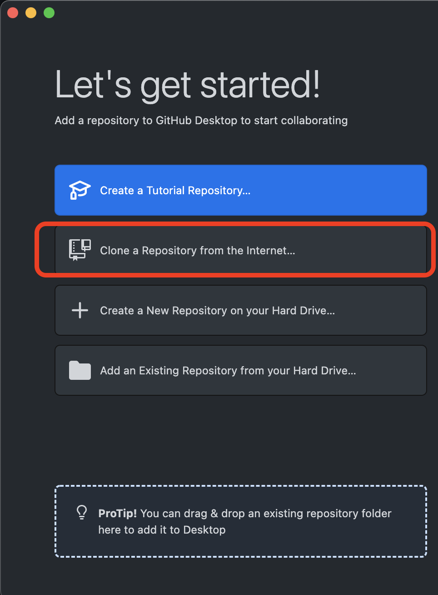
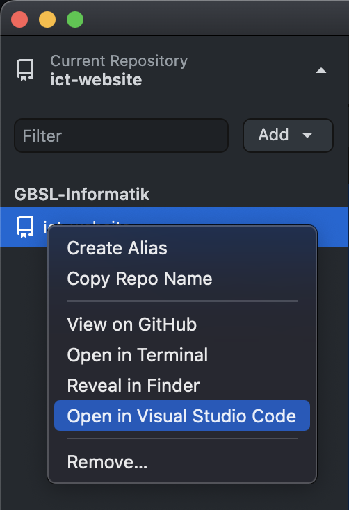

---
sidebar_custom_props:
  icon: mdi-microsoft-visual-studio-code
---


# Installation

Für das Schreiben von Dokumentationen braucht es einen GitHub-Account: [https://github.com/](https://github.com/).

## Benötigte Software:

- [Node 18+](https://nodejs.org/en/download/current/)
- [VS Code](https://code.visualstudio.com/)
- [GitHub Desktop](https://desktop.github.com/) - das Repository [ict-website](https://github.com/GBSL-Informatik/ict-website) synchronisieren

## Projekt konfigurieren

In GitHub Desktop das Projekt [ict-website](https://github.com/GBSL-Informatik/ict-website) synchronisieren, indem die URL angegeben wird:

```
https://github.com/GBSL-Informatik/ict-website
```



Anschliessend kann das Projekt direkt in VS Code geöffnet werden:



Damit die Website lokal angezeigt werden kann, muss ein Server gestartet werden. Dazu müssen aber zuerst die notwendigen Bibliotheken installiert werden. Dies wird in VS Code über _Terminal_ :mdi-chevron-right: _New Terminal_  gemacht. Dort kann nun folgendes eingetippt werden:

```bash
yarn run start
```

Es öffnet sich nach einer Weile automatisch die Website unter [http://localhost:3000](http://localhost:3000)

(Mit [[Ctrl]] + [[C]] kann der Server gestoppt werden.)