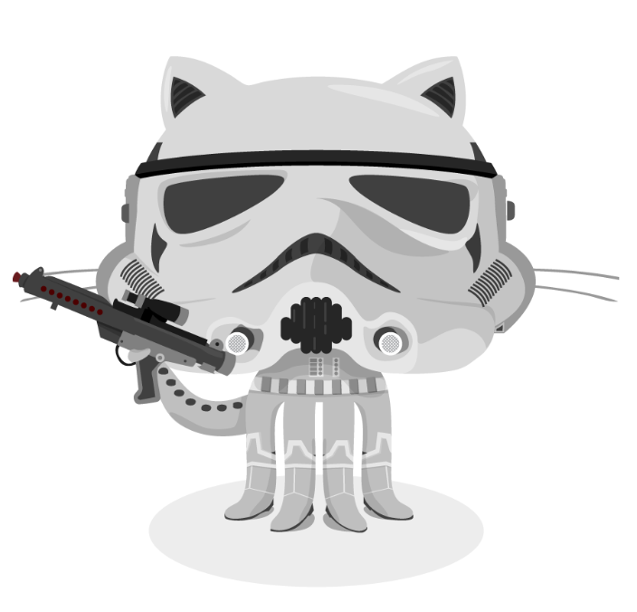
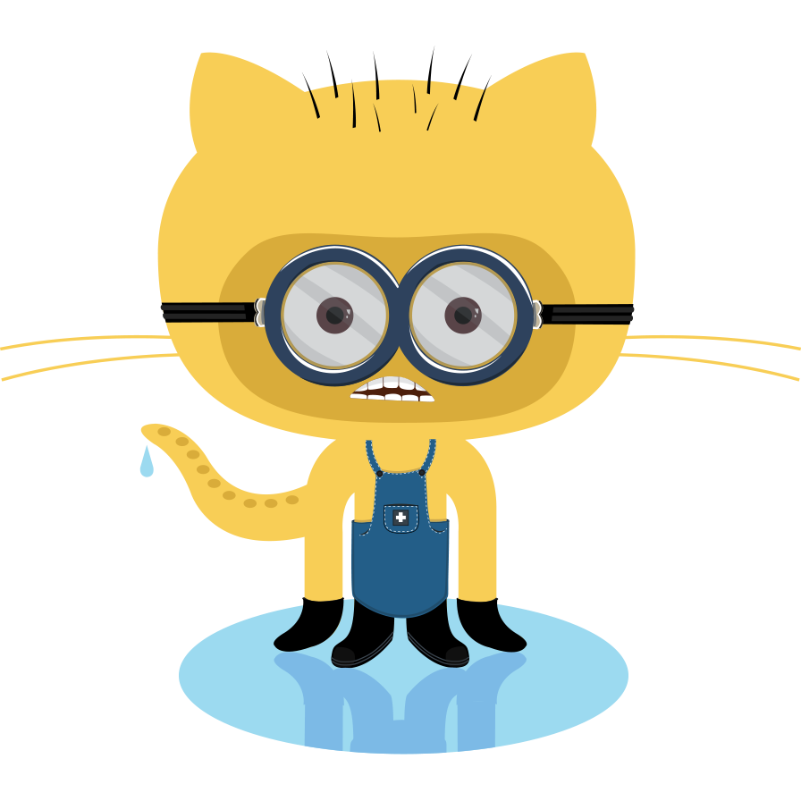

---
tags:
  - vuepress
  - vuejs
sidebar_custom_props:
  source: gym-kirchenfeld
  path: /docs/dokumentation/md-extensions.md
---

# Markdown-Extensions
## GUI Elemente

im Tab *Einstellungen*
Wähle den Menüpunkt __Datei__ :mdi[chevronRight] __Öffnen__

``` md
im Tab *Einstellungen*
Wähle den Menüpunkt __Datei__ :mdi[chevronRight] __Öffnen__
```


## Bilder


``` md

```

### Grösse


``` md

```


``` md

```

## Icons (MDI)

:mdi[island] :mdi[soccer]

```md
:mdi[island] :mdi[soccer]
```

farbig

:mdi[school]{.red} :mdi[school]{.green} :mdi[school]{.blue} :mdi[school]{.yellow} :mdi[school]{.orange} :mdi[school]{.cyan}

```md
:mdi[school]{.red} 
:mdi[school]{.green}
:mdi[school]{.blue}
:mdi[school]{.yellow}
:mdi[school]{.orange}
:mdi[school]{.cyan}
```

unterschiedliche Grösse

:mdi[school]{.m} :mdi[school]{.l} :mdi[school]{.xl}

```md
:mdi[school]{.m} :mdi[school]{.l} :mdi[school]{.xl}
```

oder kombiniert...

:mdi-school--orange-m: :mdi-school--red-l: :mdi-school--green-xl:

```md
:mdi-school--orange-m: :mdi-school--red-l: :mdi-school--green-xl:
```


## Flex Boxen - Inhalt Nebeneinander

:::flex

::br

::br

:::

```md
:::flex

::br

::br

:::
```

### mit Text
:::flex
Eine Dojocat ist ein Maskottchen der Code-Hosting-Website GitHub. Es handelt sich um eine Katze, die ein Karateanzug trägt und somit die Verbindung zu "Dojo" herstellt, einem Ort, an dem man traditionell japanische Kampfkünste studiert. Die Dojocat wurde erstmals 2012 von GitHub-Mitarbeiterin Cameron McEfee entworfen und seitdem in verschiedenen Versionen und mit unterschiedlichen Accessoires präsentiert. Sie ist ein beliebtes Symbol in der Entwicklergemeinschaft und wird oft in Zusammenhang mit Open-Source-Projekten und Programmierwettbewerben verwendet.
::br

:::

```md
:::flex
Eine Dojocat ist ein...
::br

:::
```

### Ausrichtung der Elemente: `center`, `start`, `end`

:::flex[--alignItems=center]
Eine Dojocat ist ein Maskottchen der Code-Hosting-Website GitHub. Es handelt sich um eine Katze, die ein Karateanzug trägt und somit die Verbindung zu "Dojo" herstellt, einem Ort, an dem man traditionell japanische Kampfkünste studiert. Die Dojocat wurde erstmals 2012 von GitHub-Mitarbeiterin Cameron McEfee entworfen und seitdem in verschiedenen Versionen und mit unterschiedlichen Accessoires präsentiert. Sie ist ein beliebtes Symbol in der Entwicklergemeinschaft und wird oft in Zusammenhang mit Open-Source-Projekten und Programmierwettbewerben verwendet.
::br

:::

```md
:::flex[--alignItems=center]
Eine Dojocat ist ein...
::br

:::
```
## Cards

:::cards

::br

::br

:::

```md
:::cards

::br

::br

:::
```

## Details

:::details[Klicken für mehr Details]
Ein Minion als Überraschung

:::

:::lösung
Ein Minion als Überraschung


:::

```md
:::details[Klicken für mehr Details]
Ein Minion als Überraschung

:::

:::lösung
Ein Minion als Überraschung

:::
```

## Admonitions

:::aufgabe
Probier es aus
:::

:::note
Some **content** with _markdown_ `syntax`.
:::

:::tip
Some **content** with _markdown_ `syntax`.
:::

:::info
Some **content** with _markdown_ `syntax`.
:::

:::info[Information]
Es kann auch ein angepasster Titel gewählt werden.
:::

:::caution
Some **content** with _markdown_ `syntax`.
:::

:::danger
Some **content** with _markdown_ `syntax`.
:::

```md
:::aufgabe
Probier es aus
:::

:::note
Some **content** with _markdown_ `syntax`.
:::

:::tip
Some **content** with _markdown_ `syntax`.
:::

:::info
Some **content** with _markdown_ `syntax`.
:::

:::info[Information]
Some **content** with _markdown_ `syntax`.
:::

:::caution
Some **content** with _markdown_ `syntax`.
:::

:::danger
Some **content** with _markdown_ `syntax`.
:::
```

## deflist

Definition 1
: Erklärung 1a
: Erklärung 1b

Definition 2
: Erklärung 2

``` md
Definition 1
: Erklärung 1a
: Erklärung 1b

Definition 2
: Erklärung 2
```


## kbd
[[Ctrl]] + [[x]]

``` md
[[Ctrl]] + [[x]]
```


## Anpassungen


``` md


```
