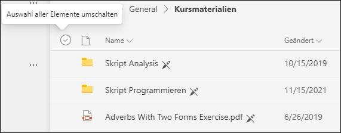
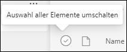
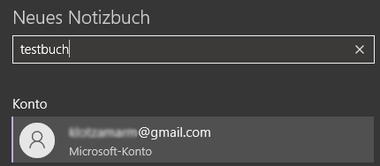
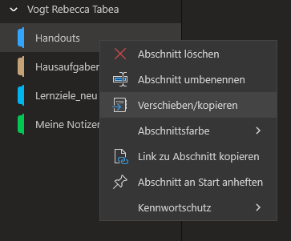
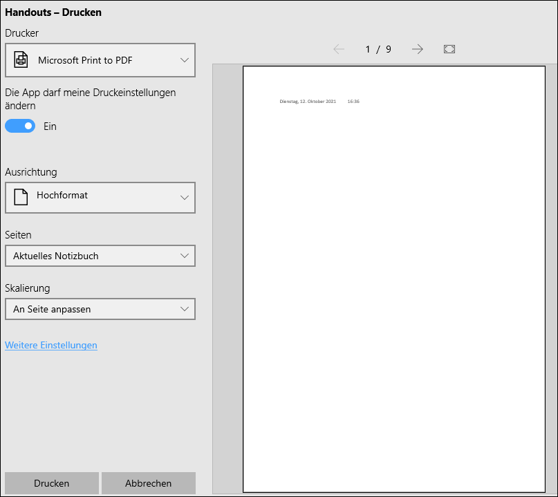
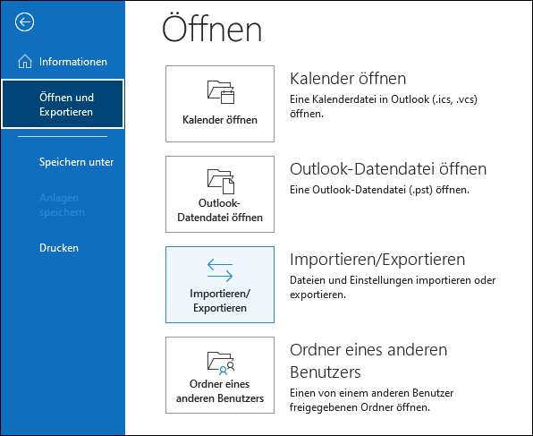
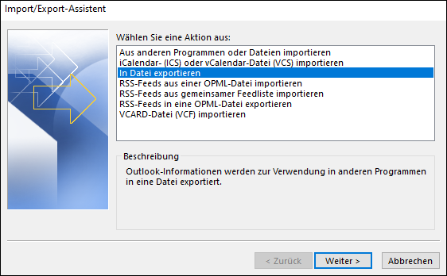

Nach dem Schulaustritt werden alle Daten, die im Schulaccount gespeichert sind, gelöscht und sind danach nicht wiederherstellbar.

:::warning
Das **Austrittsdatum** für Maturandinnen und Maturanden ist der **letzte Tag der mündlichen Maturprüfungen**.
:::

| Was geschieht?     | Wann?                       | Was passiert mit den Daten?                      |
| :----------------- | :-------------------------- | :----------------------------------------------- |
| Schulaustritt      | Am Austrittsdatum           | Daten sind bis zur Kontodeaktivierung zugänglich |
| Kontodeaktivierung | 30 Tage nach Austrittsdatum | Daten sind nicht mehr zugänglich                 |
| Kontolöschung      | 60 Tage nach Austrittsdatum | Daten werden gelöscht                            |

Deshalb ist es wichtig, die Daten innerhalb von 30 Tagen nach Austrittsdatum zu sichern.

Dies sind vor allem:

  :mdi-check-circle: Bitlockerschlüssel (nur für Windowsnutzer*innen)
  :mdi-check-circle: Dateien in Teams
  :mdi-check-circle: Dateien in OneDrive
  :mdi-check-circle: OneNote-Notizbücher: Kursnotizbücher und das persönliche Schulnotizbuch
  :mdi-check-circle: E-Mails (falls man diese sichern möchte..)
  :mdi-check-circle: Falls vorhanden: Dateien auf den Schullaufwerken (Laufwerke H: und K: und für Lehrpersonen auch L: und V:)

## Bitlocker

:::warning <i class="mdi mdi-alert"></i> Wichtiger Hinweis für Windows-Nutzer*innen
Bitlocker ist eine Windows-Sicherheitsoption, die die Festplatte eines Geräts verschlüsselt. Je nach Windows-Version ist es möglich, dass Bitlocker **automatisch** aktiviert wurde. Die Verschlüsselung bleibt auch **nach der Löschung des Kontos am Gymnasium Kirchenfeld aktiv**.
Wenn das Gerät später wegen irgendwelcher Probleme nicht mehr korrekt startet oder die Festplatte entfernt werden muss, weil das Gerät defekt ist, kann man **ohne Schlüssel nicht mehr auf die Daten auf der Festplatte zugreifen**. 

Deshalb ist es zwingend notwendig, den **Bitlocker-Schlüssel vor dem Austritt zu sichern**. Nach der Löschung des Gymkirchenfeld-Accounts kann man den Schlüssel nur noch so lange speichern, wie der Zugriff auf das Gerät noch funktioniert. Der Informatikdienst speichert den Schlüssel nicht ab und hat nach Löschung des Kontos keine Möglichkeit, auf den Schlüssel zuzugreifen.

Deshalb sollten alle Windows-Nutzer*innen vor dem Austritt:
**1. Kontrollieren, ob Bitlocker auf ihrem Gerät aktiviert ist**
**2. Falls dies der Fall ist, den Bitlockerschlüssel sichern oder Bitlocker deaktivieren**

Bitte folgender Anleitung gemäss vorgehen:

[Artikel zu Bitlocker](/microsoft365/bitlocker)
:::

## Teams

Wenn man Dateien aus Teams sichern möchte, muss man das **für jedes Team und jeden Kanal einzeln** machen. Nicht in der Sicherung inbegriffen sind die Kursnotizbücher - um diese zu sichern siehe den Abschnitt zu _OneNote_. Die Dateien lassen sich als zip-Archiv herunterladen:

1. Im entsprechenden Team auf den Kanal (normalerweise _Allgemein_) klicken
   
2. Zu _Dateien_ wechseln, wobei keine Dateien oder Ordner markiert werden sollen
   
3. Auf den Button __Herunterladen__ klicken
   
4. **Nicht** dabei ist der _Kursmaterialien_-Ordner, in dem die Lehrperson Unterlagen zur Verfügung stellt. Falls man diesen auch sichern möchte:
    * auf den Kursmaterialien-Ordner klicken
    * auf _Auswahl aller Elemente umschalten_ (neben dem Dateisymbol in der Titelleiste) klicken um alle Ordner zu markieren

      

    * auf __Herunterladen__ klicken

Die Daten liegen als .zip-Dateien im _Downloads_-Ordner (standardmässig ist das _C:\Users\\[Nutzername]\Downloads_).

## OneDrive

1. Auf cloud.gymkirchenfeld.ch einloggen
   
2. Auf _OneDrive_ klicken
   
3. Mit einem Klick auf _Auswahl aller Elemente umschalten_ (neben dem Dateisymbol in der Titelleiste) klicken um alle Ordner zu markieren

4. Auf __Herunterladen__ klicken

    

Die Daten liegen als .zip-Dateien im _Downloads_-Ordner (standardmässig ist das _C:\Users\\[Nutzername]\Downloads_).

## OneNote Notizbücher

OneNote-Notizbücher können nicht als einzelne Dateien abgespeichert werden. Die Abschnitte müssen entweder einzeln in ein neues Notizbuch kopiert werden (falls man eine private Office-Lizenz besitzt) oder andernfalls als PDF exportiert werden.

### Abschnitte in ein anderes Notizbuch kopieren

Falls eine private Office-Lizenz vorhanden ist:

1. OneNote öffnen
   
2. Oben auf die Notizbuch-Übersicht klicken
   
3. Auf "Notizbuch hinzufügen" klicken
   
4. Als Konto das privat genutzt Microsoftkonto wählen (NICHT dasjenige mit der Schul-E-Mail, denn dieses wird ja gelöscht!) und einen Notizbuchnamen geben

5. In der Notizbuchübersicht auf das Schulnotizbuch klicken, aus dem kopiert werden soll
   
6. Auf einen Abschnitt rechtsklicken und _Verschieben/kopieren_ wählen

7. Es erscheint ein Menü, in dem man wählen kann, wohin dieser Abschnitt kopiert werden soll. Hier nun das zuvor erstellte private Notizbuch auswählen
   
8. Auf __Kopieren__ klicken
   
9.  Nun in der Notizbuchübersicht wieder auf das Schulnotizbuch klicken und den Vorgang ab Schritt 6 wiederholen, bis alle Abschnitte in das private Notizbuch kopiert sind

### Notizbuch als PDF speichern

Falls keine private Office-Lizenz vorhanden ist, kann das Notizbuch als PDF gesichert werden.

1. OneNote öffnen
   
2. Oben auf die Notizbuch-Übersicht klicken und das Notizbuch, das gespeichert werden soll, anwählen
   
3. Ins Notizbuch klicken und die Tastenkombination __Ctrl__ + __P__ drücken
   
4. Als _Drucker_ entweder _Microsoft Print to PDF_ oder _PDF24_ wählen
   
5. Unter _Seiten_ entweder _aktuelles Notizbuch_ (falls das gesamte Notizbuch gespeichert werden soll) oder _aktueller Abschnitt_ wählen
   
   

6. Auf __Drucken__ klicken
   
7. Den Speicherort angeben

## E-Mails

E-Mails können nicht im Webclient (d.h. wenn man von cloud.gymkirchenfeld.ch aus auf die Mails zugreift) gesichert werden. Man muss dafür ein Mailprogramm installieren und einrichten (siehe https://ict.mygymer.ch/byod/ und beim entsprechenden Gerät den Abschnitt _E-Mail einrichten_).

### E-Mails vom Schulaccount in einen privaten Account übertragen

Ist in einem E-Mailprogramm (z.B. Outlook, Apple Mail, Thunderbird) sowohl das Schulmail-Konto als auch ein privates Mailkonto konfiguriert, können die Schulmails direkt im Mailprogramm mittels Drag&Drop in das private Mailkonto kopiert werden.

:::warning Achtung:
  * Wenn grössere Mengen E-Mails verschoben werden, sollten die Speicherplatzbeschränkungen des jeweiligen Mailanbieters berücksichtigt werden. Wenn die Speicherkapazität des Zielpostfachs überschritten wird, ist je nach Anbieter unterschiedlich, was genau passiert (entweder können keine neuen E-Mails mehr hinzugefügt werden oder beliebige, alte E-Mails werden gelöscht).
  * Es sollte genügend Zeit einberechnet werden um die Mails zu verschieben. Der Vorgang wird unterbrochen, wenn das Mailprogramm geschlossen wird!
  * Um die Übersicht zu wahren bei grossen Mengen an Mails (> 1000) diese besser in Blöcken (Hunderterblöcke) verschieben
:::

Nähere Informationen zum Verschieben oder Kopieren zwischen unterschiedlichen Mailkonten:
  * **Outlook**: https://support.microsoft.com/de-de/office/verschieben-oder-kopieren-eines-elements-in-einen-anderen-ordner-19768dfe-86c4-40bf-b82c-1c084b624492
  
  * **Apple Mail**: https://support.apple.com/de-ch/guide/mail/mlhlp1000/mac
  
  * **Thunderbird**: https://support.mozilla.org/de/kb/thunderbird-daten-auf-neuen-rechner-uebertragen

### Sämtliche E-Mails als Datei abspeichern

E-Mails lassen sich in Outlook als einzelne Datei archivieren. Man muss dafür den Outlook-Client installieren und einrichten (siehe https://ict.mygymer.ch/byod/ und beim entsprechenden Gerät den Abschnitt _E-Mail einrichten_).

#### E-Mails als pst-Datei speichern

Um den bisherigen E-Mailverlauf zu sichern folgendermassen vorgehen:

1. Outlook öffnen

2. Links oben auf _Datei_ klicken

3. Auf _Öffnen und exportieren_ klicken

4. __Importieren/Exportieren__ anklicken

   

5. _In Datei exportieren_ wählen und auf __weiter__ klicken

   

6. _Outlook-Datendatei (.pst)_ wählen und auf __weiter__ klicken

7. Beim nächsten Schritt alles so belassen (ggf. kann der Speicherpfad geändert werden) und auf __weiter__ und anschliessend auf __Fertig stellen__ klicken

8. Das Setzen eines Kennwortes kann gemacht werden - wenn man kein Kennwort setzen möchte, einfach die Felder leer lassen und mit __Ok__ bestätigen

Die Datei liegt nun standardmässig unter _C:\Users\\[Nutzername]\Documents\Outlook-Dateien_.

#### E-Mails aus pst-Datei wiederherstellen

Um die Schulemails nun wieder lesen zu können, muss man mit einem privaten Microsoftaccount (NICHT dasjenige mit der Schul-E-Mail, denn dieses wird ja gelöscht!) bei Outlook angemeldet sein.

1. Outlook öffnen

2. Links oben auf _Datei_ klicken

3. Auf _Öffnen und exportieren_ klicken

4. __Importieren/Exportieren__ anklicken

5. _Aus anderen Programmen oder Dateien importieren_ wählen und auf __weiter__ klicken

6. _Outlook-Datendatei (.pst)_ wählen und auf __weiter__ klicken

7. Den Pfad, in dem die pst-Datei liegt, über den Button __Durchsuchen...__ angeben und auf __weiter__ klicken

8. Auf __Fertig stellen__ klicken
