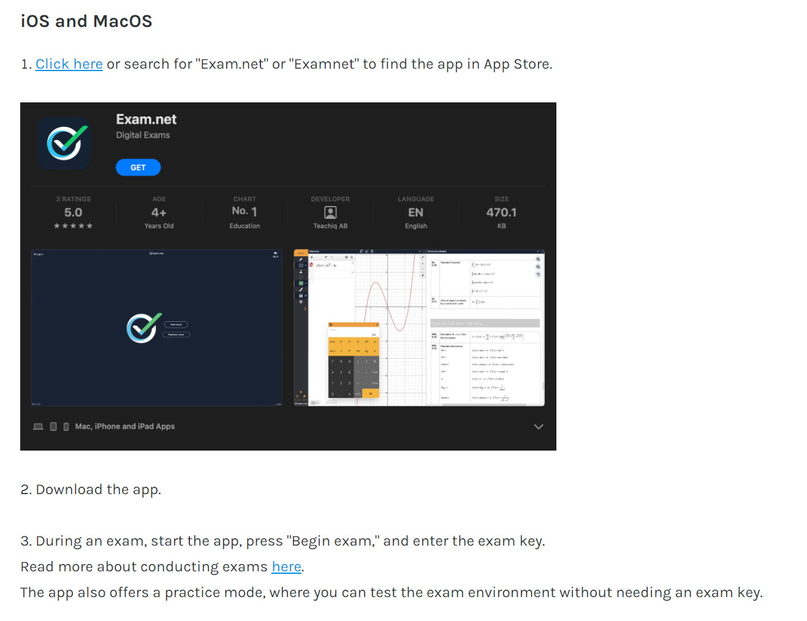

# exam.net für Schüler:innen

## Anleitung für Schüler:innen

An unserer Schule werden vermehrt Prüfungen digital mit exam.net geschrieben, auch Abschlussprüfungen. Diese Anleitung zeigt, wie ein Computer für den Hochsicherheitsmodus eingerichtet werden kann.

### Vorbereitung

Download
: Download und Installation der Software von exam.net
: 👉 https://faq-en.exam.net/article/52869/install-high-security-software. 

<Tabs>
  <TabItem value="win" label="Windows">

  </TabItem>
  <TabItem value="osx" label="Mac, iPad">

  </TabItem>
</Tabs>

:::warning Wichtig!
WLAN auf automatisch verbinden setzen.

:::

### Prüfung starten

Anschliessend mit einem beliebigen Browser [👉 exam.net](https://exam.net) öffnen und oben rechts den Prüfungsschlüssel __as9bKy__ eingeben. 

<BrowserWindow url="https://exam.net">

</BrowserWindow>

Den hohen Sicherheitsmodus (**SafeExamBrowser**, nicht Take a Test!) auswählen.

<BrowserWindow url="https://exam.net">

</BrowserWindow>

---
