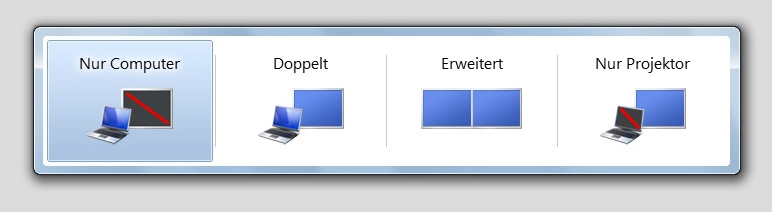
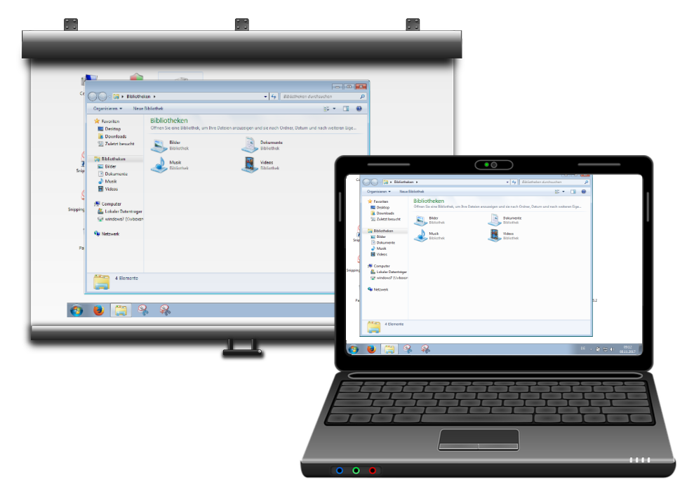
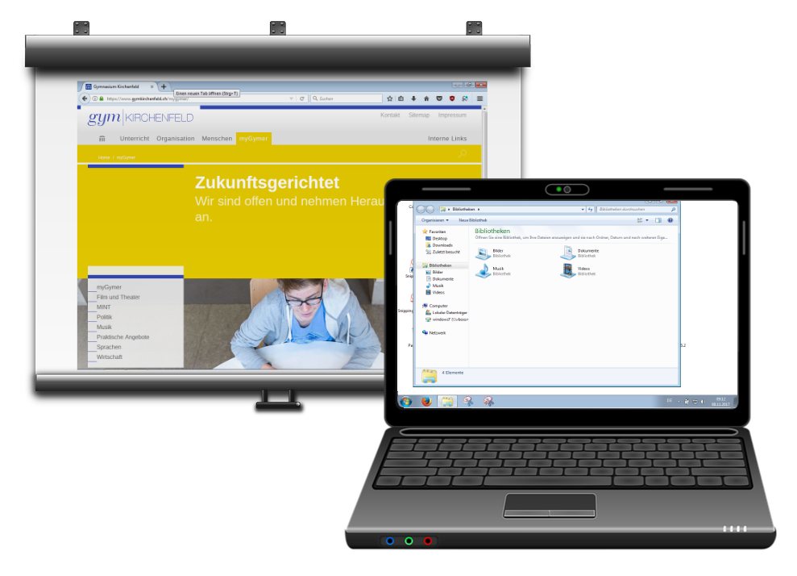

---
sidebar_custom_props:
  icon: mdi-projector
  source: gym-kirchenfeld
  path: /docs/infra/geraete/beamer/README.md
draft: false
---

#  Beamer

Anschliessen des Laptops über hdmi-Kabel oder drahtlos über WinAir oder MacAir:
Sobald ein Laptop am Beamer angeschlossen ist, gibt es unterschiedliche Präsentationsmodi. 

## Umschalten
Um zwischen den Modi umzuschalten verwendet man die Tastenkombination [[:mdi[microsoftWindows]]] + [[P]]. Im nun erscheinenden Menü wählt man den Modus. 

### 1. Nur Computer
Dieser Modus zeigt das Bild nur auf dem Notebook an - das Beamerbild ist schwarz. 

### 2. Doppelt
Der am häufigsten verwendete Modus. Zeigt das Bild des Notebooks auf dem Beamer an. 

### 3. Erweitert
Die Einstellung «Erweiterte» **kombiniert zwei Bildschirme zu einem**: Das Fenster kann beliebig auf den Bildschirmen hin- und hergeschoben werden. Hierbei dient das projizierte Beamerbild als **Erweiterung** des Desktops am Notebook. Dieser Modus ist nützlich, wenn die "Freeze"-Taste nicht zur Verfügung steht (Zimmer mit Stehpult und neuen Beamern), indem man ein gewünschtes Fenster in die Projektionsfläche ziehen und gleichzeitig in einem andren Programm arbeiten kann.  

