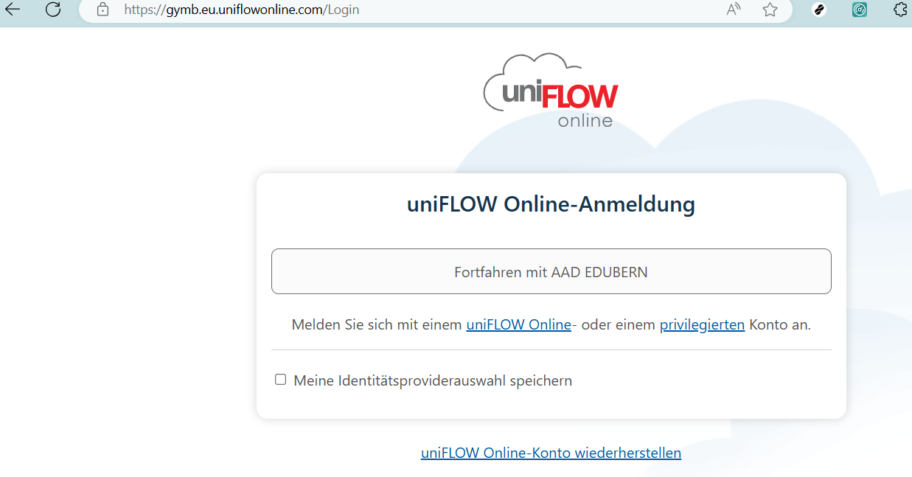
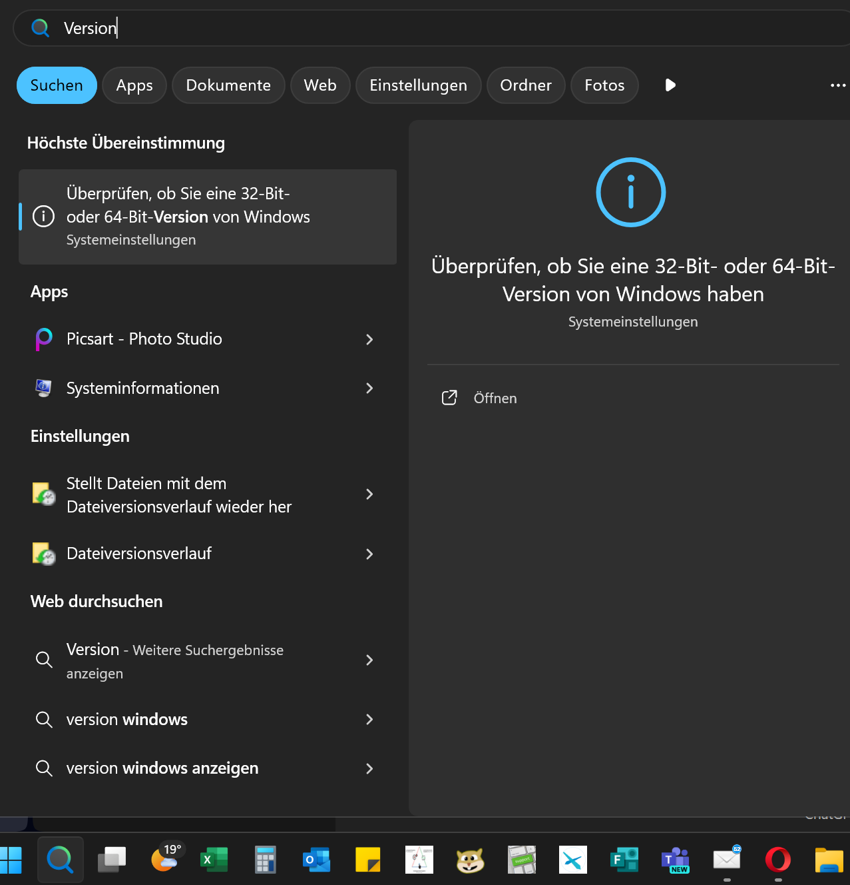

---
sidebar_custom_props:
  icon: mdi-printer
  source: gym-kirchenfeld
  path: /docs/infra/geraete/drucker/README.md
---
# Drucker einrichten

## Neue Druckeransteuerung für BYOD-Geräte mit erweiterten Möglichkeiten

Einrichten des Uniflow-Druckertreibers für die Fotokopierer/Drucker. Klicke auf folgenden Link: [https://gymb.eu.uniflowonline.com/Login](https://gymb.eu.uniflowonline.com/Login)

Melde dich mit deinem Schulkonto (Mailadresse) an. Du wirst eine Mail mit dem PIN für uniflow erhalten.

Du befindest dich auf dem Dashboard. Klicke im Menü links auf "Drucken starten" und scrolle herunter bis zu "Druckertreiber installieren".

Wähle den Druckertreiber gemäss deinem Betriebssystem.

:::details[Windows: Ich weiss nicht, welche Version des Betriebssystems ich habe.]
Klicke in der Taskleiste auf das Suchfenster und gib "Version" ein, danach klickst du auf "Überprüfen..."

:::

Lade den Druckertreiber herunter und starte ihn mit einem Doppelklick. Erlaube dem Installationsprogramm Änderungen. Der Prozess dauert eine Weile, anschliessend steht dir der Drucker in all deinen Programmen zur Verfügung, so auch in Word:

Um den Broschürendruck zu finden, gehe auf "Druckereigenschaften", im neuen Fenster kannst  du den Broschürendruck wählen.

