# Lehrpersonen

Multifunktionsgeräte stehen unter dem Namen _DruckerAllgemein_ zum Drucken, Kopieren und Scannen an folgenden Standorten zur Verfügung:
  * Eingangshalle
  * Mediothek
  * Zimmer 401
  * Im Gang zwischen Zimmer 427 und 436
  
  Im Kopierraum (Zimmer 220) können unter dem Namen _DruckerKopierraum_ ebenfalls zwei Geräte verwendet werden. Zusätzlich können auch die kleinen Geräte in den Fachschaftszimmern (_DruckerXYZ_, wobei XYZ die Zimmernummer ist) genutzt werden.

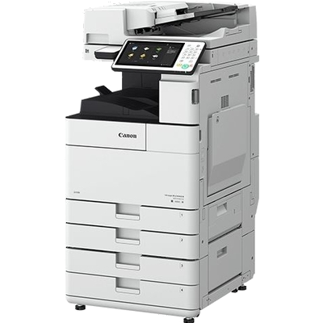

## Druckaufträge erteilen

Druckaufträge können über einen Schulcomputer (Zimmernotebook, Lehrerzimmer-PC) oder über ein eigenes Gerät erteilt werden. Die Anleitung zur Einrichtung des Druckers auf einem eigenen Gerät findet man in der Sektion [BYOD beim entprechenden Betriebssystem](http://ict.mygymer.ch/byod/) unter _Drucker einrichten_. Gibt man einen Druckauftrag an ein Multifunktionsgerät _DruckerAllgemein_ oder _DruckerKopierraum_, so wird der Druckauftrag auf dem Server gespeichert und man hat 48 Stunden Zeit, um sich an einem Drucker mit dem Schlüssel anzumelden und den Druckauftrag auszuführen. Aufträge an einen Lehrerzimmerdrucker werden direkt ausgedruckt und man benötigt keine Authentifizierung mittels Schlüssel.

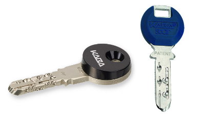

## Drucken von mobilen Geräten

Die Multifunktionsgeräte unterstützen Mobile Printing. Das bedeutet, dass PDF-Dateien direkt von einem Smartphone oder Tablet gedruckt werden können. Diese Funktion ist für Geräte gedacht, bei denen ein fixes Einrichten der Drucker gemäss [unserer Anleitung](http://ict.mygymer.ch/byod/) nicht möglich ist. Der Vorgang funktioniert wie folgt: 

1. Auf dem mobilen Gerät eine E-Mail wie folgt schreiben
  * Von: vorname.name@gymkirchenfeld.ch
  * An: drucken@gymkirchenfeld.ch
  * Der Betreff wird ignoriert, kann also gut leer sein
  * Der Text im E-Mail-Body wird ebenfalls ignoriert
  * PDF-Datei als Anhang hinzufügen

2. Anmelden an der gewünschten Kopierstation wie gewohnt mit Schlüssel oder Kopierkarte

3. Schaltfläche Secure Print antippen und wie gewohnt ausdrucken

Wichtig: Der Vorgang funktioniert nur, wenn als Absender die eigene, offizielle Schul-E-Mail-Adresse (also vorname.name@gymkirchenfeld.ch) verwendet wird, sonst kann die gesendete E-Mail nicht dem richtigen Konto zugeordnet werden

## Verwenden der Multifunktionsgeräte

Die Multifunktionsgeräte eignen sich besonders gut für das Drucken von Klassensätzen, da sie für hohe Geschwindigkeit und grossen Durchsatz ausgelegt sind.

### Anmeldung

Um von einem Multifunktionsgerät gedruckte Dokumente abzuholen, meldet man sich mit dem Schlüssel am Gerät an. Man fährt dafür mit dem Schlüssel über die weisse Fläche neben dem Bedienfeld des Geräts:

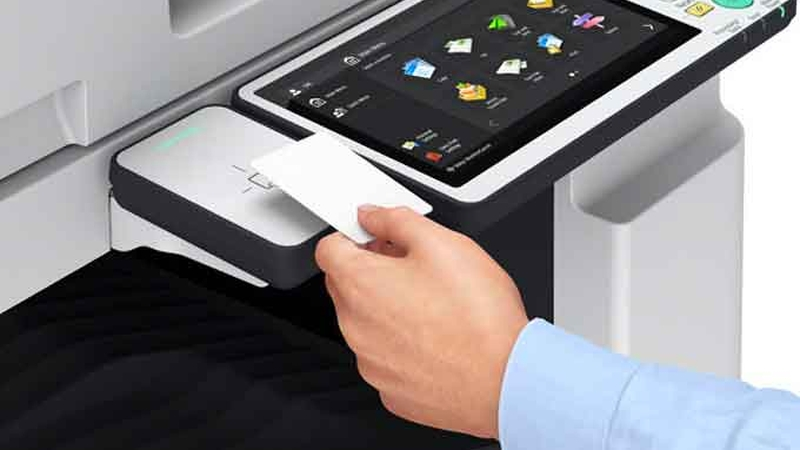

### Hauptmenü

Wenn man sich am Drucker angemeldet hat, sieht man das folgende Menü:

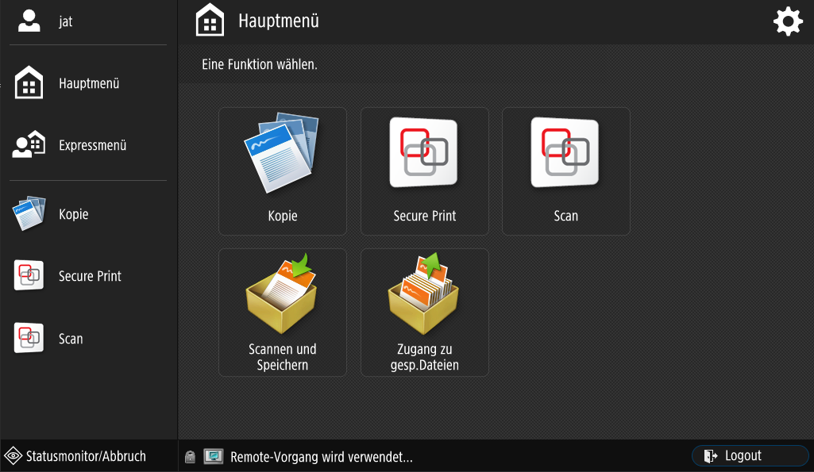

- **Kopie und Secure Print:** Öffnen die bekannten Kopier- resp. Druckansichten, diese werden hier nicht weiter erklärt
- **Scan:** Scannen von Bildern und Textdokumenten, eine Option zur Texterkennung steht zur Verfügung. Man kann die gescannten Dokumente an die eigene E-Mailadresse oder in den Home-Ordner senden lassen
- **Scannen und Speichern:** Mit dieser Option wird das Dokument gescannt und auf einem USB-Stick abgespeichert
- **Zugang zu gesp. Daten:** Auf einem USB-Speicherstick gespeicherte PDF-Dokumente drucken

Der USB-Anschluss befindet sich auf der rechten Seite des Geräts.

:::warning <i className="mdi mdi-alert"></i> Wichtig
Es können nur PDF-Dokumente ab dem USB-Speicherstick gedruckt werden. Andere Dokumenttypen müssen direkt ab PC/Notebook gedruckt werden.
:::

[1]: https://intern.gymkirchenfeld.ch/

### Scan (mit Texterkennung) per Mail oder in Home-Verzeichnis

Es besteht die Möglichkeit,  Dokumente  zu  scannen  und  an  die  eigene  E-Mail-Adresse  zu  senden oder im Home-Verzeichnis zu speichern:

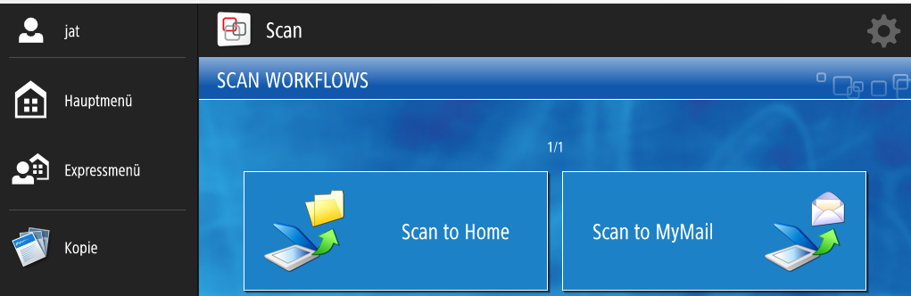

**Scan to MyMail** sendet das  gescannte  Dokument  an  die  E-Mail-Adresse  der  angemeldeten  Person
**Scan to Home** speichert das gescannte Dokument in etwas besserer Qualität unter H:\Scans

Das Scanmenu sieht folgendermassen aus:

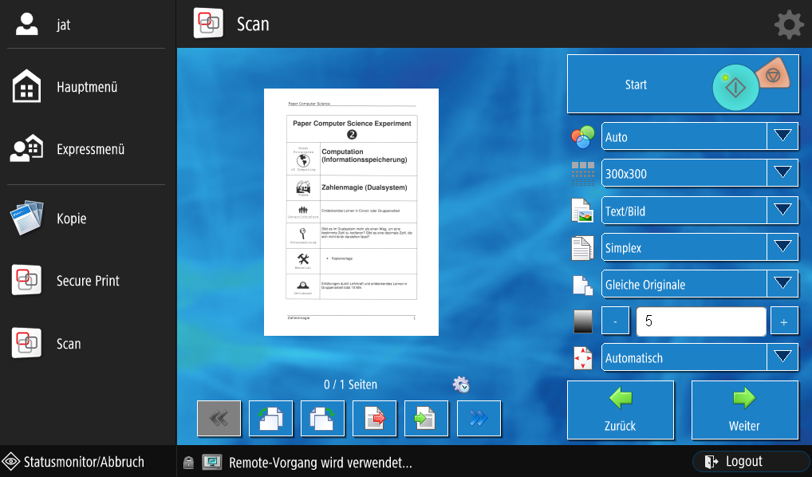

1. Über die Schaltflächen rechts können diverse Einstellungen vorgenommen werden

2. Sobald mindestens eine Seite gescannt wurde (ausgelöst durch die grüne Kopiertaste), kann diese gedreht, gelöscht oder innerhalb der gescannten Seiten verschoben werden (Schaltflächen unten). Weitere Seiten können jederzeit mit Hilfe der grünen Kopiertaste hinzugefügt werden. 

3. Mit einem Klick auf _Weiter_ wird nach dem gewünschten Dateiformat gefragt (PDF ist voreingestellt). Die Kopiergeräte erkennen Text und ermöglichen das Markieren und Kopieren des Textes aus den PDF-Dateien. Ausserdem können auch Word-(DOCX), Excel-(XLSX) und Bilddateien (JPG) erzeugt werden. 

4. Nach einem erneuten  Klick auf _Weiter_ wird das Dokument im gewünschten Format erzeugt und gespeichert, resp. verschickt.

### Scan (mit Texterkennung) auf USB-Stick

Es besteht die Möglichkeit, am Kopiergerät (auf der rechten Seite) einen USB-Stick  einzustecken und direkt darauf zu scannen. Dazu wählt man auf dem Startbildschirm die Option _Scannen und Speichern_. 

1. Nach dem Einstecken des USB-Sticks erscheint dieser im folgenden Bildschirm:

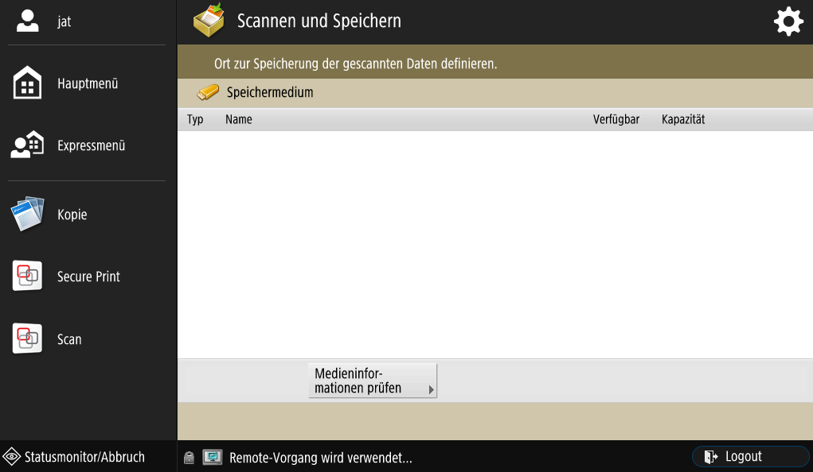

2. Den USB-Stick auswählen und zum gewünschten Ordner navigieren. Nach einem Klick auf _Scan_ öffnet sich die Einstellungsansicht:

3. Falls  nötig  die  Einstellungen  anpassen  und  dann  auf den grünen Kopierknopf (im Bedienfeld neben dem Display) drücken. Mehrere Seiten können entweder über den automatischen Einzug oder auf der Glasfläche nacheinander  gescannt  werden  (immer  wieder  auf  den  grünen  Kopierknopf  im  Bedienfeld  neben  dem  Display drücken).  

4. Zum  Abschliessen  des  Scans  auf  den  im  Display  angezeigten  Knopf _Speichern starten_ drücken. Beim Speichern wird die Datei auf dem USB-Stick nach Datum und Uhrzeit benannt:

5. Nun ist es ganz wichtig, den USB-Stick nicht einfach auszuziehen, sondern ihn korrekt durch Antippen des kleinen Knopfs unten im Display  zu entfernen.

### Drucken ab USB-Stick

Man hat die Möglichkeit, direkt ab USB-Stick zu drucken. 

:::warning <i className="mdi mdi-alert"></i> Wichtig
Es wird ausschliesslich das Drucken von PDF-Dokumenten unterstützt! Das Drucken von Worddateien und anderen Dateitypen ist nicht möglich! Die Dateien werden zwar angezeigt und können ausgewählt werden, allerdings erscheint beim Drucken eine Fehlermeldung.
:::

1. Auf dem Startbildschirm die Schaltfläche _Zugang zu gespeicherten Dateien_ antippen und einen USB-Stick einstecken (auf der rechten Seite des Kopierers).

2. Der USB-Stick wird angezeigt und kann angetippt werden:

3. Nun können einzelne Dateien markiert werden, die gedruckt werden sollen:

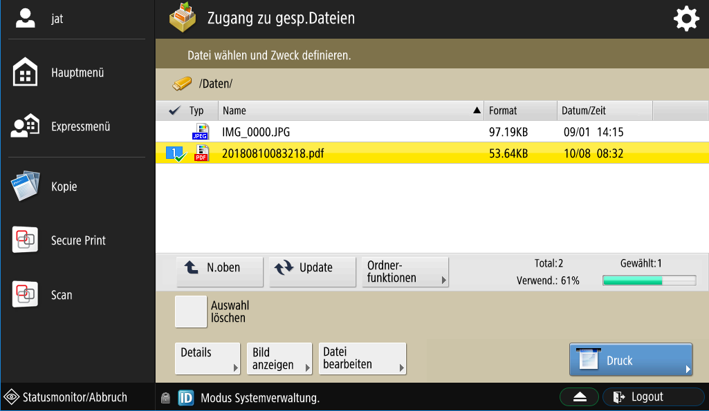

4. Mit einem Klick auf den Button __Druck__ wird der Druckauftrag ausgelöst

### Folien und dickes Papier

Auf Folien und dickes Papier darf ausschliesslich über den Seiteneinzug kopiert werden! Das richtige Medium wird nicht automatisch erkannt, sondern muss manuell ausgewählt werden. 

1. Im Druckmenü zum Mehrzweckfach (Seiteneinzug) **nicht __Auto Erken. Format__** wählen, sondern auf **__ändern__** klicken:

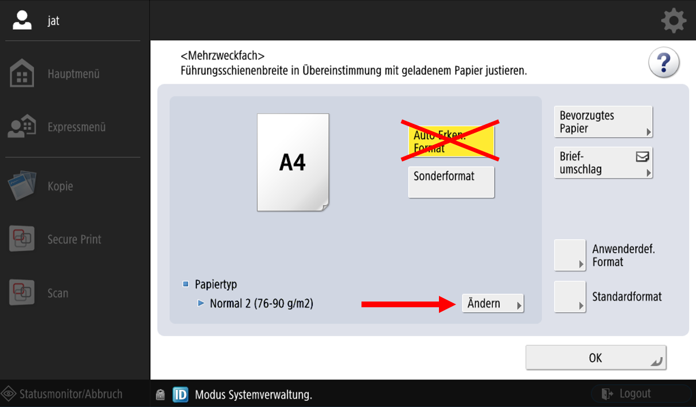

2. Im folgenden Menu das Format wählen, z.B. _Folie_, _Etikette_, _schwer_. Das Gewicht bei dickem Papier steht auf der Verpackung:

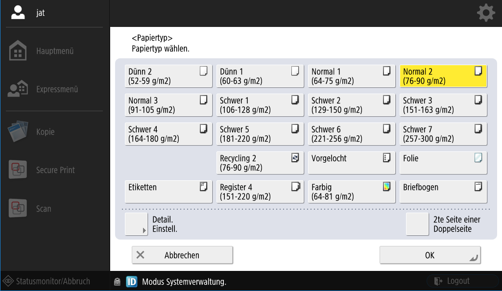

3. Mit __Ok__ bestätigen

### Heften und Lochen

Das automatische Heften und Lochen von Dokumenten ist nur an den Multifunktionsgeräten im Kopierraum (Zimmer 220) _DruckerKopierraum_ möglich.

Es stehen die Optionen **Ecoheften** und **Heften** zur Verfügung. 

**Heften**: Normale Heftung mit Heftklammern (Bostitch)

**Ecoheften**: Heften ohne Heftklammern, **maximal 5 Seiten**

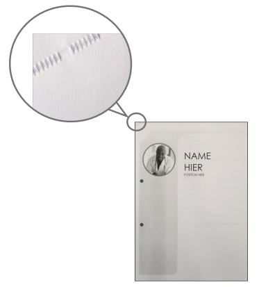

**Kopieren**

1. Nach dem Anmelden am Gerät links _Expressmenü_ wählen

2. Die gewünschte Art der Heftung und Lochung anwählen

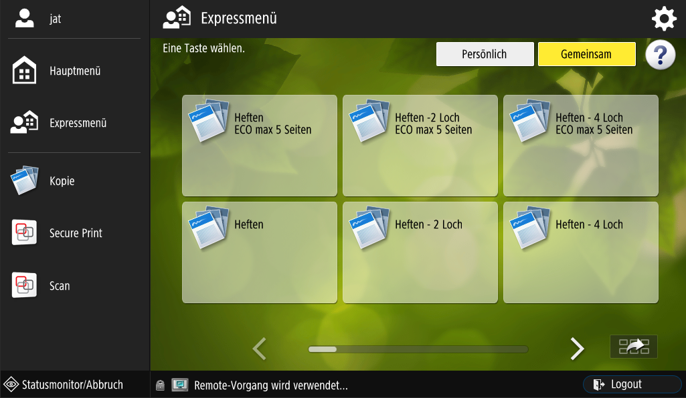

**Drucken**

1. Die Datei in einem Programm (z.B. Word, Adobe Reader, etc.) öffnen

2. _Drucken_ wählen

3. _DruckerKopierraum_ wählen

4. Auf _Druckereigenschaften_ klicken

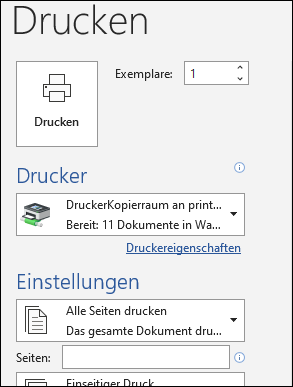

5. Im neuen Fenster oben den Reiter _Endverarbeitung_ wählen

6. Unter _Endverarbeitung_ den gewünschten Modus wählen

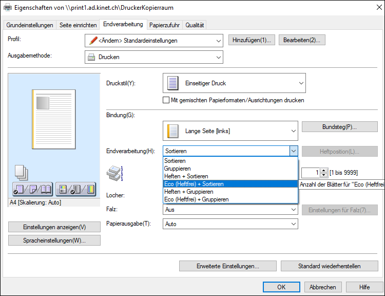

7. Mit __OK__ bestätigen

### Broschürendruck Windows

Unter Windows kann der Druckdialog in einem PDF-Programm (z.B. Adobe Reader) oder in Word für den Broschürendruck verwendet werden. Wenn man die Broschüren im Kopierraum falten und heften lassen will, sollte man folgendermassen vorgehen:

1. Das gewünschte Dokument im entsprechenden Programm öffnen (im Folgenden als Beispiel mit Adobe Reader) und den Druckdialog anzeigen. 

2. Zuerst den Drucker _DruckerKopierraum_ auswählen, sonst steht die Option **Falten und Heften** nicht zur Verfügung. Zur Sicherheit den Knopf __Grösse__ anklicken und auf keinen Fall den Knopf __Broschüre__ verwenden!

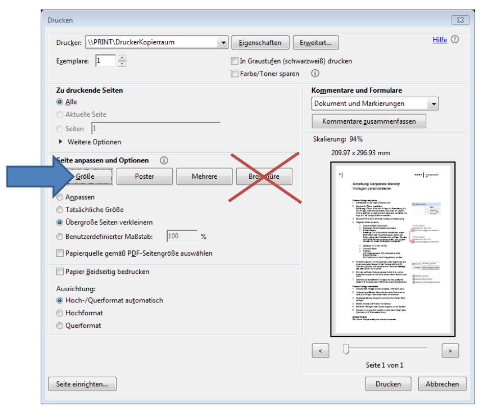

3. Anschliessend den Knopf __Eigenschaften__ anklicken und die Registerkarte _Endverarbeitung_ öffnen. Hier wählt man nun bei _Druckstil_ den Eintrag _Broschürendruck_.

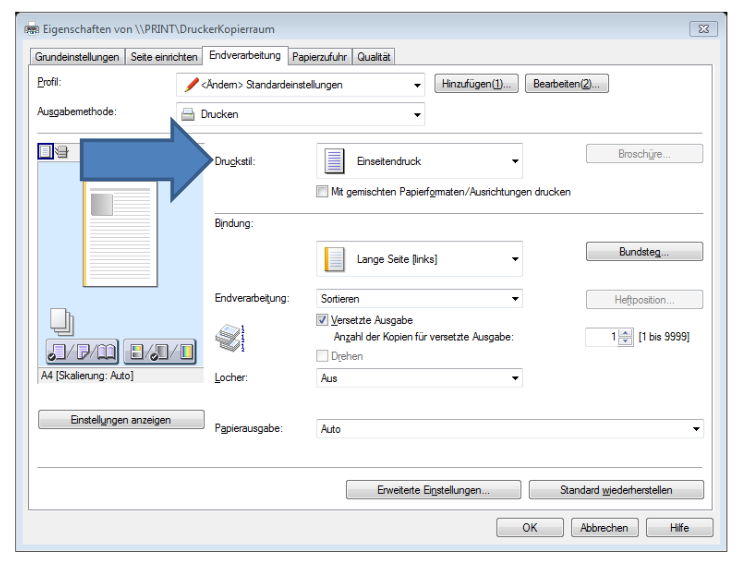

4. Nun wird eine zusätzliche Auswahl **Einstellung für Sattelheftung** angezeigt. Dort wählt man je nach Wunsch _Nur Falz_ oder _Falz + Sattelheftung_ aus und schliesst das Fenster mit __OK__, damit die Einstellungen übernommen werden

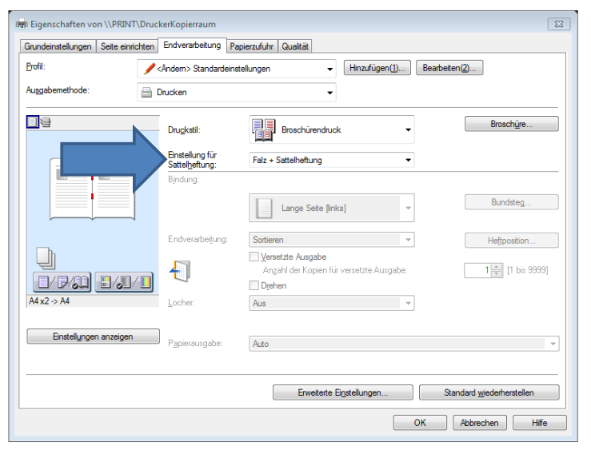

### Broschürendruck macOS

:::warning Voraussetzung
Um den Broschürendruck in macOS machen zu können, muss der Drucker _DruckerKopierraum_ gemäss folgender Anleitung hinzugefügt werden:
https://ict.mygymer.ch/byod/macos/drucker/#druckerkopierraum-hinzufugen
:::

Unter macOS kann der Druckdialog in einem PDF-Programm (z.B. Adobe Reader) oder in einem Textverarbeitungsprogramm (z.B. Pages oder Word) für den Broschürendruck verwendet werden. Wenn man die Broschüren im Kopierraum falten und heften lassen will, sollte man folgendermassen vorgehen:

1. Das gewünschte Dokument im entsprechenden Programm öffnen (im Folgenden als Beispiel mit Adobe Reader) und den Druckdialog anzeigen. 

2. Zuerst den Drucker _DruckerKopierraum_ auswählen, sonst steht die Option **Falz und Sattelheftung** nicht zur Verfügung. Zur Sicherheit den Knopf __Grösse__ anklicken und auf keinen Fall den Knopf __Broschüre__ verwenden!

3. Falls ein Dialogfeld mit der Nachfrage erscheint, ob man fortfahren möchte, _Diese Meldung nicht mehr anzeigen_ anklicken und auf _Ja_ klicken

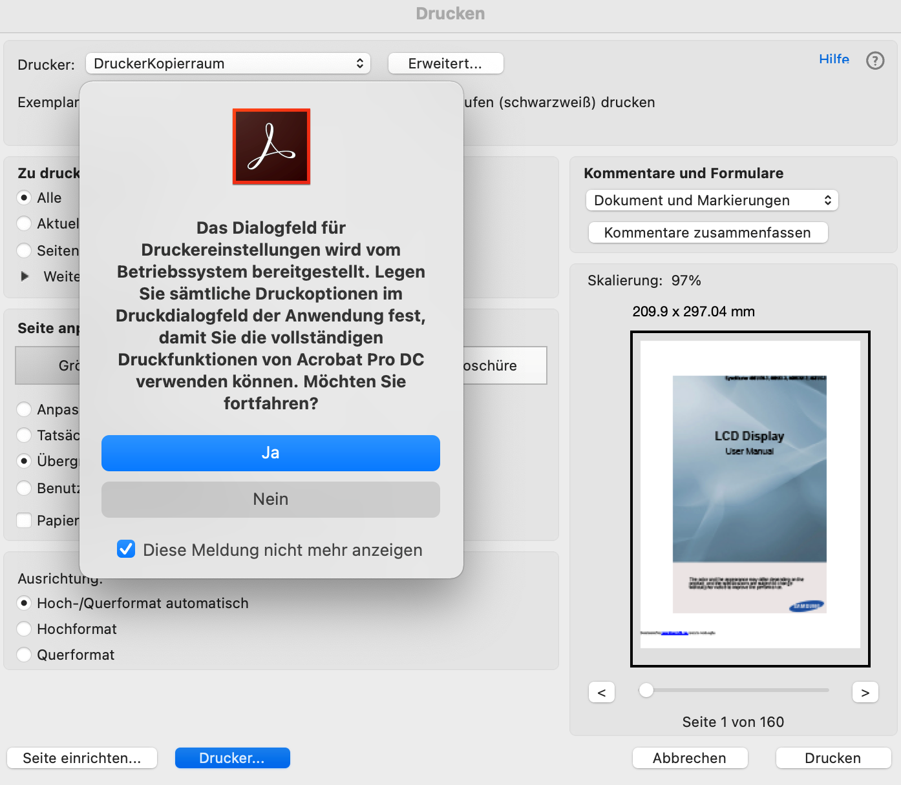

4. Unten im Dialogfeld auf __Drucker..__ klicken

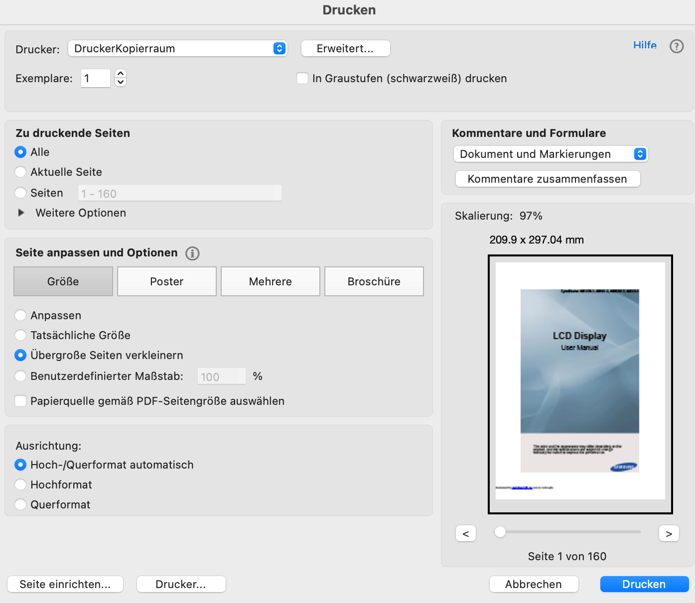

5. Den Knopf __Details einblenden__ anklicken

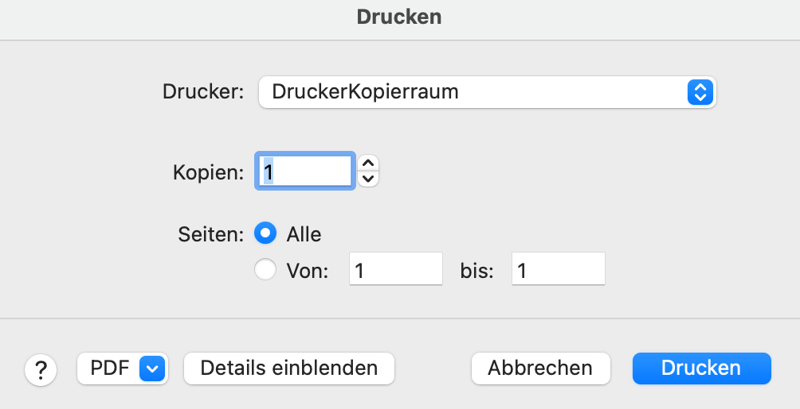

6. Im Feld, in dem _Layout_ gewählt ist, _Endverarbeitung_ wählen

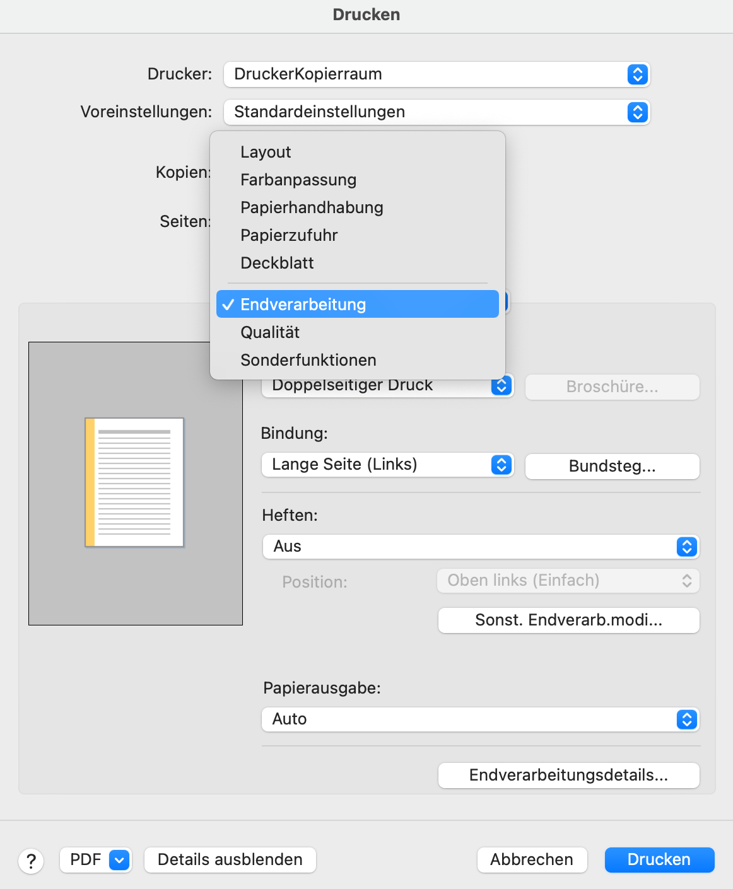

7. Folgende Optionen auswählen:
  * **Druckstil:** Broschürendruck
  * **Einstellungen für Sattelheftung:** Falz + Sattelheftung

  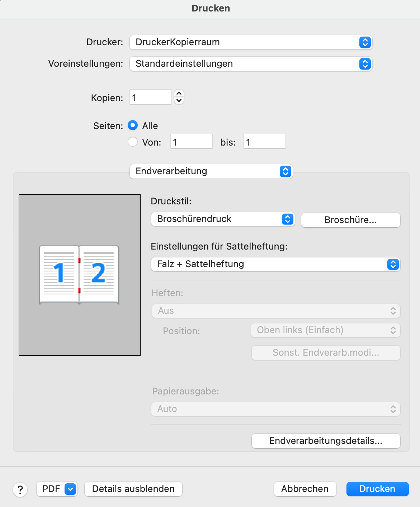

### Posterdruck

Dank dem Posterdruck können Seiten in Übergrösse auf mehrere Blätter aufgeteilt gedruckt werden. Die Blätter werden anschliessend von Hand zugeschnitten und zusammengeklebt. So lassen sich grossformatige Poster auch ohne Plotter herstellen. Die Drucker _DruckerAllgemein_ und _DruckerKopierraum_ bieten die Möglichkeit, auf A3 zu drucken. Die folgende Anleitung beschreibt den Posterdruck eines Motivs auf das Format A1(entspricht 4 A3-Seiten). 

:::warning Auflösung
Wenn beim Erstellen des Posters klar ist, dass dieses später im Format A1 gedruckt werden soll, dann sollten die Seitengrösse im Programm entsprechend auf A1 eingestellt werden, resp. eine hohe Pixelauflösung für die Bilder gewählt werden. Andernfalls könnten Text und Bilder beim Vergrössern verpixelt dargestellt werden. 
:::

1. Das Motiv als PDF abspeichern und in einem beliebigen Programm öffnen

2. Mit [[:mdi-microsoft-windows:]]+ P den Druckdialog öffnen

3. Den _DruckerAllgemein_ oder _DruckerKopierraum_ wählen

4. Die Option _Grosse Seite Kacheln_ oder _Poster_ wählen (der Titel unterschiedet sich je nach Programm, in dem das PDF geöffnet wurde)

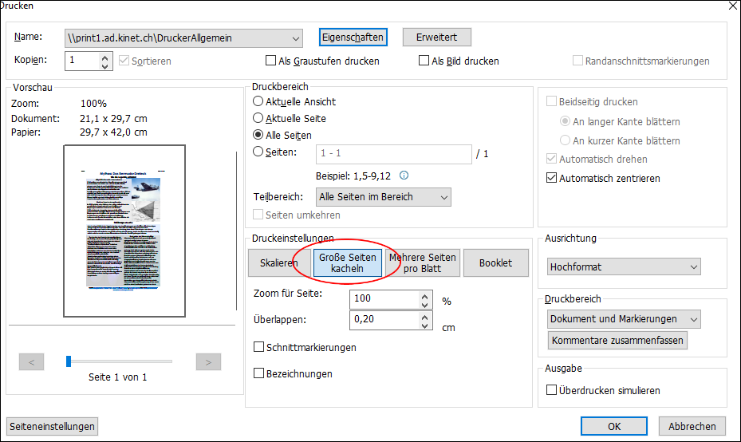

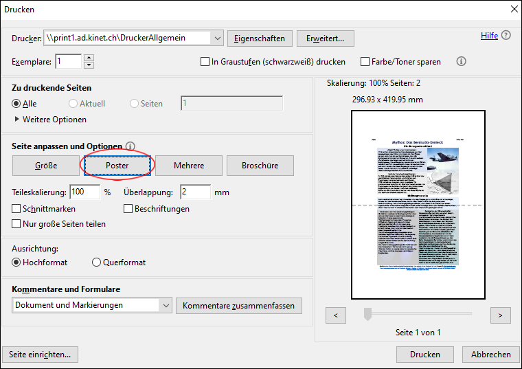

5. Als Überlappung 2 mm auswählen 
  
6. Dann auf den Button _Eigenschaften_ klicken

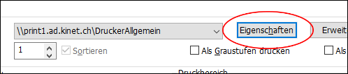

7. _Seitenformat_: _A3_ und _Farbmodus_: _Farbe_ wählen

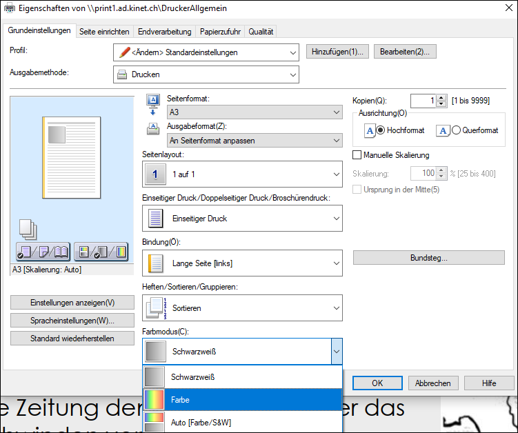
