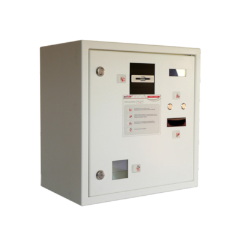
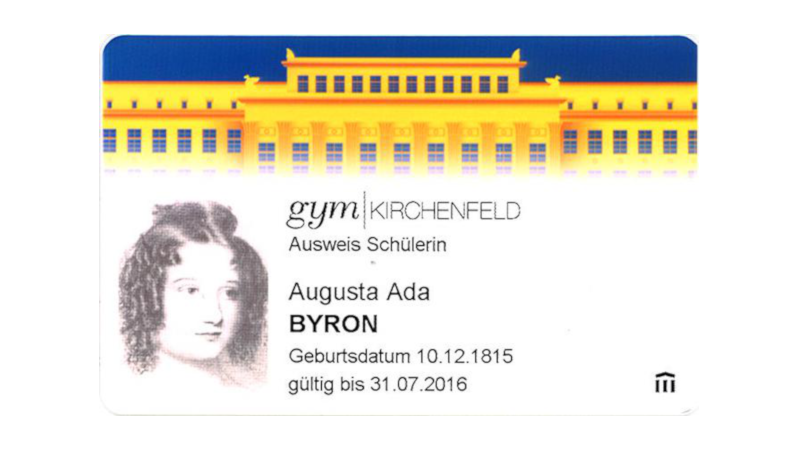
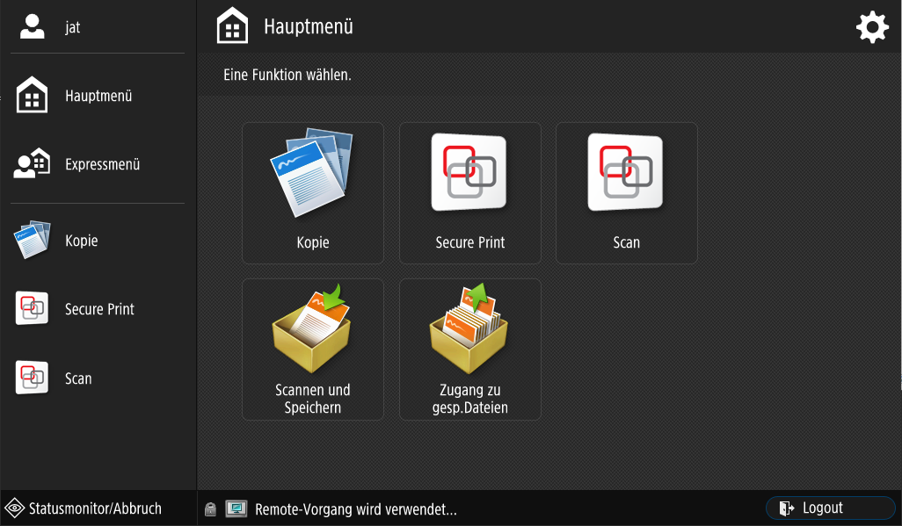
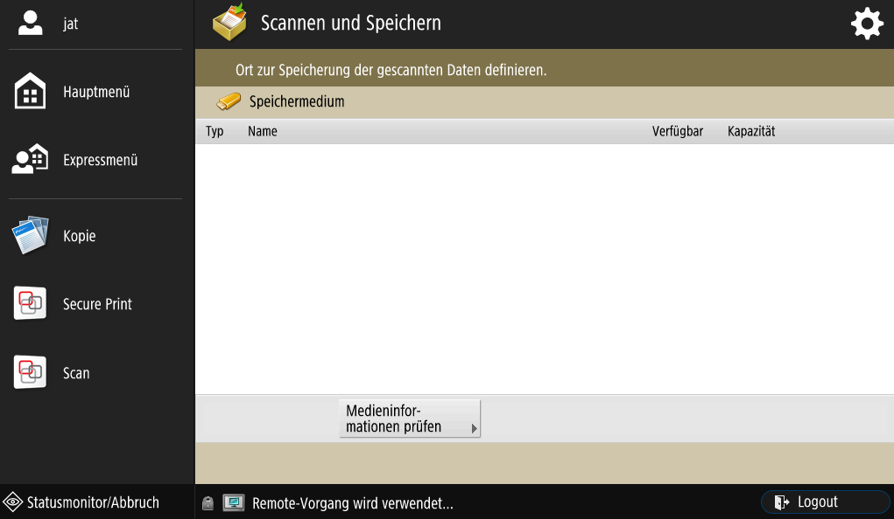
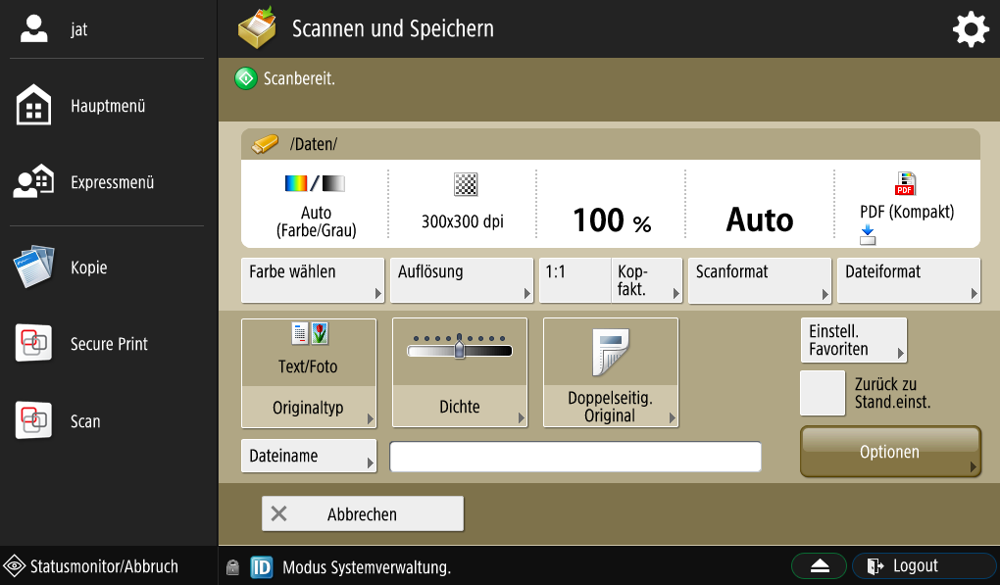
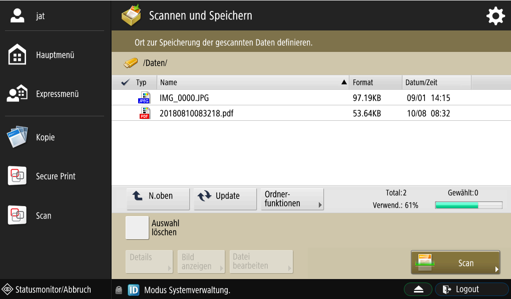
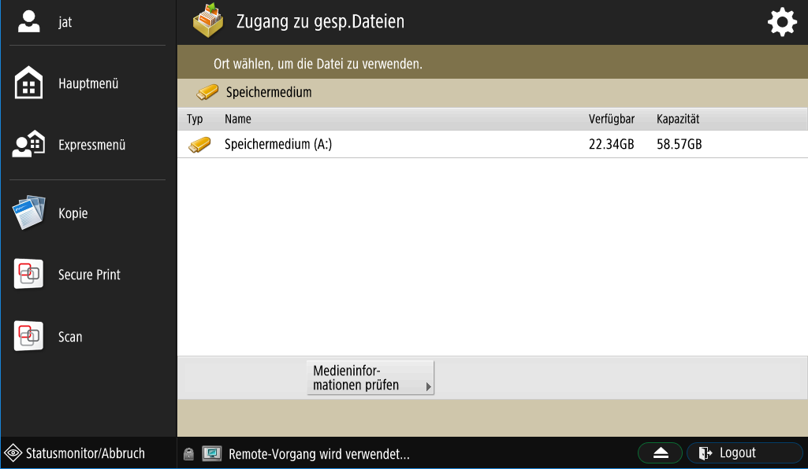

# Schüler*innen

An unserer Schule stehen zwei Multifunktionsgeräte zu Verfügung, mit welchen man drucken, kopieren und scannen kann. Das eine Gerät steht in der **Eingangshalle**, das andere in der **Mediothek**. 

## Kosten und Druckkonto

Das Drucken und Kopieren kostet für Schüler*innen gemäss folgender Tabelle:

| Drucken / Kopieren | Kosten |
| :----------------- | -----: |
| A4-Seite schwarz   | 10 Rp. |
| A4-Seite farbig    | 30 Rp. |

Die Kosten verstehen sich pro Seite. Wenn man also ein A4-Blatt doppelseitig farbig bedruckt, kostet das 60 Rp.

Die Kosten werden dem Druckkonto des Schülers/der Schülerin belastet. Auf der [internen Webseite][1] kann man den Stand der Druckkontos der letzten Nacht einsehen. Man kann das eigene Konto jederzeit an der Geldladestation in der Eingangshalle aufladen.

## Drucken am Computer

Vor dem Drucken muss man immer den **DruckerAllgemein** auswählen. Der Druckauftrag wird auf dem Server gespeichert. Danach hat man 48 Stunden Zeit, um sich an einem Drucker anzumelden und den Druckauftrag auszuführen. Erst dann fallen Kosten an.

## Verwenden des Druckers

### Anmeldung

Bevor man das Gerät benutzen kann, muss man sich mit dem Schüler*innenausweis anmelden:

### Hauptmenü

Wenn man sich am Drucker angemeldet hat, sieht man das folgende Menü:

- **Kopie:** Damit kann man Kopien anfertigen.
- **Secure Print:** Mit diesem Menü hat man Zugriff auf die Druckaufträge, welche man am Computer ausgelöst hat.
- **Scan:** Hier kann man Dokumente einscannen und sich diese per E-Mail zuschicken.
- **Scannen und Speichern:** Diesen Menüpunkt kann man wählen, um Dokumente einzuscannen und auf einem USB-Stick zu speichern.
- **Zugang zu gesp. Daten:** Mit diesem Menü kann man auf einem USB-Speicherstick gespeicherte PDF-Dokumente drucken.

Der USB-Anschluss befindet sich auf der rechten Seite des Geräts.

:::warning <i class="mdi mdi-alert"></i> Wichtig
Man kann nur PDF-Dokumente ab dem USB-Speicherstick drucken. Andere Dokumenttypen muss man am Computer drucken.
:::

[1]: https://intern.gymkirchenfeld.ch/

### Scan (mit Texterkennung) per Mail oder in Home-Verzeichnis

Es besteht die Möglichkeit,  Dokumente  zu  scannen  und  an  die  eigene  E-Mail-Adresse  zu  senden oder im Home-Verzeichnis zu speichern:

**Scan to MyMail** sendet das  gescannte  Dokument  an  die  E-Mail-Adresse  der  angemeldeten  Person
**Scan to Home** speichert das gescannte Dokument in etwas besserer Qualität unter H:\Scans

Das Scanmenu sieht folgendermassen aus:

1. Über die Schaltflächen rechts können diverse Einstellungen vorgenommen werden

2. Sobald mindestens eine Seite gescannt wurde (ausgelöst durch die grüne Kopiertaste), kann diese gedreht, gelöscht oder innerhalb der gescannten Seiten verschoben werden (Schaltflächen unten). Weitere Seiten können jederzeit mit Hilfe der grünen Kopiertaste hinzugefügt werden. 

3. Mit einem Klick auf _Weiter_ wird nach dem gewünschten Dateiformat gefragt (PDF ist voreingestellt). Die Kopiergeräte erkennen Text und ermöglichen das Markieren und Kopieren des Textes aus den PDF-Dateien. Ausserdem können auch Word-(DOCX), Excel-(XLSX) und Bilddateien (JPG) erzeugt werden. 

4. Nach einem erneuten  Klick auf _Weiter_ wird das Dokument im gewünschten Format erzeugt und gespeichert, resp. verschickt.

### Scan (mit Texterkennung) auf USB-Stick

Es besteht die Möglichkeit, am Kopiergerät (auf der rechten Seite) einen USB-Stick  einzustecken und direkt darauf zu scannen. Dazu wählt man auf dem Startbildschirm die Option _Scannen und Speichern_. 

1. Nach dem Einstecken des USB-Sticks erscheint dieser im folgenden Bildschirm:

2. Den USB-Stick auswählen und zum gewünschten Ordner navigieren. Nach einem Klick auf _Scan_ öffnet sich die Einstellungsansicht:

3. Falls  nötig  die  Einstellungen  anpassen  und  dann  auf den grünen Kopierknopf (im Bedienfeld neben dem Display) drücken. Mehrere Seiten können entweder über den automatischen Einzug oder auf der Glasfläche nacheinander  gescannt  werden  (immer  wieder  auf  den  grünen  Kopierknopf  im  Bedienfeld  neben  dem  Display drücken).  

4. Zum  Abschliessen  des  Scans  auf  den  im  Display  angezeigten  Knopf _Speichern starten_ drücken. Beim Speichern wird die Datei auf dem USB-Stick nach Datum und Uhrzeit benannt:

5. Nun ist es ganz wichtig, den USB-Stick nicht einfach auszuziehen, sondern ihn korrekt durch Antippen des kleinen Knopfs unten im Display  zu entfernen.

### Drucken ab USB-Stick

Man hat die Möglichkeit, direkt ab USB-Stick zu drucken. 

:::warning <i class="mdi mdi-alert"></i> Wichtig
Es wird ausschliesslich das Drucken von PDF-Dokumenten unterstützt! Das Drucken von Worddateien und anderen Dateitypen ist nicht möglich! Die Dateien werden zwar angezeigt und können ausgewählt werden, allerdings erscheint beim Drucken eine Fehlermeldung.
:::

1. Auf dem Startbildschirm die Schaltfläche _Zugang zu gespeicherten Dateien_ antippen und einen USB-Stick einstecken (auf der rechten Seite des Kopierers).

2. Der USB-Stick wird angezeigt und kann angetippt werden:

3. Nun können einzelne Dateien markiert werden, die gedruckt werden sollen:

4. Mit einem Klick auf den Button __Druck__ wird der Druckauftrag ausgelöst

## Drucken von mobilen Geräten

Die Multifunktionsgeräte unterstützen Mobile Printing. Das bedeutet, dass PDF-Dateien direkt von einem Smartphone oder Tablet gedruckt werden können. Diese Funktion ist für Geräte gedacht, bei denen ein fixes Einrichten der Drucker gemäss [unserer Anleitung](http://ict.mygymer.ch/byod/) nicht möglich ist. Der Vorgang funktioniert wie folgt: 

1. Auf dem mobilen Gerät eine E-Mail wie folgt schreiben
  * Von: vorname.name@gymkirchenfeld.ch
  * An: drucken@gymkirchenfeld.ch
  * Der Betreff wird ignoriert, kann also gut leer sein
  * Der Text im E-Mail-Body wird ebenfalls ignoriert
  * PDF-Datei als Anhang hinzufügen

2. Anmelden an der gewünschten Kopierstation wie gewohnt mit Schlüssel oder Kopierkarte

3. Schaltfläche Secure Print antippen und wie gewohnt ausdrucken

Wichtig: Der Vorgang funktioniert nur, wenn als Absender die eigene, offizielle Schul-E-Mail-Adresse (also vorname.name@gymkirchenfeld.ch) verwendet wird, sonst kann die gesendete E-Mail nicht dem richtigen Konto zugeordnet werden
