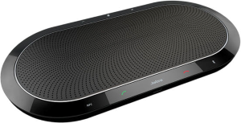
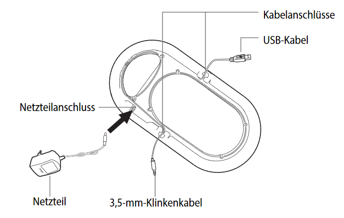
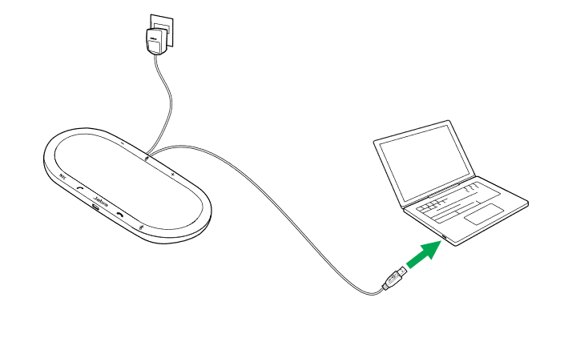
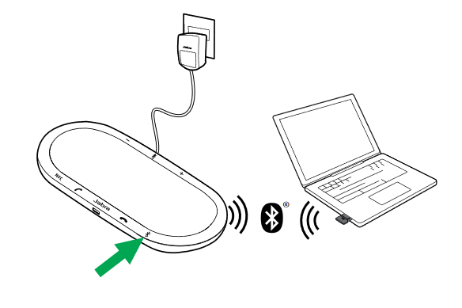
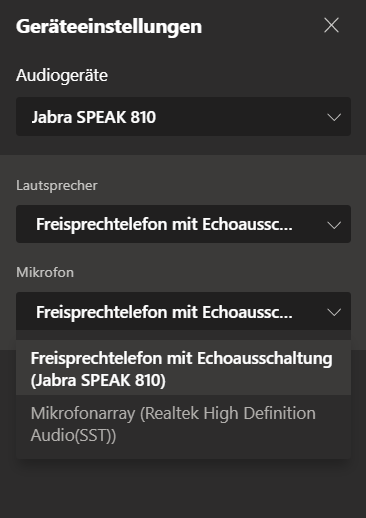
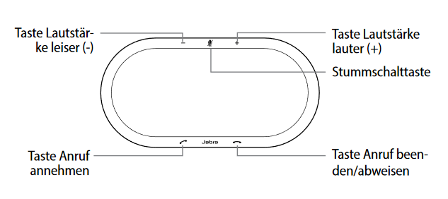

---
sidebar_custom_props:
  icon: mdi-microphone-variant
  source: gym-kirchenfeld
---

#  Jabra Speak Konferenzmikrofon

Das Jabra Speak 810 MS Konferenzmikrofon ist ein Raummikrofon, das störende Umgebungsgeräusche filtert. Es ermöglicht es, das gesamt Konferenz- oder Klassenzimmer in einem Meeting (z.B. per Teams) zu hören. 

## Einrichten

1. Das Stromkabel auf der Unterseite des Jabra Speak einstecken und das USB-Kabel abwickeln.

2. Das Gerät an den Strom anschliessen.

3. Das Gerät via USB-Kabel am Notebook anschliessen.

**Optional:**

Falls das Notebook Bluetooth-fähig ist, kann das Jabra Speak auch per Bluetooth verbunden werden:

* Auf die Bluetooth-Taste am Jabra Speak tippen und den sprachgeführten Anweisungen folgen.

* _Jabra Speak 810_ aus der Liste der Bluetooth-Geräte auswählen.

4. Im Konferenztool, z.B. Teams, unter _Einstellungen_ sicherstellen, dass folgende Geräte eingestellt sind:
_Audiogeräte:_ _Jabra Speak_ 
_Lautsprecher_ und _Mikrofon:_ _Freisprechtelefon mit Echoausschaltung (Jabra SPEAK 810)_

## Steuerung

Anruf und Lautstärke können im Konferenztool oder direkt über das Mikrofon gesteuert werden:

|                            |                                    |
| :------------------------- | :--------------------------------- |
|   | Anruf entgegennehmen               |
|   | Anruf beenden                      |
|   | Lautsprecher lauter/leiser stellen |
|  | Mikrofon stumm schalten            |

