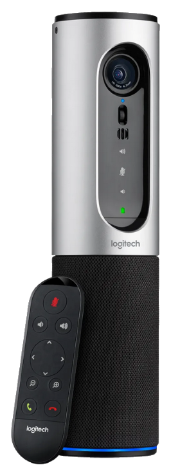
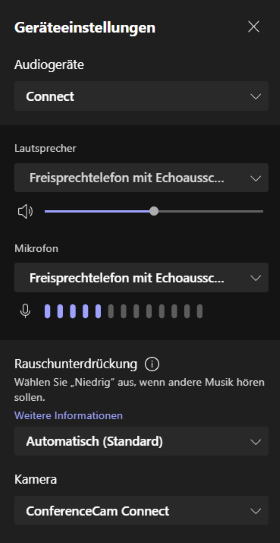
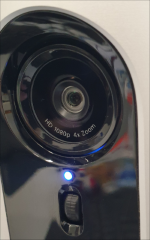

#  Logitech Connect ConferenceCam

Die Logitech Connect ConferenceCam ist ein Konferenzgerät mit 90°-Kamera. Sie ermöglicht es, einen Bereich im Konferenz- oder Klassenzimmer in einem Meeting (z.B. per Teams) zu zeigen und ist gleichzeitig ein Konferenzmikrofon/-lautsprecher. Die Kamera besitzt einen Akku, der automatisch geladen wird, sobald sie per USB mit einem Computer verbunden ist.

## Einrichten

1. Die Kamera per USB-Kabel mit dem Notebook/PC verbinden.

2. Mehrere Sekunden auf der Oberseite der Kamera auf den Powerknopf drücken, bis der Startton der Kamera zu hören ist:

3. Die Fernbedienung von der Front entfernen. 

4. Sicherstellen, dass auf der Oberseite der Kamera das Symbol _Kameramodus_ aktiviert ist (weisses Licht leuchtet):

5. Im Konferenztool, z.B. Teams, wird die Kamera standardmässig automatisch gewählt. Unter _Einstellungen_ sollte _Connect_ als Audiogerät, _Freisprechtelefon mit Echoausschaltung (Connect)_ als Mikrofon und _ConferenceCam Connect_ als Kamera eingestellt sein:

6. Unterhalb der Kamera leuchtet ein blaues Licht, wenn die Kamera an ist:

## Steuerung

* Der Kamerawinkel kann mit dem Rädchen unter der Kamera nach oben/unten ausgerichtet werden. 

**Knöpfe des Bedienfelds auf der Oberseite der Kamera:**

|                          |                                                                                                              |
| :----------------------- | :----------------------------------------------------------------------------------------------------------- |
|  | Ein- und ausschalten                                                                                         |
|  | Verwendung als Bluetooth-Lautsprecherbox (Funktion wird für den Gebrauch als Konferenzkamera nicht benötigt) |
|  | Mikrofon stummschalten (rotes Licht leuchtet, wenn Mikrofon stumm geschaltet)                                |
|  | Kameramodus für Videokonferenzen (weisses Licht leuchtet, wenn dieser Modus aktiviert ist)                   |

**Knöpfe Fernbedienung:**

|                                                  |                          |
| :----------------------------------------------- | :----------------------- |
|                          | Mikrofon stummschalten   |
|  | Lautstärke regulieren    |
|  | Kamera-Zoom              |
|                          | Gespräch/Sitzung beenden |
