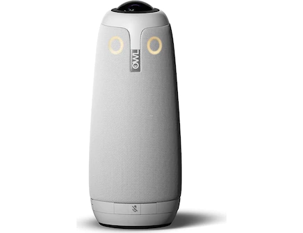
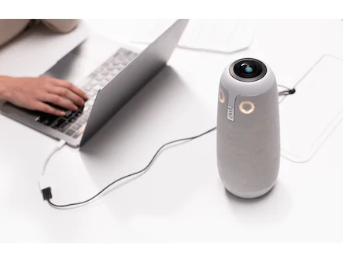
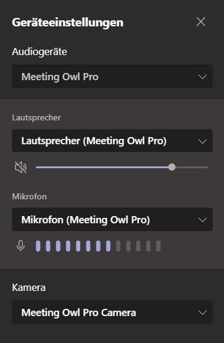
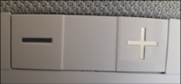
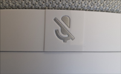

---
sidebar_custom_props:
  icon: mdi-owl
  source: gym-kirchenfeld
  path: /docs/infra/geraete/konf/owl/README.md
draft: true
---

#  MeetingOWL

Die MeetingOWL ist ein Konferenzgerät mit 360°-Kamera. Sie ermöglicht es, das gesamt Konferenz- oder Klassenzimmer in einem Meeting (z.B. per Teams) zu zeigen und fokussiert die Kamera automatisch auf die Person, die gerade spricht.

## Einrichten

1. Das Stromkabel und das USB-Kabel auf der Unterseite der Eule einstecken.

2. Die Eule an den Strom anschliessen und warten, bis sie gurrt.

3. Die Eule via USB-Kabel am Notebook anschliessen.

4. Im Konferenztool, z.B. Teams, unter _Einstellungen_ sicherstellen, dass _Meeting Owl Pro_ als Kamera, Mikrofon und Lautsprecher eingestellt ist.

## Steuerung

* Die Lautstärke kann mit den _+_/_-_ Buttons reguliert werden.

* Das Mikrofon kann mit der Mikrofontaste stumm geschaltet werden.

