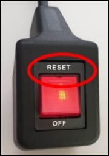
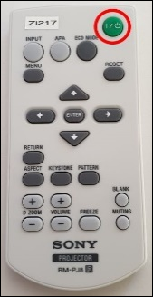
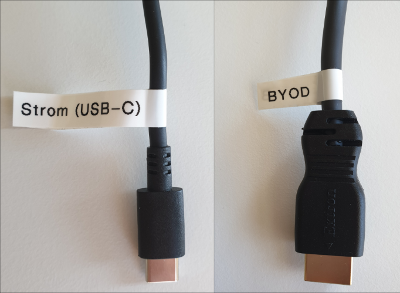
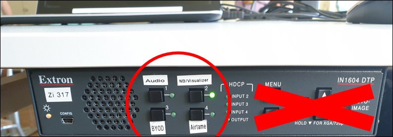
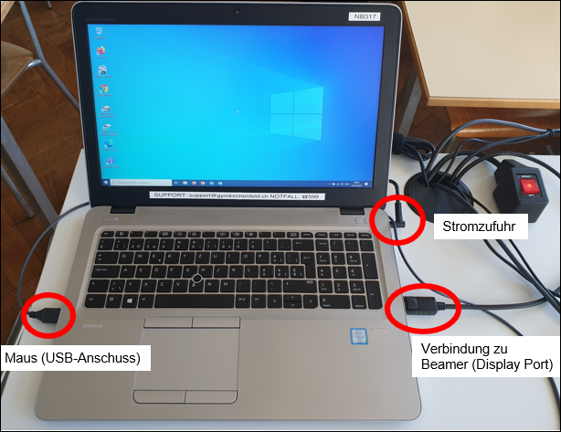
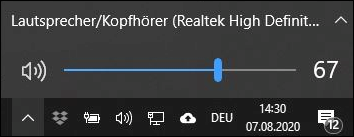
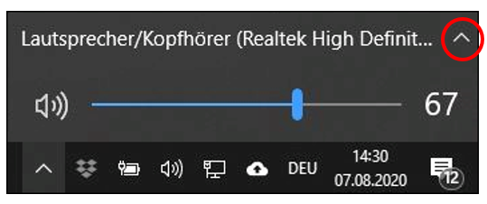
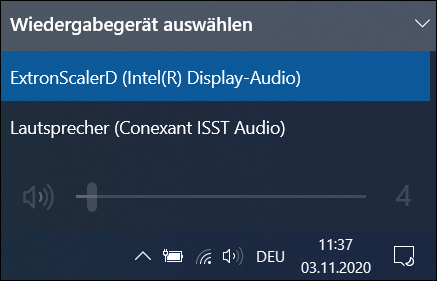
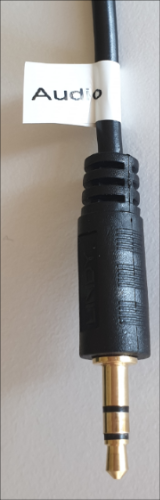

---
sidebar_custom_props:
  icon: mdi-human-male-board
  source: gym-kirchenfeld
  path: /docs/infra/geraete/stehpult/README.md
draft: false
---

#  Stehpult

Seit Sommer 2020 sind in einigen Zimmern höhenverstellbare Stehpulte installiert.

## Höhe verstellen

Metallhebel nach oben drücken, gleichzeitig Tischfläche nach unten oder oben drücken

## Pult/Beamer einschalten

1. Stromzufuhr Pult einschalten: Knopf auf _reset_

2. Beamer einschalten mit Beamerfernbedienung: Auf den grünen Knopf __I/&#x23FB;__ drücken. **Achtung:** Input muss **nie** umgeschaltet werden (ist immer auf _Stehpult_)

3. Benötigtes Gerät einschalten

    * Visualizer 
    * Zimmernotebook
    * Eigenes Gerät (BYOD)

4. Falls eigenes Gerät (BYOD) verwendet wird:

    * Wenn HDMI-Anschluss vorhanden, _BYOD_-Kabel anschliessen und ggf. über _Strom (USB-C)_ aufladen
    * Wenn kein HDMI-Anschluss vorhanden, mit Airtame anmelden

5. Am Wandler unter Tischplatte den Kanal auf das benötigte Gerät schalten

    **1 Audio** = Audiokabel zum Abspielen von Audiodateien z.B. vom Handy (ohne Bild)
    **2 NB/Visualizer** = Zimmernotebook oder Visualizer. Ist der Visualizer ausgeschaltet, zeigt der Beamer automatisch das Bild des Zimmer-notebooks 
    **3 BYOD** = eigenes Gerät über «BYOD»-Kabel
    **4 Airtame** = eigenes Gerät, das über Airtame verbunden ist

## Pult/Beamer ausschalten

Bei jedem noch so kurzen Verlassen eines Raumes muss der Bildschirm immer am Schul-Computer resp. am eigenen Laptop mit Ctrl+Alt+Del gesperrt werden, um zu verhindern, dass SuS oder andere Personen auf die eigenen Dateien zugreifen können.

Beim Verlassen des Unterrichtszimmers gilt (auch wenn danach noch Unterricht stattfindet!):

1.	Beamer ausschalten mit Beamerfernbedienung: Auf den grünen Knopf __I/&#x23FB;__ drücken. Bitte immer auf das Licht am Beamer achten - ist es grün, läuft er noch, auch wenn er nichts projiziert! Wenn das Licht am Beamer orange leuchtet, schaltet er ab. 

2.	Verwendete Geräte ausschalten

    * Visualizer **(mindestens 2 Sek. auf Ein-/Ausschaltknopf)**
    * Zimmernotebook. Nachdem das Licht am Ausschaltknopf erloschen ist, den Notebookdeckel zuklappen.
    * Eigenes Gerät (BYOD)

3.	Stromzufuhr Pult ausschalten: Knopf auf _off_

## Zimmernotebook

So ist das Zimmernotebook korrekt angeschlossen:

## Umschalten zwischen Visualizer und Zimmernotebook

1. Kanal am Wandler unter Tischplatte auf **2 NB/Visualizer** schalten

2. Zimmernotebook und Visualizer einschalten

3. Auf dem Bedienfeld des Visualizers die beiden Tasten verwenden, um auf Visualizer (links) oder Notebook (rechts) umzuschalten:

## Lautstärke regeln

Lautstärke wird direkt per Lautstärkesteuerung am Notebook geregelt (in der Taskleiste und in Anwendungen wie z.B. Youtube), es gibt keinen Regler mehr am Verstärker.

## Wenn der Ton nicht hörbar ist

  * Prüfen, ob die Quelle korrekt eingestellt ist. Rechts unten auf das Lautsprechersymbol klicken

  * Auf das __^__-Symbol klicken um das Menu zu öffnen

  * Ton auf Zimmerlautsprecher übertragen: _ExtronScalerD (Intel(R) Display-Audio)_ wählen
  * Ton über eingebauten Notebook-Lautsprecher abspielen: _Lautsprecher (Conexant ISST Audio)_ wählen

## Audiodateien ab Handy abspielen

1. Kabel mit Beschriftung «Audio» an Handy einstecken

2. Am Wandler unter Tischplatte «1 Audio» einstellen

