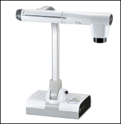
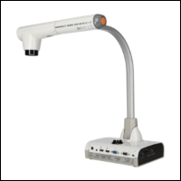
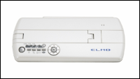

# Visualizer

In einigen Schulzimmern ist eine Dokumentenkamera, ein sog. Visualizer, installiert. Die Modellbezeichnung befindet sich jeweils auf dem Arm mit der Kamera.

[:mdi-toolbox: Elmo Interactive Toolbox](elmointeractive/)

| Elmo L-12F                                     | Elmo L-12iD                                     | Elmo MO-1                                     |
| :--------------------------------------------- | :---------------------------------------------- | :-------------------------------------------- |
|  |  |  |
