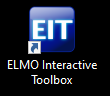
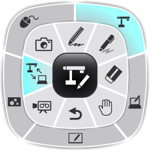
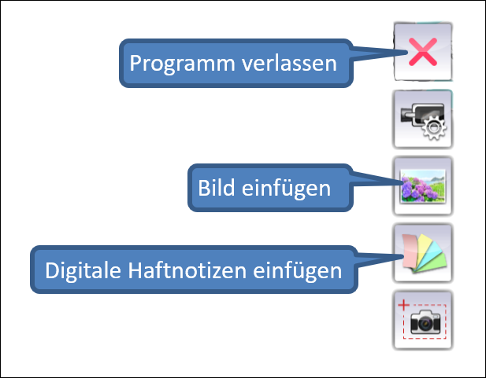
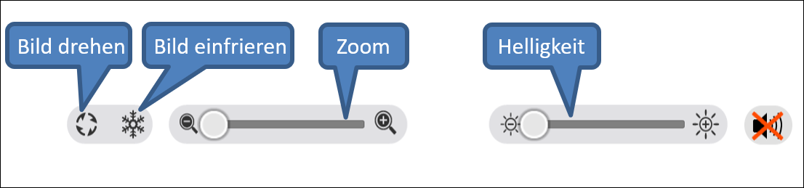
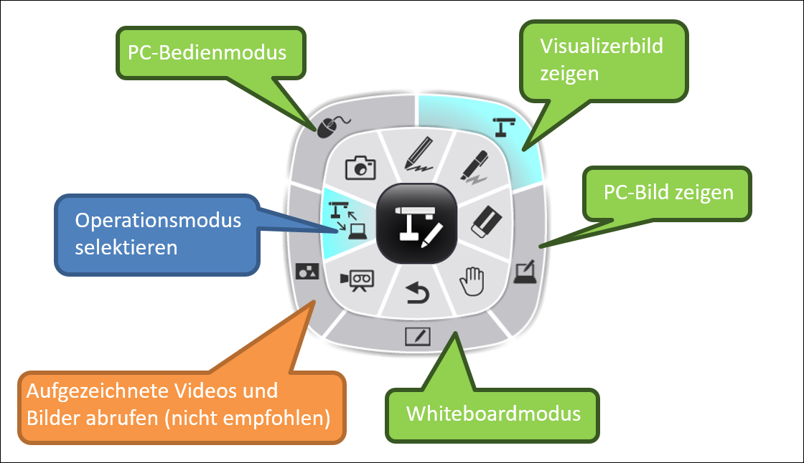
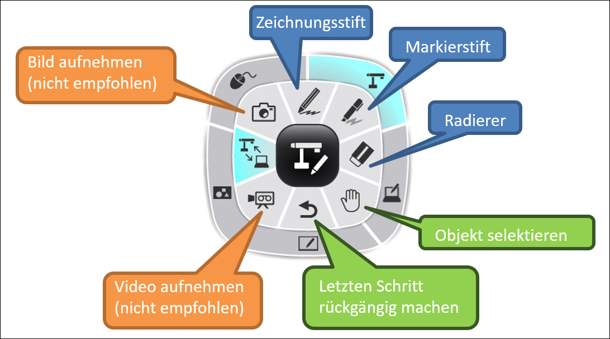
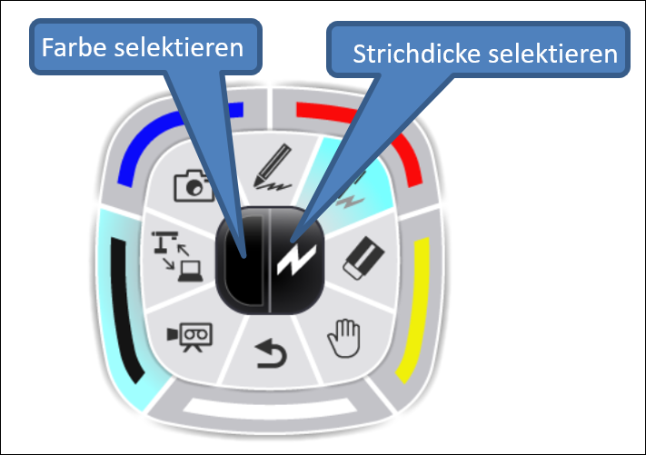

---
sidebar_custom_props:
  icon: mdi-toolbox
  source: gym-kirchenfeld
  path: /docs/infra/geraete/visualizer/elmointeractive/README.md
draft: true
---

# Elmo Interactive Toolbox

Mit der Elmo Interactive Toolbox lässt sich das Bild vom Visualizer direkt am Notebook/PC anschauen und während der Präsentation bearbeiten. So kann man direkt ins Bild zeichnen oder schreiben. Es ist ebenfalls möglich, die Toolbox ohne Visualizer als Whiteboard am Notebook zu nutzen.

## Elmo Interactive Toolbox installieren

Auf den Zimmernotebooks ist die Software bereits vorinstalliert. Wer mit dem eigenen Gerät (BYOD) arbeitet, installiert die Software selbst:

1. Software _Elmo Interactive Toolbox_ auf [Elmoeurope.com](https://www.elmoeurope.com/index.php/de-de/download-service/software) herunterladen.
[Elmo Interactive Toolbox für Windows](https://www.elmoeurope.com/images/Download/EITSetup_ver3_14.zip)
[Elmo Interactive Toolbox für MacOS](https://www.elmoeurope.com/images/Download/EIT_3.zip)

2. Die Datei mit einem Unzip-Programm (z.B. [7zip](https://www.7-zip.org/)) entpacken

3. Die entpackte Datei ausführen um die Installation durchzuführen

## Elmo Interactive Toolbox starten am Zimmernotebook

1. Das Kabel mit der Beschriftung _Elmo Interactive Toolbox_ muss im Notebook und dem Visualizer eingesteckt sein

2. _Zimmer ohne Stehpult:_ Am Beamer den Kanal _Notebook_ wählen

   _Zimmer mit Stehpult:_ Am Kästchen Kanal 2 _NB/Visualizer_ selektieren 

3. Den Visualizer starten und auf dem Bedienfeld auf den Modus _Computer_ einstellen 
  
  

4. Mit einem Klick auf das Icon _Elmo Interactive Toolbox_ starten

   
    
## Elmo Interactive Toolbox starten am eigenen Notebook (BYOD)

1. Das Kabel mit der Beschriftung _Elmo Interactive Toolbox_ muss im Notebook und dem Visualizer eingesteckt sein

2. _Zimmer ohne Stehpult:_ 
    * VGA-Stecker aus dem Zimmernotebook am eigenen Notebook anschliessen (ggf. mit Adapter) oder Notebook per Airtame mit dem Beamer verbinden
    * Am Beamer den Kanal _Notebook_ (Kabelverbindung) oder _Wireless_ (Airtame) einstellen

   _Zimmer mit Stehpult:_ 
    * Das eigene Gerät an das HDMI-Kabel mit der Beschriftung _BYOD_ anschliessen oder Notebook per Airtame mit dem Beamer verbinden
    * Am Kästchen Kanal 3 _BYOD_ (Kabelverbindung) oder Kanal 4 _Airtame_ (Airtame) wählen

3. Den Visualizer starten und auf dem Bedienfeld auf den Modus _Computer_ einstellen 
  
  

4. Mit einem Klick auf das Icon _Elmo Interactive Toolbox_ starten

  

## Menüelemente

  * Im Menü links oben kann der Bildmodus eingestellt werden und es stehen verschiedene Bedienmöglichkeiten zur Auswahl

  

  * Mit der Maus an den linken Rand des Bildschirms fahren, um das Hauptmenü zu öffnen

   

   * Am unteren Bildschirmrand befindet sich im Visualizermodus ein Menü zum Einstellen des Visualizers

      

## Bildmodus einstellen

**Achtung:** Wenn der Bildmodus in _Elmo Interactive Toolbox_ gewechselt wird, kann es sein, dass der Modus auf dem Bedienfeld des Visualizers selbständig vom Modus _Computer_ auf _Visualizer_ wechselt. Dann auf dem Bedienfeld wieder den Modus _Computer_ einstellen, indem man den entsprechenden Knopf drückt: 
  
  

  

  * Mit der Taste  kann das Bildmodus-Menü geöffnet werden

  * **PC-Bedienmodus:** _Elmo Interactive Toolbox_ bleibt offen, parallel dazu kann man Dateien oder Programme auf dem Notebook öffnen

  * **Visualizerbild zeigen:** Das Über den Visualizer projizierte Bild anzeigen und bearbeiten, z.B. darauf zeichnen oder Bereiche markieren 

  * **PC-Bild zeigen:** Der Desktop des Computers wird angezeigt und man kann darauf zeichnen oder Bereiche markeiren, jedoch kann man keine Dateien oder Programme öffnen
  
  * **Whiteboardmodus:** Einen weissen Hintergrund anzeigen und bearbeiten, z.B. zeichnen oder Bereiche markieren

  * **Aufgezeichnete Videos und Bilder abrufen:** Hier können Bilder und Videos abgerufen werden, die unter _Bedienmöglichkeiten_ aufgenommen bzw. aufgezeichnet wurden. **Da das Programm in diesem Modus instabil läuft, empfehlen wir, diese Funktion nicht zu nutzen.** 

  ## Bedienmöglichkeiten

 

   * **Zeichnungsstift / Markierstift / Radierer:** Im Stiftmodus auf die Fläche Zeichnen oder Bereiche markieren

   * **Bild aufnehmen / Video aufnehmen:** Fotos und kurze Videos können aufgezeichnet werden und werden automatisch lokal abgespeichert. Mit dem Bildmodus _Aufgezeichnete Videos und Bilder abrufen_ können diese aufgerufen werden. **Da das Programm in diesem Modus instabil läuft, empfehlen wir, diese Funktionen nicht zu nutzen.** Standbilder können mit der Freezefunktion (Menü am unteren Bildschirmrand) erstellt und bearbeitet werden. Sie sind anschliessend jedoch nicht auf dem Rechner abgespeichert.

## Stiftmodus

## PC-Bedienmodus

