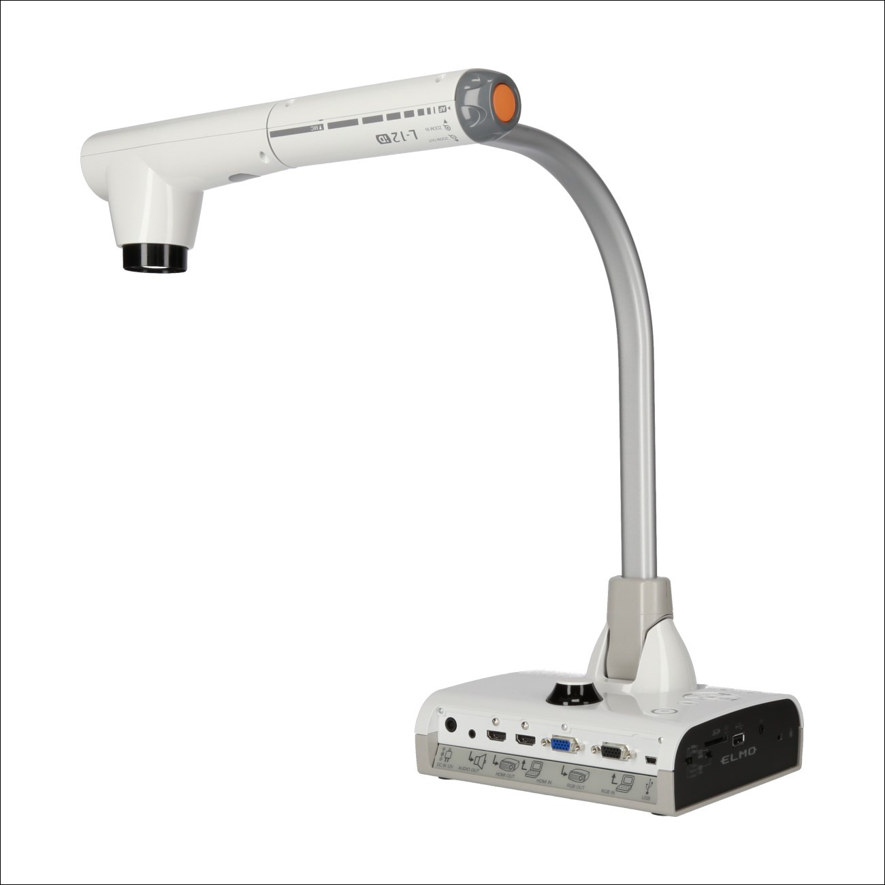
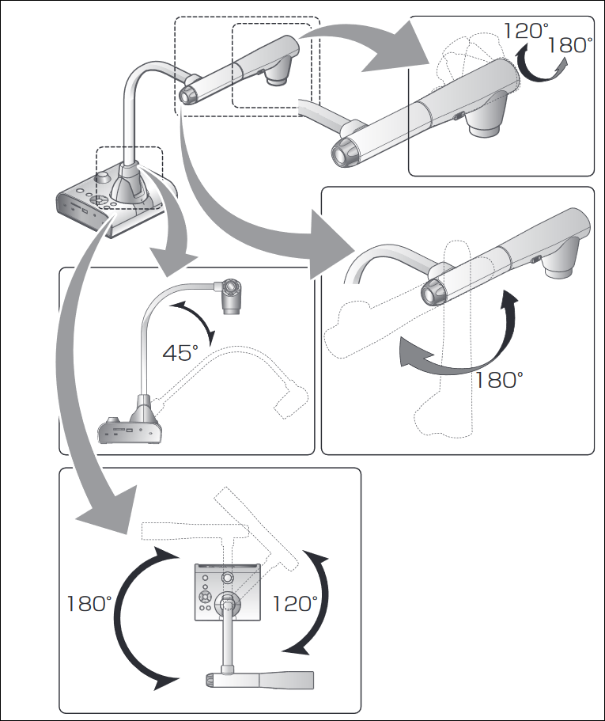
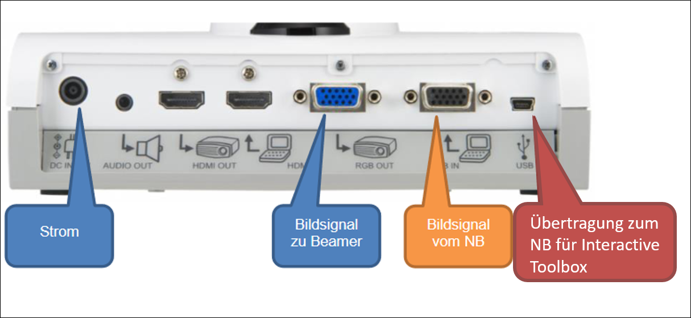
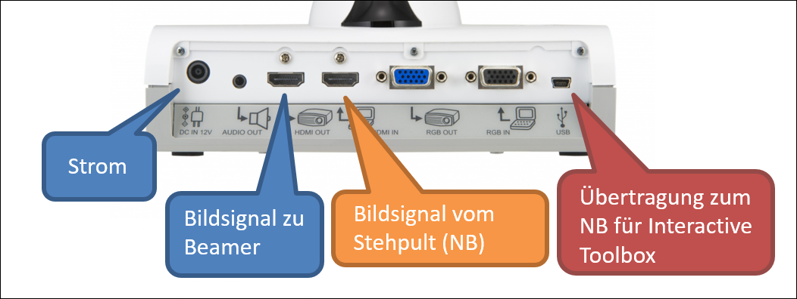
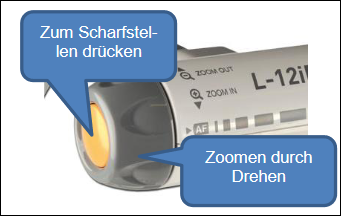
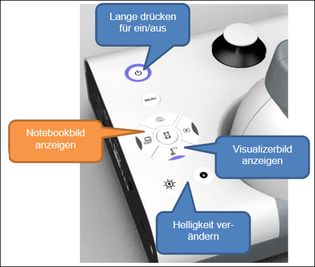
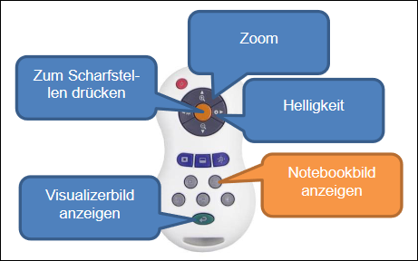

---
sidebar_custom_props:
  icon: mdi-camera-metering-center
---

#  "Elmo L-12iD"

## Kamera korrekt ausrichten
Der Kamera-Arm kann gekippt und gedreht werden

## Verkabelung
Die folgende Abbildung zeigt, wie der Visualizer verkabelt sein muss:

_Zimmer ohne Stehpult:_

_Zimmer mit Stehpult:_

## Arbeiten am Notebook ohne Visualizer
_Zimmer ohne Stehpult:_ Der Visualizer ist über den Kabelschlauch mit dem Beamer verbunden. Das Bildsignal des Notebooks ist am Visualizer angeschlossen. Das Notebook-Bild wird folglich via Visualizer an den Beamer übertragen. Dies klappt nur, wenn der Visualizer am Strom angeschlossen ist, er muss aber nicht eingeschaltet sein.

_Zimmer mit Stehpult:_ Der Visualizer ist über das Stehpult bzw. den Kabelschlauch mit dem Beamer verbunden. Am Kästchen muss Kanal 2 "NB/Visualizer" gewählt sein, damit Visualizer, Notebook oder beide verwendet werden können.

## Arbeiten mit Visualizer und Notebook im Wechsel
Am Visualizer kann gezielt zwischen Notebook und Visualizer hin- und hergeschaltet werden. Der Beamer benötigt beim Wechsel einige Sekunden, um sich neu einzustellen.

## Arbeiten mit der Elmo Interactive Toolbox

Die Software ermöglicht das Zeichnen am Computer auf das angezeigt Bild: [Anleitung](../elmointeractive/)