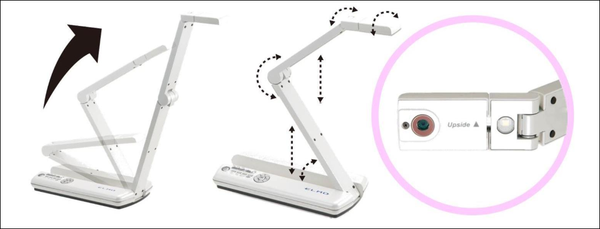
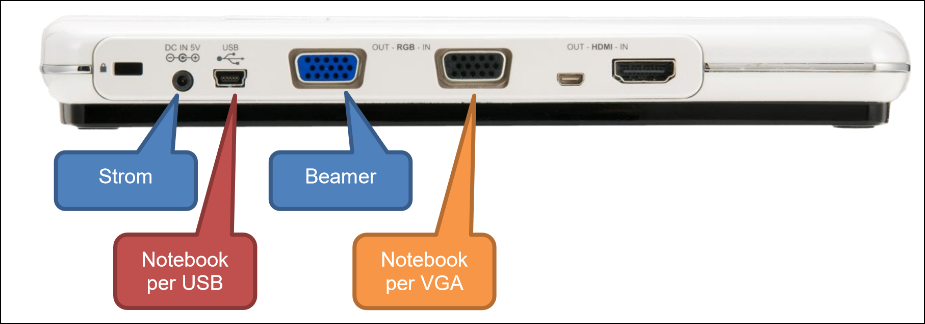
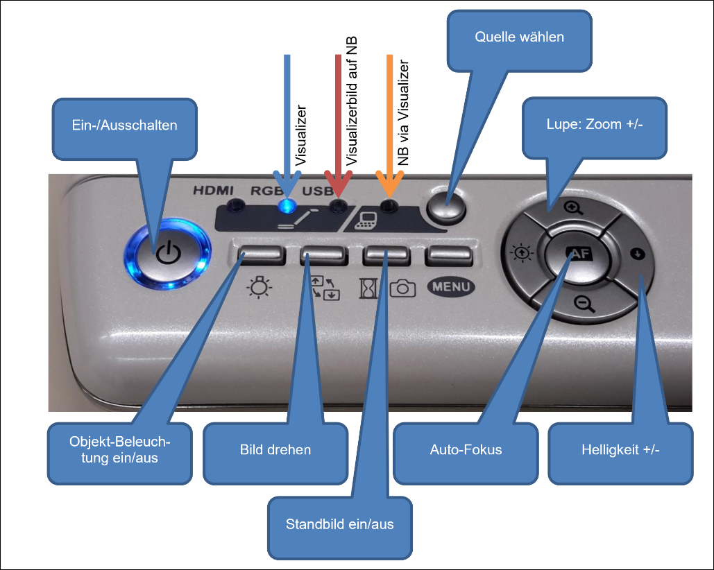

---
sidebar_custom_props:
  icon: mdi-camera-metering-center
  source: gym-kirchenfeld
  path: /docs/infra/geraete/visualizer/elmomo1/README.md
draft: true
---

# Elmo MO-1

Jeweils ein Exemplar dieser mobilen Visualizer befindet sich zur Ausleihe in Zi206 Lehrerarbeitsraum GH, Zi306 Lehrerarbeitsraum WR und Zi330 Lehrerarbeitsraum MN.

## Kamera korrekt ausrichten

## Verkabelung

## Arbeiten am Notebook mit dem Visualizer

## Arbeiten mit der Elmo Interactive Toolbox

Die Software ermöglicht das Zeichnen am Computer auf das angezeigt Bild: [Anleitung](../elmointeractive/)
