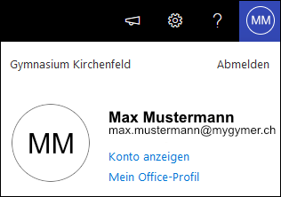
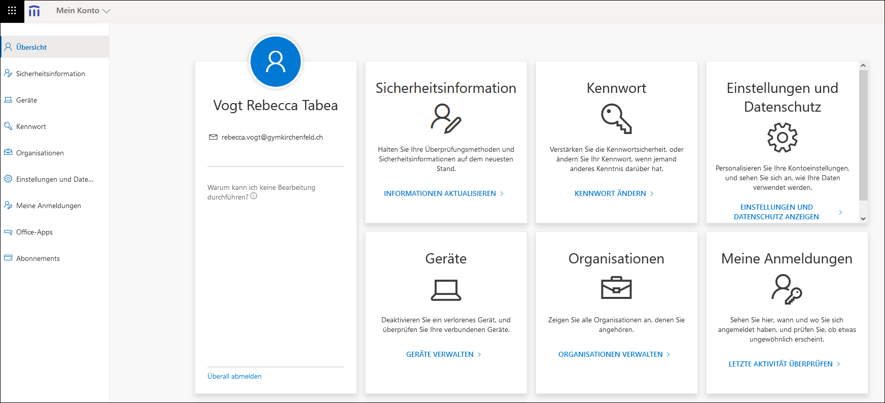
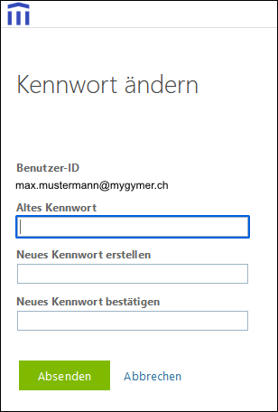

---
sidebar_custom_props:
  icon: mdi-account
  source: gym-kirchenfeld
  path: /docs/infra/konto/README.md
draft: true
---

#  Konto und Passwort

## E-Mail-Adresse

Für das Login verwendest du überall deine **Schul-E-Mail-Adresse**. Deine E-Mail-Adresse lautet so:

|               |                     E-Mail-Adresse |
| :------------ | ---------------------------------: |
| Schüler:innen |        vorname.nachname@mygymer.ch |
| Lehrer:innen  | vorname.nachname@gymkirchenfeld.ch |

## Benutzername

Den Benutzernamen brauchst du eigentlich nicht, du kannst ihn allerdings zum Einloggen an den *PCs und Notebooks* verwenden, um weniger tippen zu müssen.

|                            |       Benutzername |
| :------------------------- | -----------------: |
| Schüler:innen (vor Mai 20) | _vorname.nachname_ |
| Lehrer:innen (vor Mai 20)  |     _xyz_ (Kürzel) |
| alle ab Mai 20             |           _u12345_ |

## Passwort vergessen

Solltest du dein Passwort einmal vergessen, dann kommst du mit einem **Ausweis** beim Informatikdienst im **Zimmer 048** vorbei.

## Passwort ändern am Schulcomputer

So kannst du dein Passwort an einem Schulcomputer ändern:

- Melde dich an einem **Schul-Computer** an.
- Drücke die Tastenkombination [[Ctrl]] + [[Alt]] + [[Del]]
- wähle __Kennwort ändern…__

## Passwort ändern am eigenen Notebook

So kannst du dein Passwort an deinem eigenen Notebook ändern:

- Melde dich auf cloud.gymkirchenfeld.ch an.
- Klicke ganz rechts oben im Fenster auf das runde Symbol mit deinem Namenskürzel.
- Wähle _Konto anzeigen_.

- Klicke in der Übersicht unter _Kennwort_ auf den Link _Kennwort ändern_.

- Gib dein altes Kennwort in das oberste Feld ein und das neue in das mittlere und untere Feld. Das neue Passwort muss mindestens 10 Zeichen lang sein.

## Sicheres Passwort

Du solltest für das Schulkonto unbedingt ein sicheres Passwort verwenden. Das Passwort muss **mindestens 10 Zeichen lang** sein.

Es gibt Strategien, um gute Passwörter zu erstellen, die man sich einfach merken kann:

### A. Anfangsbuchstaben

Denke einen Satz aus, den du dir gut merken kannst:

**Jeden Abend vor dem Schlafen trinke ich eine Tasse Kräutertee!**

Nimm die Anfangsbuchstaben von jedem Wort und die Satzzeichen, das ist dein Passwort:

**JAvdStieTKt!**

### B. Vier zufällige Wörter

Wähle vier zufällige Wörter. Verwende beispielsweise einen Webdienst dazu. Überlege dir anschliessend eine Visualisierung, mit welcher du dir diese Wörter merken kannst.
