# e-Thek

Der Online-Katalog der Mediothek heisst e-Thek und ist online erreichbar: 

https://medio.gymkirchenfeld.ch/NetBiblio
oder
https://e-thek-zh.onleihe.com/e-thek/frontend/welcome,51-0-0-100-0-0-1-0-0-0-0.html

Schülerinnen und Schüler sowie Lehrpersonen können über die e-Thek digital Bücher für einen begrenzten Zeitraum ausleihen. Diese lassen sich auf beliebigen Geräten abrufen, sofern Adobe Digital Editions installiert ist. Die digitale Leihe erfolgt entweder über einen Link im Katalog der Mediothek des Gymnasium Kirchenfeld oder direkt über die e-Thek-Webseite.

## Adobe Digital Editions installieren

Mit Adobe Digital Editions können virtuelle Bücher verwaltet und für einen gewissen Zeitraum verfügbar gemacht werden. Diese Anwendung muss auf dem Gerät installiert sein, damit e-Thek nutzbar ist.

1. Adobe Digital Editions herunterladen

Im Browser auf https://www.adobe.com/ch_de/solutions/ebook/digital-editions/download.html gehen. Entsprechende Version (Windows oder Mac) auswählen.

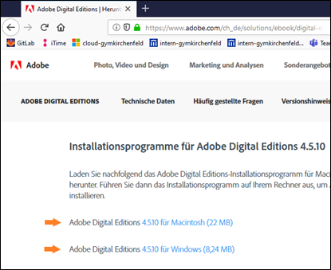

2. Die Installationsdatei ausführen (diese befindet sich unter Windows standardmässig im _Downloads_-Ordner). **Achtung**: Im Dialogfeld _Ihren Computer autorisieren_ beim Feld _**Ich möchte den Computer ohne ID autorisieren**_ das Häkchen setzen.

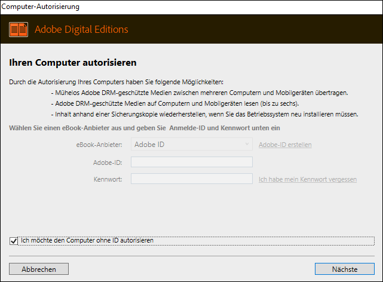

## Leihe über den Katalog der Mediothek

1.	Im Katalog nach dem gewünschten Medium suchen.

2.	Ist das Medium digital leihbar, erscheint ein blauer Divibib-Button, diesen anklicken.

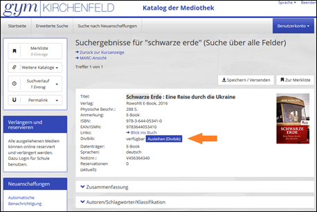

3.	In der Loginmaske Nutzerdaten eingeben, falls man noch nicht angemeldet ist:

|               |                         Benutzername |
| :------------ | -----------------------------------: |
| Schüler*innen |        _vorname.nachname@mygymer.ch_ |
| Lehrer*innen  | _vorname.nachname@gymkirchenfeld.ch_ |

Passwort: Das eigene Schulpasswort

4.	Auf _Anmelden_ klicken.

5.	Beim Medium auf den Button «Jetzt ausleihen» klicken.

6. Ausleihdauer wählen.

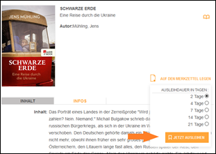

7. Im Dialogfenster «Öffnen mit» wählen. Adobe Digital Editions wird bereits standardmässig vorgeschlagen.

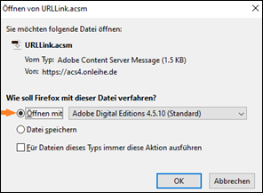

8.	Das ausgeliehene Buch erscheint jetzt in Adobe Digital Editions.

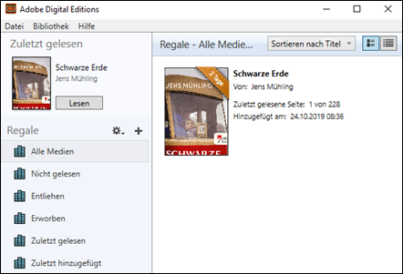

## Leihe über e-Thek

1.	Im Browser auf https://e-thek-zh.onleihe.com/ gehen.

2.	Auf «Mein Konto» klicken.

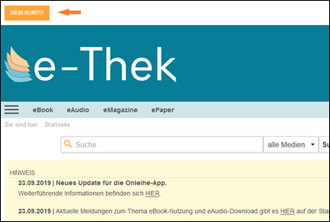

3. Beim ersten Login: Bibliothek «Bern (Mediothek Gymnasium Kirchenfeld)» wählen.

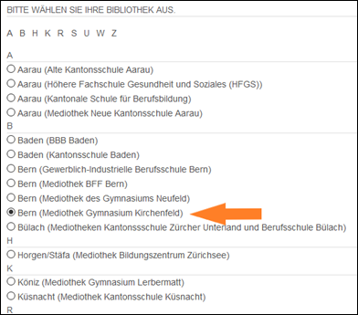

4.	Unten auf der Seite auf Button «weiter» klicken.

5.  Schülerinnen und Schüler: In das Feld «Benutzernummer» die vollständige mygymer-Mailadresse vorname.nachname@mygymer.ch und das Passwort eintragen. Lehrerinnen und Lehrer: In das Feld «Benutzernummer» die vollständige gymkirchenfeld-Mailadresse vorname.nachname@gymkirchenfeld.ch und das Passwort eintragen. Anschliessend auf _Login_ klicken.

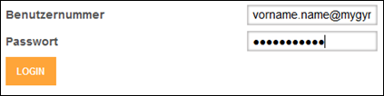

6.  Im Suchfeld kann nach Titeln gesucht werden. Im nebenstehenden Menü kann die Medienart eingegrenzt werden.

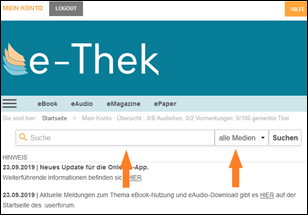

7. Um die neusten Titel einer Medienart zu sehen, kann im entsprechenden Menu aus den Katego-rien «eBook», «eAudio», «eMagazine» und «ePaper» ausgewählt werden.

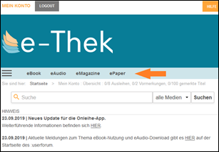

8. Erscheint beim gewünschten Medium der Button «Jetzt ausleihen», so ist dieses Medium für die digitale Ausleihe verfügbar. Auf den Button klicken.

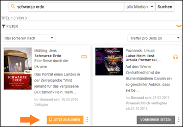

9. Ausleihdauer wählen.

10. Im Dialogfenster «Öffnen mit» wählen. Adobe Digital Editions wird bereits standardmässig vorgeschlagen.

11.	Das ausgeliehene Buch erscheint jetzt in Adobe Digital Editions.

