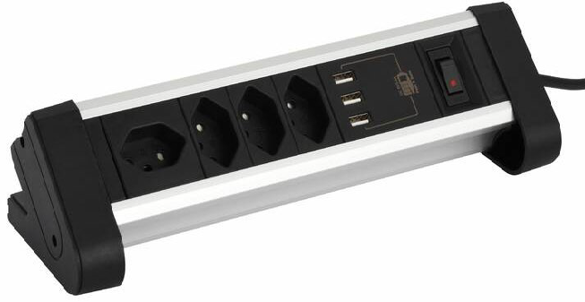
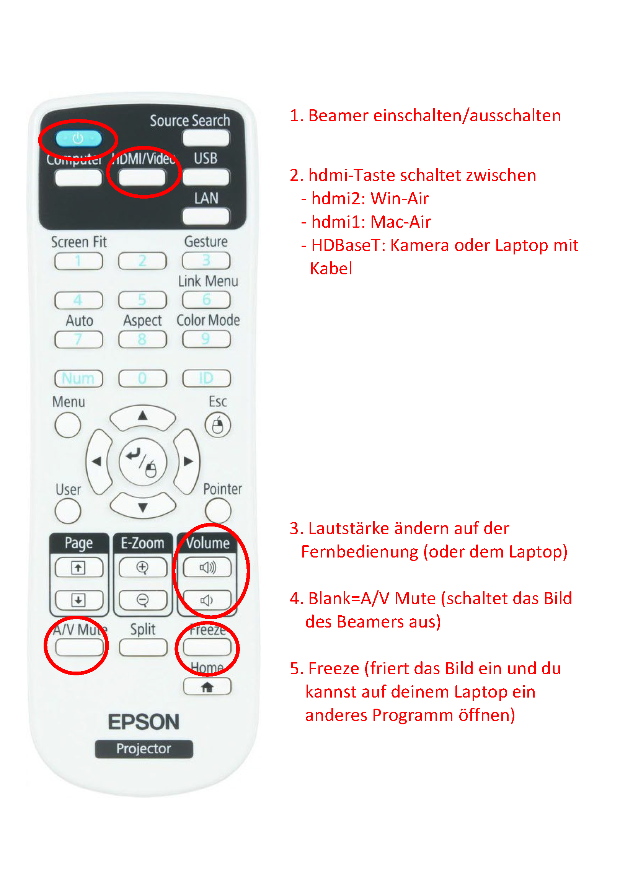

# Anleitungen Beamerinstallationen

<Tabs groupId="gebäude">
  <TabItem value="d" label="Gebäude A,D">

Der **Beamer** ist das zentrale Gerät in diesen Unterrichtszimmern, über ihn werden die Quellen geschaltet.

- Die Steuerung der Quellen erfolgt über die **Fernbedienung des Beamers**.  
  - Die Lautstärke stellst du damit ein oder über deinen Laptop.  
  - Zwischen den Quellen wechselst du mit der Taste **„hdmi“** auf der Fernbedienung:  
    - **hdmi1** = Mac kabellos über AirPlay  
    - **hdmi2** = Windows-Laptop kabellos  
    - **HDBaseT** = Visualizer oder verkabelter Laptop  

- **Kabellose Verbindung:**  
  - Windows-Laptop: **Windows-Taste** gedrückt halten und **K** drücken.  
  - MacBook oder iPad: Verbindung über **AirPlay** (Bluetooth muss eingeschaltet sein).  

- **Kabelverbindung:**  
  - MacBook und Windows-Laptop kannst du auch mit Kabel verbinden.  
  - Schließe das Kabel am schwarzen Kästchen an und wähle mit dem Knopf den entsprechenden Eingang.  
  
  - Für die Kamera wählst du den anderen Eingang. 
  - Das Ledlämpchen des gewählten und damit aktiven Eingangs leuchtet.
  - Mit der Fernbedienung „HDBaseT“ wählen.  

- Auf dem **Lehrertisch** findest du eine Tischsteckdose mit Stromstecker für deinen Laptop.

---

## Fernbedienung des Beamers

Auf der Fernbedienung benötigst du nur **2 Tasten**:  
- **Ein/Aus**  
- **hdmi**  

Optional:  
- **Volume**  
- **A/V Mute** (= Blank)  
- **Freeze**

---

<a target="\_blank" href={require('./assets/Installationen-A-D.pdf').default}>
   :mdi[download-box-outline]{.blue} Download dieser Anleitung
</a>

  </TabItem>
  <TabItem value="p" label="Gebäude G,M,P,S">

Zentrales Steuergerät ist der **Verstärker**, über diesen werden die Quellen gesteuert.

1. Wenn ein Laborpult vorhanden ist (betrifft das **G**), dann schalte den Strom ein mit dem Schlüssel.
2. Starte den Verstärker **(1)**.
3. Schalte den Monitor auf dem Pult ein.
4. Schalte den Beamer ein.  
   - Wähle die Quelle über den linken Drehknopf **(2)**:  
     - **Mac** (falls einer installiert ist)  
     - **Camera** (schalte die Kamera ein)  
     - **WinAir**:  
       - Auf deinem Windows-Laptop drückst du die **Windows-Taste**, hältst sie und danach **K**.  
       - Suche die Zimmernummer (siehe projiziertes Bild mit Code) und verbinde deinen Laptop.  
     - **MacAir**:  
       - Verbinde dein MacBook mit **AirPlay** (Display spiegeln).  
       - Wähle das angezeigte Zimmer und tippe den Code ein.  
     - **Laptop**:  
       - Verbinde deinen Laptop mit einem **HDMI-Kabel** an der Front des Verstärkers **(4)**.  
5. Welche Quelle angewählt ist, siehst du auf dem Display **(5)**.
6. Die Lautstärke stellst du auf dem rechten Drehknopf **(3)** ein.

<a target="\_blank" href={require('./assets/Installationen-G-M-P-S.pdf').default}>
   :mdi[download-box-outline]{.blue} Download dieser Anleitung
</a>

  </TabItem>
</Tabs>
