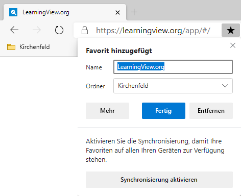
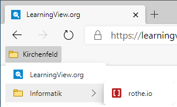
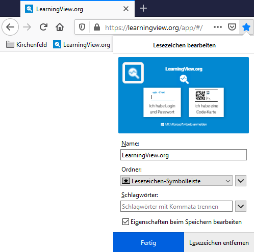

## Edge

Mit dem Stern-Symbol rechts des Adressfelds kann die aktuelle Webseite als Favorit hinzugefügt werden:

Die Favoriten werden als Liste zwischen Adressleiste und Webseite angezeigt. Mit der Tastenkombination [[Shift]]+[[Ctrl]]+[[B]] kann die Favoritenleiste ein- oder ausgeblendet werden. Sie können mit Ordnern und Unterordnern strukturiert werden:

## Firefox

Mit dem Stern-Symbol rechts des Adressfelds kann die aktuelle Webseite als Favorit hinzugefügt werden. Hier muss unbedingt im Auswahlfeld _Ordner_ der Eintrag __Lesezeichen-Symbolleiste__ (oder ein selbst erstellter Ordner) ausgewählt werden, damit der Favorit auch dort erscheint.

