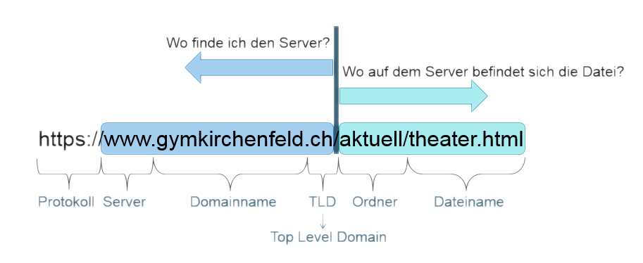
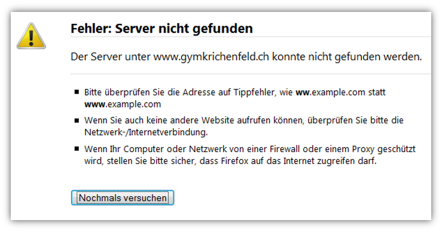
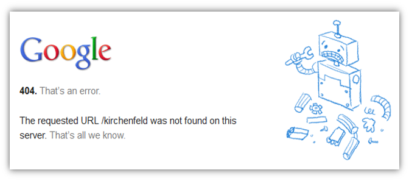

# Internetadressen

## URL
Unter einer URL (Uniform Resource Locator) versteht man eine allgemein gültige Art anzugeben, wo sich eine Quelle im Internet befindet (z.B. Webseiten, Dateien, Filme, ...) oder wie man eine Ressource erreicht (z.B. per E-Mail mit einer bestimmten Adresse, per Telefon, ...).

## Aufbau von Internetadressen

## Fehler in Internetadressen
Ist im 1. Teil der URL ein Fehler enthalten, so wird eine Fehlermeldung des Browsers ausgegeben, die besagt, dass der Server nicht gefunden werden konnte. Solche Fehlermeldungen sehen stets gleich aus, denn der Browser bestimmt ihr Aussehen:

Zur Korrektur dieses Fehlers muss folglich nur der 1. Teil der URL angeschaut werden.

Befindet sich der Fehler allerdings im 2. Teil der URL, so sehen die Fehlermeldungen alle unterschiedlich aus. Der betreffende Server konnte kontaktiert werden, nur die gewünschte Seite nicht, daher kann die Fehlermeldung auf dem Server ans Design der Institution angepasst werden:

Zur Korrektur dieses Fehlers kann z.B. der ganze 2. Teil der URL gelöscht werden. Somit besucht man die Hauptseite und versucht, über die Navigation zur gewünschten Seite zu gelangen.
