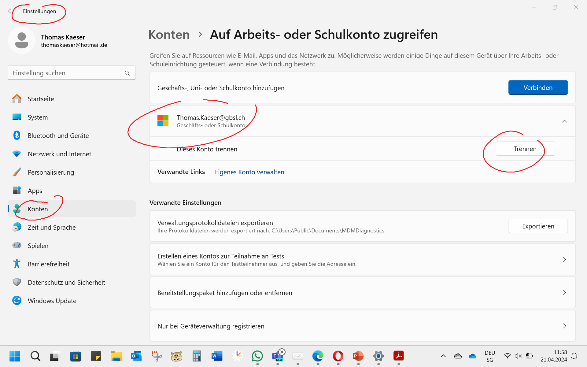

---
sidebar_custom_props:
  icon: mdi-block-helper
  tags: ["Problem Installation"]
  path: /docs/byod/installationsprobleme/README.md
sidebar_position: 39
---

# Installationsprobleme

## Office 365 :mdi[microsoft-office]{.blue}

### Anmeldung nicht möglich

Unten Links auf __Nein, nur bei dieser App anmelden__ klicken.

(Grund: EduBern, welche das Schul-Konto verwalten, sollen keinen Fernzugriff auf Ihren Laptop haben. Damit dies nicht fälschlicherweise doch passiert, hat EduBern diese Option deaktiviert.)

### Das alte Schulkonto wird angezeigt

Damit die automatische Synchronisation der Dateien mit OneDrive funktioniert, darf nur ein einziges Schulkonto aktiv sein. Um ein bestehendes Schulkonto zu entfernen, ist wie folgt vorzugehen:

<Tabs groupId="os">
  <TabItem value="win" label="Windows">

Unter __Einstellungen :mdi[cog]{.blue} > Konten :mdi[account]{.cyan} > Trennen__ auf __trennen__ klicken.

  </TabItem>
  <TabItem value="osx" label="Mac">

Unter Mac OS X muss ein Tool für die Entfernung von bestehenden Konten verwendet werden. 

Anleitung
: [👉 Anleitung](https://support.microsoft.com/de-de/office/entfernen-von-office-lizenzdateien-auf-einem-mac-b032c0f6-a431-4dad-83a9-6b727c03b193)
Tool
: [👉 Removal-Tool](https://go.microsoft.com/fwlink/?linkid=849815)

  </TabItem>
</Tabs>
