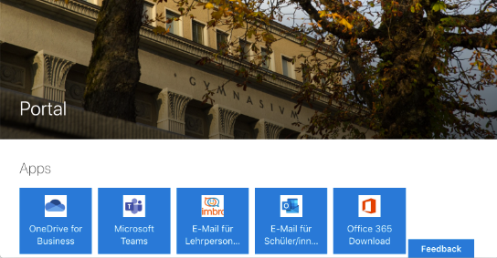
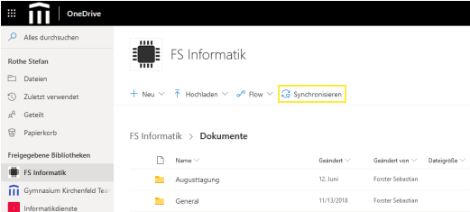
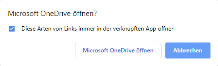
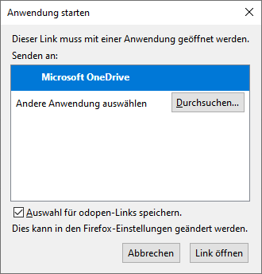
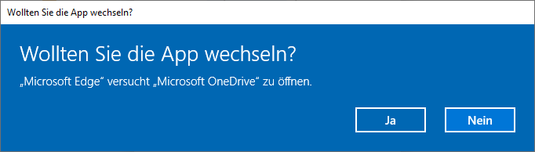
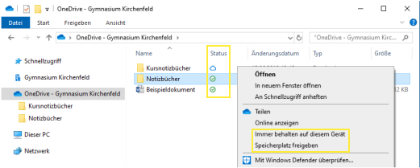

# 'Synchronisation Windows'

## Kurse synchronisieren

Die einem Kurs zugeordneten Ordner heissen in OneDrive «Bibliotheken». Die Synchronisation einer Bibliothek mit dem eigenen Gerät musst du via Browser aktivieren. Dazu musst du dich an der Cloud anmelden und mit einem Klick auf die Kachel ganz links («OneDrive for Business») nach OneDrive wechseln:

Im Menü von OneDrive findest du unter _Freigegebene Bibliotheken_ alle Kurse, an welchen du teilnimmst. Klick den Kurs an, welchen du synchronisieren möchtest. Klicke anschliessend auf den Link __Synchronisieren__:

Dieser Link weist OneDrive an, die Bibliothek mit dem Gerät zu synchronisieren. Es muss mit der OneDrive-App geöffnet werden. Je nach Browser ist das Verhalten hier unterschiedlich:

- **Chrome** zeigt die folgende Aufforderung an. Aktiviere die Option _Diese Arten von Links immer mit der verknüpften App öffnen_, um OneDrive-Links zukünftig automatisch zu öffnen. Klicke auf __Microsoft OneDrive öffnen__.

    

- **Firefox** zeigt die folgende Aufforderung an. Wähle __Microsoft OneDrive__ aus der Liste aus. Aktiviere die Option _Auswahl für odopen-Links speichern_, um OneDrive-Links zukünftig automatisch zu öffnen. Klicke auf __Link öffnen__.

    

- **Edge** zeigt die folgende Aufforderung an. Klicke auf __Ja__.

    

## Synchronisation überprüfen und steuern

Im Datei-Explorer wird lokale Kopie des Cloud-Speicher mit dem OneCloud-Symbol :mdi-microsoft-onedrive: und der Bezeichnung _OneDrive - Gymnasium Kirchenfeld_ angezeigt.

Hier sind alle Ordner und Dateien aufgelistet, welche im Cloud-Speicher vorhanden sind. In der Spalte _Status_ wird der Synchronisationsstatus angezeigt. Die Symbole haben folgende Bedeutung:

| Symbol                     | Bedeutung                       |
| :------------------------- | :------------------------------ |
| :mdi-cloud-outline:        | nur im Cloud-Speicher           |
| :mdi-check-circle-outline: | lokal auf dem Gerät vorhanden   |
| :mdi-check-circle:         | immer behalten auf diesem Gerät |
| :mdi-refresh:              | Synchronisierung ausstehend     |

Über das Kontextmenü (Rechtsklick auf das Element) kannst du die Synchronisationsart für einzelne Datein oder Ordner ändern.

- __Immer behalten auf diesem Gerät__: Wenn diese Option aktiviert ist, wird die Datei  auf dem Gerät behalten, auch wenn sie auf einem anderen Gerät oder im Cloud-Speicher gelöscht wird.
- __Speicherplatz freigeben__: Mit diesem Befehl wird die lokale Kopie der Datei gelöscht. Im Cloud-Speicher bleibt die Datei erhalten. Mit diesem Befehl können grosse Dateien lokal gelöscht werden, falls der Speicherplatz knapp ist. Wenn eine Datei geöffnet wird, wird automatisch wieder eine lokale Kopie angelegt.