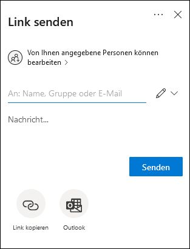
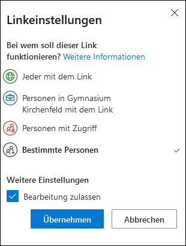
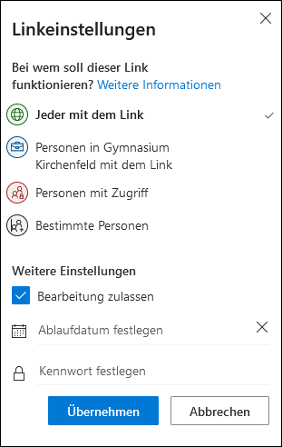
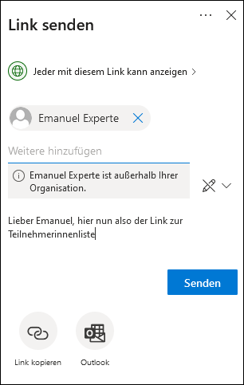
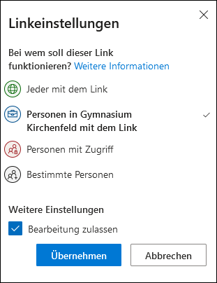
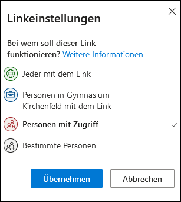
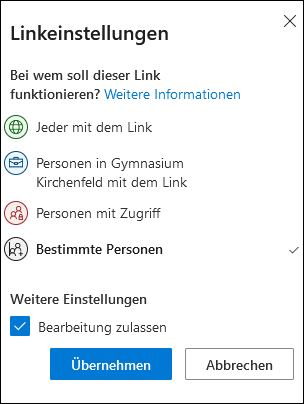

- Wenn man einen Ordner oder eine Datei in OneDrive mit anderen Personen von innerhalb oder ausserhalb der Schule teilen möchte, muss man sich zuerst via cloud.gymkirchenfeld.ch auf OneDrive einloggen. 

- Beim entsprechenden Ordner oder der entsprechenden Datei auf die drei Punkte klicken und auf _Teilen_ klicken.

- Auf _Von Ihnen angegebene Personen können bearbeiten_ klicken, um die gesamte Auswahl der Optionen zu sehen.

- Nun sind die verschiedenen Optionen zum Teilen sichtbar.

| Bezeichnung                                    | Beschreibung                                                                                                                                 |
| :--------------------------------------------- | :------------------------------------------------------------------------------------------------------------------------------------------- |
| Jeder mit dem Link                             | Jeder, der den Link hat, kann die Inhalte einsehen und ggf. bearbeiten. Zeitlich begrenzte Dauer zur Linkfreigabe lässt sich festlegen.      |
| Personen in Gymnasium Kirchenfeld mit dem Link | Alle Personen mit einer _@gymkirchenfeld.ch_ oder _@mygymer.ch_ E-Mailadresse, die den Link haben, können auf die Inhalte zugreifen          |
| Personen mit Zugriff                           | Wenn einer Person bereits Zugriff gewährt wurde und man ihr den Link erneut zusenden möchte                                                  |
| Bestimmte Personen                             | Inhalte werden nur für bestimmte Personen via E-Mailadresse freigegeben. Es spielt keine Rolle, ob die Personen am Gymnasium sind oder nicht |

## Jeder mit dem Link

Diese Option eignet sich nur für nicht-sensible Daten, da der Link von der Empfängerin/dem Empfänger weitergegeben und dadurch von nicht-autorisierten Personen genutzt werden kann.

Um einen Link zu senden auf _Jeder mit dem Link_ klicken. Nun kann optional gewählt werden:

- Ob eine Bearbeitung der Inhalte durch die Empfängerin/den Empfänger des Links möglich sein soll (Häkchen in Kästchen setzen)
- Ob der Link ein Ablaufdatum haben soll. Dazu ein Ablaufdatum in das entsprechende Feld eingeben.
- Ob der Link mit einem Kennwort geschützt werden soll.  

Anschliessend auf _Übernehmen_ klicken. 

 In der nächsten Ansicht kann eine beliebige Mailadresse des Empfängers / der Empfängerin angegeben werden und mit Klick auf das Stiftsymbol kann festgelegt werden, ob diese Person nur anzeigen kann oder auch bearbeiten können soll. Optional kann eine Nachricht hinzugefügt werden.

Anschliessend auf _Senden_ klicken. Optional: Auf _Link kopieren_ klicken um den Link in die Zwischenablage zu speichern. Von dort aus kann er mittels _Einfügen_ (rechter Mausklick) in einem beliebigen Dokument eingefügt werden.

## Personen in Gymnasium Kirchenfeld mit dem Link

Diese Option eignet sich nur für nicht-sensible Daten, da der Link von der Empfängerin/dem Empfänger an andere Personen am Gymnasium weitergegeben und dadurch von nicht-autorisierten Personen genutzt werden kann.

Um einen Link zu senden auf _Personen in Gymnasium Kirchenfeld mit dem Link_ klicken. Nun kann optional gewählt werden, ob eine Bearbeitung der Inhalte durch die Empfängerin/den Empfänger des Links möglich sein soll (Häkchen in Kästchen setzen). Anschliessend auf _Übernehmen_ klicken.

In der nächsten Ansicht kann eine _@gymkirchenfeld.ch_ oder _@mygymer.ch_ Mailadresse des Empfängers / der Empfängerin angegeben werden und mit Klick auf das Stiftsymbol kann festgelegt werden, ob diese Person nur anzeigen kann oder auch bearbeiten können soll. Optional kann eine Nachricht hinzugefügt werden.

Anschliessend auf _Senden_ klicken. Optional: Auf _Link kopieren_ klicken um den Link in die Zwischenablage zu speichern. Von dort aus kann er mittels _Einfügen_ (rechter Mausklick) in einem beliebigen Dokument eingefügt werden.

## Personen mit Zugriff

Wenn einer Person bereits zu einem früheren Zeitpunkt Zugriff auf eine Datei oder einen Ordner gewährt wurde und man den Link erneut senden möchte, klickt man auf _Personen mit Zugriff_ und anschliessend auf _Übernehmen_.  In der nächsten Ansicht kann eine beliebige Mailadresse des Empfängers / der Empfängerin angegeben werden und mit Klick auf das Stiftsymbol kann festgelegt werden, ob diese Person nur anzeigen kann oder auch bearbeiten können soll. Optional kann eine Nachricht hinzugefügt werden.

Anschliessend auf _Senden_ klicken. Optional: Auf _Link kopieren_ klicken um den Link in die Zwischenablage zu speichern. Von dort aus kann er mittels _Einfügen_ (rechter Mausklick) in einem beliebigen Dokument eingefügt werden.

## Bestimmte Personen

Diese Art zu Teilen eignet sich, wenn man einer bestimmten Person via E-Mailadresse Zugriff gewähren möchte. Es spielt keine Rolle, ob die Person am Gymnasium Kirchenfeld ist oder nicht. Jedoch muss die eingegebene E-Mailadresse mit einem Microsoft-Konto verbunden sein. Diese Methode eignet sich auch zum Teilen sensibler Daten, da sich die Empfängerin/der Empfänger authentifizieren muss, bevor er/sie Zugriff erhält. 

Hierfür klickt man auf _Bestimmte Personen_ und anschliessend auf _Übernehmen_.  In der nächsten Ansicht kann eine beliebige Mailadresse des Empfängers / der Empfängerin angegeben werden und mit Klick auf das Stiftsymbol kann festgelegt werden, ob diese Person nur anzeigen kann oder auch bearbeiten können soll. Optional kann eine Nachricht hinzugefügt werden.

Anschliessend auf _Senden_ klicken. Optional: Auf _Link kopieren_ klicken um den Link in die Zwischenablage zu speichern. Von dort aus kann er mittels _Einfügen_ (rechter Mausklick) in einem beliebigen Dokument eingefügt werden.

