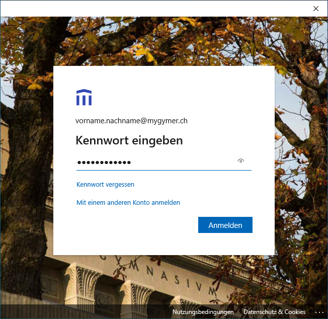
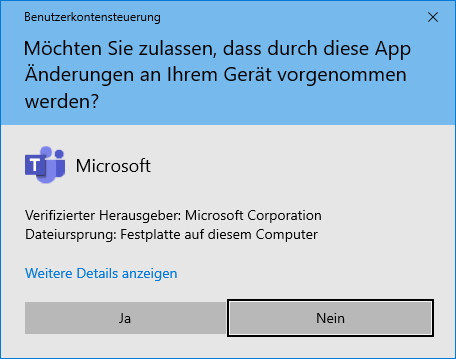
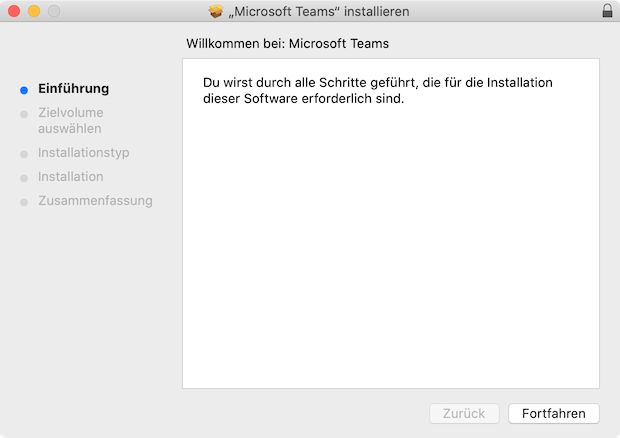
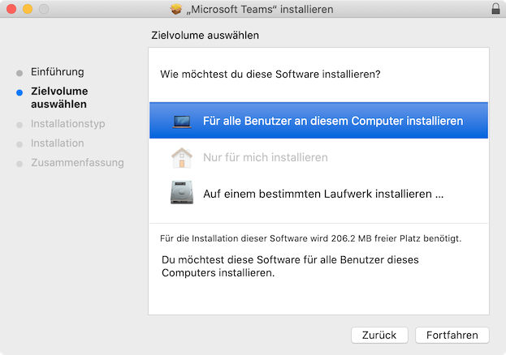
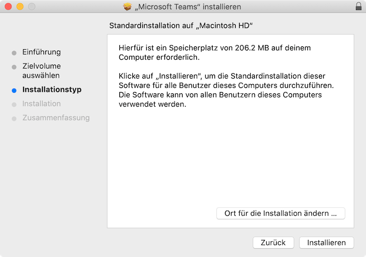
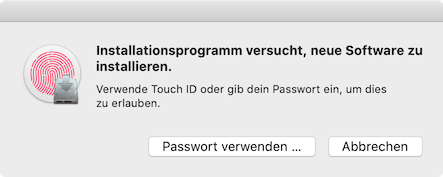
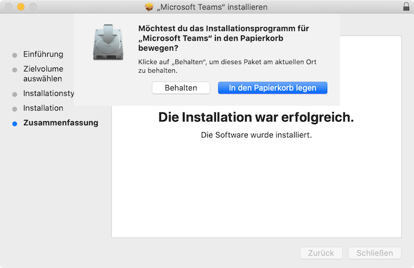

---
apps:
  - Microsoft Teams
sidebar_position: 20
sidebar_custom_props:
  icon: mdi-microsoft-teams
  source: gym-kirchenfeld
  path: /docs/microsoft365/teams/README.md
---

# Teams

<Tabs>
  <TabItem value="win" label="Windows">

Um Microsoft Teams auf deinem Windows-Laptop einzurichten, musst du:

1. Microsoft Teams herunterladen und installieren,
2. dich mit Teams an unserer Schul-Cloud anmelden,
3. in Teams in die Listenansicht wechseln.

## Teams installieren

Lade Microsoft Teams von dieser Webseite herunter und installiere es:

[Microsoft Teams Download](https://www.microsoft.com/de-ch/microsoft-365/microsoft-teams/download-app)

Warte einfach, bis Microsoft Teams fertig installiert worden ist:

## Anmelden

1. Gib deine Schul-E-Mail-Adresse ein und klicke auf __Anmelden__:

    

2. Gib dein Kennwort ein und klicke auf __Anmelden__:

    

3. Es kann sein, dass Teams beim ersten Start die folgende Meldung anzeigt. Hier will Teams eine zusätzliche Installation vornehmen, um den Teams-Chat in Office zu integrieren. Klicke auf __Los&nbsp;geht's!__:

    

4. Klicke auf __Ja__:

    

  </TabItem>
  <TabItem value="osx" label="Mac OS">
  

Um Microsoft Teams auf deinem macBook einzurichten, musst du:

1. Microsoft Teams herunterladen und installieren,
2. dich mit Teams an unserer Schul-Cloud anmelden,
3. in Teams in die Listenansicht wechseln.

## Teams installieren

Lade Microsoft Teams von dieser Webseite herunter und installiere es:

[Microsoft Teams Download](https://www.microsoft.com/de-ch/microsoft-365/microsoft-teams/download-app)

Installation Schritt für Schritt

1. Installiere Microsoft Teams. Klicke hier auf __Fortfahren__:

    

2. Wähle _Für alle Benutzer an diesem Computer installieren_ und klicke anschliessend auf __Fortfahren__:

    

3. Klicke auf __Installieren__:

    

4. Bestätige die Installation mit deinem Fingerabdruck oder klicke auf __Passwort verwenden…__:

    

5. Klicke auf __Schließen__, anschliessend auf __In den Papierkorb legen__:

    

## Anmelden

1. Öffne das Launchpad, um Microsoft Teams zu starten. Das Launchpad kann mit der Taste [[F4]] oder mit folgendem Icon geöffnet werden:

    

2. Klicke im Launchpad auf das Teams-Icon:

    

3. Gib deine Schul-E-Mail-Adresse ein und klicke auf __Anmelden__:

    

4. Gib das Kennwort ein und klicke auf __Anmelden__:

    

  </TabItem>
  <TabItem value="ios" label="iOS">
    Anleitung iOS
  </TabItem>
  <TabItem value="androi" label="Android">
    Anleitung Android
  </TabItem>
</Tabs>

