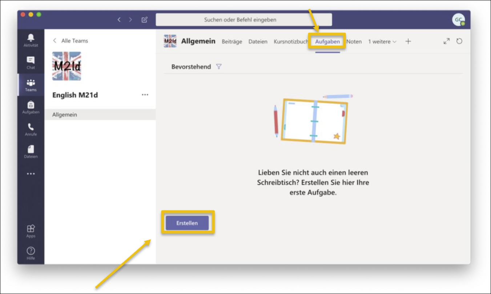
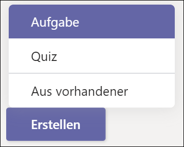
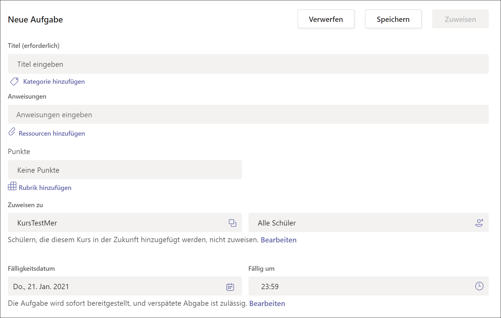
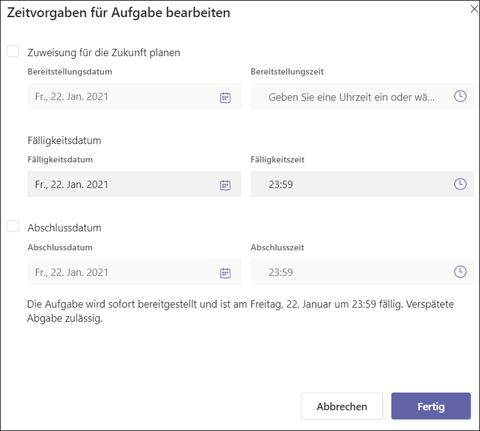
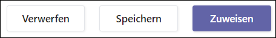

# Aufträge erstellen (Lehrer*innen)

1. Das gewünschte Team öffnen und _Aufgaben_ wählen

2. Auf _Erstellen_ klicken

3. _Aufgabe_ auswählen

4. Im Formular die nötigen Einstellungen vornehmen

    * Titel: Name der Aufgabe
    * Anweisungen: Den Auftrag eintragen
    * Ressourcen hinzufügen: Hier kann digitales Material wie Word-Vorlagen, pdf-Dokumente, etc. zur Verfügung gestellt werden.
    * Punkte: Hier kann ein Beurteilungsraster angegeben werden und Maximalpunkte können festgelegt werden
    * Zuweisen zu: 
      * Links angeben, welche Klasse(n) den Auftrag lösen sollen (mehrere möglich)
      * Rechts angeben, wer aus der Klasse / den Klassen die Aufgabe lösen soll. Standard ist _alle Schüler_, also alle Schüler der Klasse(n). Es können aber auch einzelne Schüler:innen angegeben werden.
    * Fälligkeitsdatum / Fällig um: Tag und Uhrzeit angeben, bis wann die Aufgabe abgegeben werden soll.

  

5. **Optional:** Starttermin für einen späteren Zeitpunkt planen:

    * Neben _Die Aufgabe wird sofort bereitsgestellt, und verspätete Abgabe ist zulässig_ auf _Bearbeiten_ klicken.

    * _Zuweisung für die Zukunft planen_: Häkchen setzen, falls die Aufgabe erst zu einem späteren Zeitpunkt für die Klasse sichtbar werden soll. Der Zeitpunkt kann unter _Bereitstellungsdatum_ und _Bereitstellungszeit_ eingegeben werden. Ist das Häkchen nicht gesetzt, wird die Aufgabe sofort sichtbar.

    * _Fälligkeitsdatum_: Bestimmen, bis wann die Schüler:innen die Aufgabe bearbeiten sollen.

    * _Abschlussdatum_: Häckchen setzen um zu bestimmen, bis wann die Schüler:innen die Aufgabe (ggf. verspätet) einreichen dürfen. Das kann ein Datum **nach** dem Fälligkeitsdatum sein. Ist kein Häkchen gesetzt, können die Schüler:innen die Aufgabe verspätet einreichen. 

    * Auf __Fertig__ klicken.

  

  

    

6. Rechts oben auf eine der folgenden Optionen klicken um abzuschliessen:

  __Verwerfen__: Die Aufgabe wird nicht gespeichert und verworfen

  __Speichern__: Diese Aufgabe wird als Entwurf gespeichert

  __Zuweisen__: Diese Aufgabe wird jetzt sofort oder zu einem geplanten Zeitpunkt (siehe Punkt 5) aktiviert

  

    
